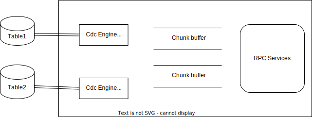
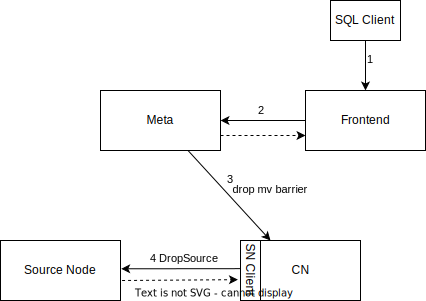

# CDC Source Node (MySQL)

## Motivation

To eliminate the Kafka cluster required for CDC events before, we introduce the Java connector node to CDC connectors. This doc is for MySQL connector.

## Design

#### 1.1 Basic model



#### 1.2 Interfaces

```protobuf
service CdcService {
  rpc GetEventStream(GetEventStreamRequest) returns (stream GetEventStreamResponse);
}

message GetEventStreamRequest {
  uint64 source_id = 1;
}

message GetEventStreamResponse {
  uint64 source_id = 1;
  repeated CdcMessage events = 2;
}

message DbConnectorProperties {
  string database_host = 1;
  string database_port = 2;
  string database_user = 3;
  string database_password = 4;
  string database_name = 5;
  string table_name = 6;
  string partition = 7;
  string start_offset = 8;
  bool include_schema_events = 9;
}

message CdcMessage {
  string payload = 1;
  string partition = 2;
  string offset = 3;
}
```

#### 1.3 Use cases

1. **Create a CDC Materialized Source**

```sql
create materialized source orders (
   order_id int,
   order_date timestamp,
   customer_name string,
   price decimal,
   product_id int,
   order_status smallint,
   PRIMARY KEY (order_id)
) with (
 connector = 'cdc',
 database.hostname = '127.0.0.1',
 database.port = '3306',
 database.user = 'root',
 database.password = '123456',
 database.name = 'mydb',
 table.name = 'orders'
) row format debezium_json;
```

If there are errors in creating the CDC engine on the source node, the Meta will report send barrier fail to the frontend.

**Discussion**:  How to propagate the error back to frontend if the user provided connector properties are wrong?

**Conclusion**

We can add a `validate`  rpc or validate the connection parameters at the first time connect to the connector node.

2. **Drop a CDC Materialized Source (not implemented yet)**



**Conclusion**

CN doesn't need to stop the CDC engines explicitly. When the CN crashed the source node will experience a grpc connection error, then corresponding CDC engines should exit.

### Failure recovery

When some nodes encounter failure, we need to recover the cluster state to the latest checkpoint.

#### 2.1 Failure scenarios

- Compute node failure

We need to recover **operator states** from the checkpoint then we can resume computations of MV. For the CDC source operators, we need to reset the state of the corresponding CDC engines, specifically the offset, rewinding to the position stored in the latest checkpoint.

- Source node failure or the connection to source node is broken

In this scenario, the source executor will see an error from the RPC client, which will cause the MV fail and the Meta node will trigger a recovery process for the failed MV. Again, we need to rewind the offset of CDC engine to resume the event stream.

Debezium engine does not provide an intuitive way to allow users to reset its offset, we need to hack the framework by ourselves. Luckily, Flink CDC has led the way for us.

💡 **Caveat**
The CDC process consist of an initial snapshot phase and the incremental binlog consuming phase, rewinding the offset can only recover the binlog consuming phase. To support recovery in the snapshot phase, we need more techniques which are not cover in this document.

#### 2.2 Design

Since the CDC engine can support rewinding its offset, the basic idea of failure recovery is same as other connector sources. Each message produced by the CDC engine will contains its offset in the binlog. And the source executor will update the offset states of the `CdcSplit` when it receives a chunk. Every time receives a checkpoint barrier, the source executor will persist the states of assigned splits.

Upon recovery, Meta will send those persisted splits to CN via barrier and we can request the Source Node to start a CDC engine with the persisted offset to resume consuming.

Besides the MySQL connector, I think the above mechanism can also apply to other connectors.

## Future possibilities

Implement more CDC connectors.
