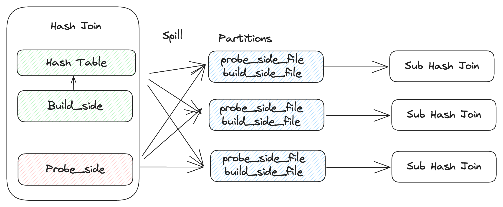

---

feature: Spill Hash Join
authors:
  - "DylanChen"
start_date: "2024/05/31"

---

# Spill Hash Join

## Motivation

Joining two large table is a typical analytical workload in a database. Risingwave supports hash join, while the hash table need to be built in memory. Without the capability to spill out to disk, it requires lots of memory to build the hash table, so it is essential to support a spill-able hash join to resolve the joining two large table issue. 

## Design

To spill a hash join, we can use the same idea from the [spill hash aggregation RFC](https://github.com/risingwavelabs/rfcs/pull/89), i.e. partition inputs of hash join to reduce the hash table size needed to be process within a hash join. Because hash join has two inputs, we need to use a same hash function to hash both inputs into partition pairs. Within a partiton, we will get a probe side input spill file and a build side input spill file. The size of the partition is expected to the much smaller than the original input size, so we can run a hash join against these partitions one by one and recursively if necessary.



### Partitions

First, we need to choose a partition number to partition the probe side and build side input. After partitioning, theoretically, each partition would only contain 1/partition_num of the original data. If this size could be fitted in the memory, we can process the HashJoin partition by partition. If this size is still too large to be fitted in the memory, we need to recursively apply the spill algorithm. When recursively applying the spill algorithm, we need to make sure they use different hash functions to avoid data skew.

How to choose a partition number? If we have the priori information about the join input size, we could choose a proper partition number to ensure each partition could be fitted into memory, however, risingwave doesn't contain this kind of statistic, so we need to choose a partition carefully.
Choosing too few partitions leads to a handful of large-sized partitions causing extra rounds of ppill and a large amount of spilling to disk. On the other hand, while using a larger number of partitions can reduce the total amount of spilling, it can make the join's I/O pattern more random due to frequent writings of partitions containing just a few rows. According to this paper[1], we can use 20 as a default partition number.

```
  HashJoinExec.execute:

    // process hash join in memory
    ...

    if not enough memory:
      // Spill
      for chunk in hash_table:
        partition = hash(k) % partition_num
        write_to_build_side_input_file(chunk)
      for chunk in build_side:
        partition = hash(k) % partition_num
        write_to_build_side_input_file(chunk)
      for chunk in probe_side:
        partition = hash(k) % partition_num
        write_to_probe_side_input_file(chunk)

      // process partition by partition
      for i in partition_num:
        HashJoinExec.execute(probe_side_input_file[i].read(), build_side_input_file[i].read())

```

### Where to spill

There are two options for us to spill: local disk or object store.

1. Local Disk
  - Pros: low latency, fixed costs, k8s could handle orphan spilled files in case of failure.
  - Cons: limited capacity and throughput
2. Object Store
  - Pros: infinite capacity and throughput
  - Cons: high latency, extra storage, and access cost, need to clean orphan spilled file.

We can use a local disk first so that users don't need to pay any extra cost.

### Spill directory

Use need a pre-defined directory to hold all the temporary spilling files. In a cloud environment, k8s should be responsible for configuring this directory via the env variable `RW_BATCH_SPILL_DIR`. By default, we can use `/tmp/` as the default spill directory. Every executor should use a uuid to create a subdirectory under the default spill directory to ensure no conflict among them. After query processing, the executor are responsible for clearing the directory.


### Serialization

We can convert keys and values of the hash table into a chunk and then serialize the chunk into a protobuf bytes which has already been supported and used during shuffling between different tasks. Finally, spill file content will look like the below. As we can see this file write pattern is append-only and the read pattern is sequential scan. This can maximize the disk IO performance.

Spill file format:

```
[proto_len]
[proto_bytes]
...
[proto_len]
[proto_bytes]

```

## Reference

- [1] Design Trade-offs for a Robust Dynamic Hybrid Hash Join
- [2] https://en.wikipedia.org/wiki/Hash_join
