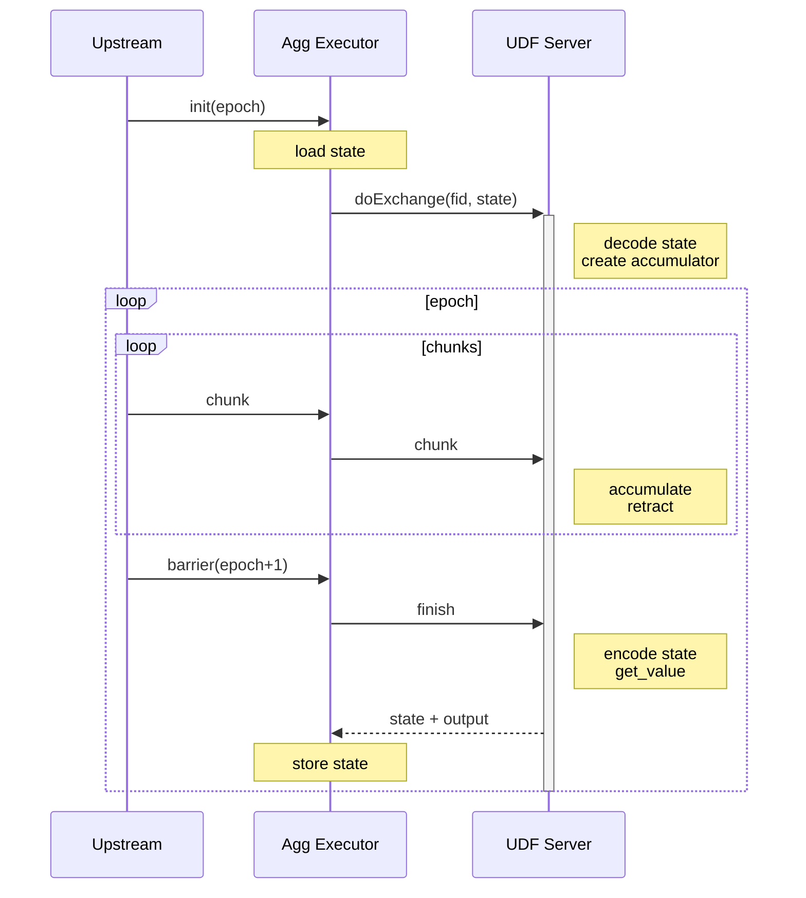

# User Defined Aggregate Functions (UDAF)

## Summary

This RFC proposes the user interface and implementation of user defined aggregate functions (UDAF).

## User Interfaces

This section describes how users create UDAFs in Python, Java, and SQL through examples.

### Python API

Similar to scalar functions and table functions, we provide an `@udaf` decorator to define aggregate functions.
The difference is that below the decorator, we define a class instead of a function.
The class is an **accumulator** that accumulates the input rows and computes the aggregate result.
It can also optionally retracts a row and merges with another accumulator.

```python
from risingwave.udf import udaf

# The aggregate function is defined as a class.
# Specify the schema of the aggregate function in the `udaf` decorator.
@udaf(input_types=['BIGINT', 'INT'], result_type='BIGINT')
class WeightedAvg:
    # The internal state of the accumulator is defined as fields.
    # They will be serialized into bytes before sending to kernel,
    # and deserialized from bytes after receiving from kernel.
    sum: int
    count: int

    # Initialize the accumulator.
    def __init__(self):
        self.sum = 0
        self.count = 0

    # Get the aggregate result.
    # The return value should match `result_type`.
    def get_value(self) -> int:
        if self.count == 0:
            return None
        else:
            return self.sum / self.count

    # Accumulate a row.
    # The arguments should match `input_types`.
    def accumulate(self, value: int, weight: int):
        self.sum += value * weight
        self.count += weight

    # Retract a row.
    # This method is optional. If not defined, the function is append-only and not retractable.
    def retract(self, value: int, weight: int):
        self.sum -= value * weight
        self.count -= weight

    # Merge with another accumulator.
    # This method is optional. If defined, the function can be optimized with two-phase aggregation.
    def merge(self, other: WeightedAvg):
        self.count += other.count
        self.sum += other.sum
```

#### Alternative

In Flink, the accumulator is a separate variable passed into functions as an argument.

```python
class WeightedAvg(AggregateFunction):
    def get_accumulator_type(self):
        return 'ROW<f0 BIGINT, f1 BIGINT>'

    def create_accumulator(self):
        # Row(sum, count)
        return Row(0, 0)

    def get_value(self, accumulator):
        # ...

    def accumulate(self, accumulator, value, weight):
        accumulator[0] += value * weight
        accumulator[1] += weight
```

While in this proposal, the accumulator is the class itself. Users don't have to define the accumulator type explicitly.
The reason we can do this is that we serialize the state into bytes before storing it in the state table.
It is opaque to RisingWave. We don't care about the internal structure.

Reference: [UDAF Python API in Flink](https://nightlies.apache.org/flink/flink-docs-release-1.17/docs/dev/python/table/udfs/python_udfs/#aggregate-functions)

### Java API

The Java API is similar to Python.
One of the differences is that users don't need to specify the input and output types,
because we can infer them from the function signatures.

```java
import com.risingwave.functions.AggregateFunction;

// The aggregate function is defined as a class, which implements the `AggregateFunction` interface.
public static class WeightedAvg implements AggregateFunction {
    // The internal state of the accumulator is defined as class fields.
    public long sum = 0;
    public int count = 0;

    // Create a new accumulator.
    public WeightedAvg() {}

    // Get the aggregate result.
    // The result type is inferred from the signature. (BIGINT)
    // If a Java type can not infer to an unique SQL type, it should be annotated with `@DataTypeHint`.
    public Long getValue() {
        if (count == 0) {
            return null;
        } else {
            return sum / count;
        }
    }

    // Accumulate a row.
    // The input types are inferred from the signatures. (BIGINT, INT)
    // If a Java type can not infer to an unique SQL type, it should be annotated with `@DataTypeHint`.
    public void accumulate(long iValue, int iWeight) {
        sum += iValue * iWeight;
        count += iWeight;
    }

    // Retract a row. (optional)
    // The function signature should match `accumulate`.
    public void retract(long iValue, int iWeight) {
        sum -= iValue * iWeight;
        count -= iWeight;
    }

    // Merge with another accumulator. (optional)
    public void merge(WeightedAvg a) {
        count += a.count;
        sum += a.sum;
    }
}
```

Reference: [UDAF Java API in Flink](https://nightlies.apache.org/flink/flink-docs-release-1.17/docs/dev/table/functions/udfs/#aggregate-functions)

### SQL API

After setting up the UDF server, users can register the function through `create aggregate` in RisingWave.

```sql
create aggregate weighted_avg(value bigint, weight int) returns bigint
as 'weighted_avg' using link 'http://localhost:8815';
```

The full syntax is:

```sql
CREATE [ OR REPLACE ] AGGREGATE name ( [ argname ] arg_data_type [ , ... ] )
[ RETURNS return_data_type ] [ APPEND ONLY ]
[ LANGUAGE language ] [ AS identifier ] [ USING LINK link ];
```

The `RETURNS` clause is optional if the function has exactly one input argument.
In this case the return type is same as the input type. For example:

```sql
create aggregate max(int) as ...;
```

The `APPEND ONLY` clause is required if the function doesn't have `retract` method.

The remaining clauses are defined the same as for `create function` statement.

## Implementations

User defined functions are running in a separate process called UDF server.
The RisingWave kernel communicates with the UDF server through Arrow Flight RPC to exchange data.

To avoid trouble in fault tolerance, the UDF server should be stateless even if the aggregate function is stateful.
However, attaching the state to each RPC call (like batch accumulation) is not efficient, especially when the state is large.
On the other hand, kernel doesn't need to know the state or the aggregate result before a barrier arrives.
Therefore, we create a streaming RPC to perform all operations within an epoch.



## Unresolved questions

* Are there some questions that haven't been resolved in the RFC?
* Can they be resolved in some future RFCs?
* Move some meaningful comments to here.

## Alternatives

What other designs have been considered and what is the rationale for not choosing them?

## Future possibilities

Some potential extensions or optimizations can be done in the future based on the RFC.
