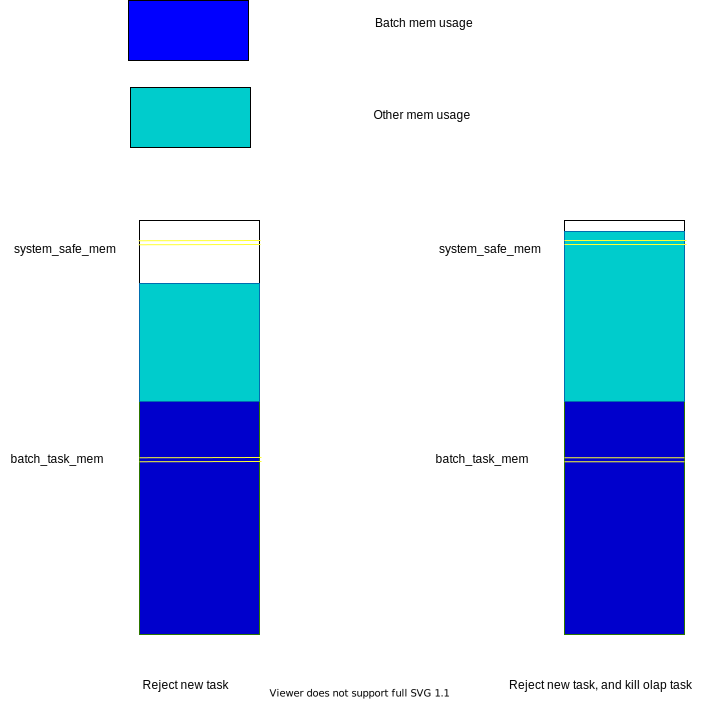

# Batch Query Resource Management

## Summary

We will introduce coarse grained resource management for batch query engine:

1. Limit number of concurrent distributed queries in each frontend node.
2. Limit the total amount of memory used by batch query engine.

## Motivation

When user executes complex sql in distributed mode in our system with huge amount of data, our compute node will abort(not panic) when running out of memory. We want to reduce process failure and impact to other users as much as possible.

### Non Goal

There exists many different fine grained resource management strategies in industry, and the goal of this rfc is not to bring them into our system.

## Design

### Limit number of concurrent distributed queries

To reduce the chance of query failure, we need to limit the number of concurrent distributed queries running in cluster. To implement this mechanism, we have two assumptions:

1. Load balancer works well, so each frontend node receives almost same amount of queries.
2. Enforcing this limitation is not mandatory, just best effort is enough.

Based on above assumptions, we will introduce a cluster wide `max_concurrent_distributed_queries` config, which limits number of concurrent distributed queries in cluster. Meta node will divide this value according to number of frontend nodes, and sync to each frontend node. Frontend node will limit this concurrent queries according to this value.

### Limit number of memory used in batch query engine

To avoid exhausting memory in compute node, we will start a monitoring task, which periodically get memory usage, and take following actions:

Here we have following definitions:

*batch_mem_usage*: All memory used by batch tasks.
*other_mem_usage*: Memory used by others, calculated by `system_mem_usage - batch_mem_usage`.
*batch_task_mem*: A configuration specifying the percentage of memory that batch task can use.
*system_safe_mem*: A configuration specifying the percentage of memory that's safe for current system, this can be same as streaming's `EVICTION_THRESHOLD_AGGRESSIVE`

To collect batch task memory usages, we need to attach an Allocator for batch tasks to collect memory usage. There are three cases to consider here:

1. Collections support allocation api.

2. Collections not supporting allocation api. In this case we need to estimate the memory usage of these containers.

3. Data chunks.

Notice that we can't simply use atomic variable here, we should use [hytra](https://docs.rs/hytra/latest/hytra/) here to accumulate memory usage.

## Unresolved questions

Why we need to collect batch tasks memory usage rather using process memory usage directly, since according to current streaming memory management design, we may starving batch tasks. Also this makes thing unpredictable and diffcult to explain to users.

## Alternatives

1. A panic based approach can be found here: <https://github.com/risingwavelabs/rfcs/pull/11/files#diff-044dd2e47982ff2f25e56eaa49e7b1b9b190ecc6308a74667a8a22fdb3178af8>

## Future possibilities

Fine grained resource management.
