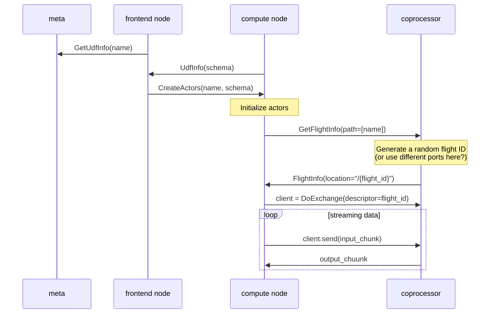

# External Function Framework

## Summary

We will introduce a gRPC-based external function framework in the kernel part. **The framework is private to users and may change later**.

## Motivation

The RFC is a preparation RFC for external UDFs with heavy runtime or complicated environments.

The RFC will not answer the following questions:

* How to define the UDFs?
* How to execute the UDFs?

## Design

### Arrow Flight Protocol

We will use [Arrow Flight RPC](https://arrow.apache.org/docs/format/Flight.html#protocol-buffer-definitions) as the external function protocol.



We can reuse many arrow infrastructures when implementing the coprocessor.

#### Non-batch API?

User-oriented APIs will have batch and non-batch interfaces, but in our protocol, it's possible only to provide the batch API.

There are several benefits of the batch API:

1. The performance of batch API is better and easy to tune.

2. Apache Arrow is a well-known open format, and we can reuse their ecosystems.

The only usages of the `eval_row` API in our codebase now:

1. `InfailableExpression::eval_infailable`: We use the row-based evaluation while meeting errors, which we can avoid with some invasions to all expression implementations.
2. `stream::HashJoinExecutor`: We use the row-based evaluation while predicting the non-equal conditions.
3. Constant folding: UDFs are not allowed in the context.

### Metadata

No matter how the function is defined, the users should provide some necessary info:

1. The function name
2. The names and types (in SQL) of all arguments
3. The return type (in SQL)

The meta service should store the metadata of external functions and broadcast them to all clients.

### Async expression framework

Calling to external functions is a non-blocking operation. There are several solutions here, but the simplest one is to make the `Expression` trait async.

```rust
trait Expression {
    #[async_recursion]
    async fn eval(&self, input: &DataChunk) -> Result<ArrayRef>;
}
```

The attribute_macro `async_recursion` is required here.

#### Concurrency between expressions

For expressions with multiple arguments, we can evaluate them concurrently and join them back.

It can reduce the latency in such cases:

```sql
SELECT udf1(x) + udf2(y) * udf3(z) FROM t;
```

However, expressions with short-circuit optimization should evaluate their arguments serially.

```sql
SELECT udf1(x) && udf2(y) && udf3(z) FROM t;
```

### Cross-chunk concurrency

Concurrency between expressions is not enough for some cases, so we should also handle chunks concurrently.

Thanks to the Stream-based execution model, we can quickly achieve the result by [`Stream::buffered`](https://docs.rs/futures/latest/futures/stream/trait.StreamExt.html#method.buffered).

### Error handling

We have no choice but to retry. One way to minimize the loss is to introduce the partial-checkpoint mechanism.

## Multiple return values

PostgreSQL allows users to specify multiple return values:

```sql
CREATE FUNCTION sum_n_product (x int, y int, OUT sum int, OUT product int)
AS 'SELECT x + y, x * y'
LANGUAGE SQL;
```

We can refer to the syntax to support multiple return values but pack them in an anonymous struct.

### Deterministic

We expect all UDFs will output a deterministic result. However,  some functions are not deterministic. There are three accepted ways:

Only allow UDFs over an append-only stream.
Force a checked `MaterializeExecutor` over the UDF.
Force UDFs to be explicitly defined with the DETERMINISTIC keyword and trust the users.

BTW we can also apply the solution to built-in non-deterministic functions, such as `random(),` `proc_time()` or `now()`.

## Alternatives

### Introduce a new operator, `ProjectAsync` to execute async UDFs

The solution heavily invades the planner part.

We can plan the SQL as the following plan:

```sql
SELECT round(my_udf(to_char(x))) FROM t;
```

```plain
LogicalProject { exprs: [round($0)] }
└─LogicalAsyncProject { exprs: [my_udf($0)] }
  └─LogicalProject { exprs: [to_char($0)] }
    └─LogicalScan { table: t, columns: [t.x] }
```

The solution can work well on `Project`, `Filter`, and `Join`, but failed on [the filter clause](https://medium.com/little-programming-joys/the-filter-clause-in-postgres-9-4-3dd327d3c852). There are also many other corner cases since expressions are used everywhere in PostgreSQL.

Also, this is not an elegant solution. For the frontend part, `Project` and `ProjectAsync` are the same.

## Future possibilities

### Using another RPC framework

The external function framework will not be public to users, so we use gRPC in our first version for simplicity. We can investigate other RPC frameworks later.

### Using wasm-based implementation and embedding the VM into the kernel?

A good idea, but currently, the capability of the wasm is limited. For some CPU-bounded functions written in some languages without heavy runtime, it's a better solution for performance.
