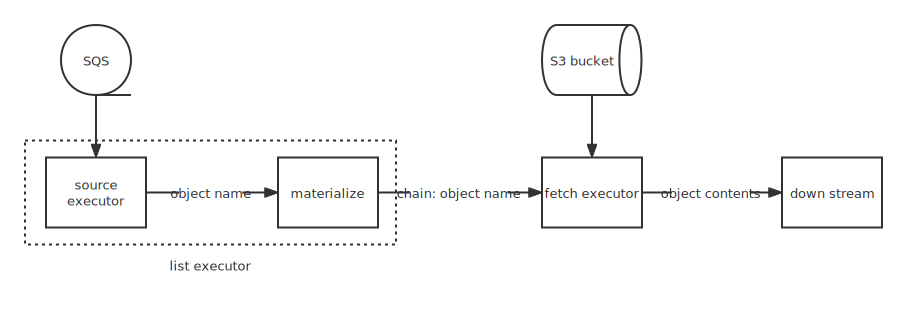

# S3 Source with SQS

## Motivation

Support load data from Amazon S3 and other Simple Storage Services.

## Background

The previous two versions RFCs are available as follows:

* [Version 1](https://www.notion.so/risingwave-labs/Deprecated-RFC-S3-Source-Design-632aa78264b347f9a4a37fd89a91d785): presents the basic abstraction of treating a file as a partition, but here we ignore the fact that a source can be relied on by multiple MVs, while sqs can only be consumed once. This results in inconsistent data across multiple MVs.
* [Version 2](https://github.com/risingwavelabs/rfcs/pull/19): want the executors to list s3 buckets independently and maintain their own state. This solution is not accepted because listing the bucket periodically is too expensive ([price policy](https://aws.amazon.com/s3/pricing/)) and we want to use SQS to describe the incremental data.

So I would like to propose an SQS-based access solution for s3 files.

## Design

This solution consists of two parts, the list executor, which maintains the list of files, and the fetch executor, which reads the files. These two executors are connected by a materialize executor.

We use the following SQL to perform reading the s3 object.

```sql
create materialized source s3_list with ( connector = 's3', ...);
create materialized view s3_content_1 as select (... schema ...) from s3_list with (...);
```

The SQL produces the plan as shown in the figure.



### List Executor

This executor can be implemented as a source executor that **must** be materialized and is responsible for listing the bucket at creation time and continuously consuming sqs incrementally. We can assume that the subsequent MV holds the list of files in the bucket at the current time.

The schema of the list executor is a fixed a varchar, so we do not allow the user to specify the schema here.

### Fetch Executor

The relationship between these two executors can be understood as mv on mv. The Fetch executor takes the list of files sent by the list executor and persists them locally, reads the contents of the s3 objects in order and sends chunks to the downstream.

The executor's state table needs to persist the name and offset of each file and the read queue of each executor. An element, a file name, is taken out of the queue when we finish reading a file, and we usually persist the current queue at checkpoint.

* Q: What to do when handing a deleting object message?
* A: We can ignore it or remove the object from the queue. When we get the message from SQS, the object has already been deleted from the bucket.
  * If we have already read the object but not yet committed, do we need to delete it from the cache? **TO BE DISCUSSED** (very rare case)

### Scale

* The parallelism of the source executor inside the list executor is fixed to 1 but the subsequent MV can be scaled.
* Fetch executor can be scaled out along with the upstream. Only the distribution of incremental data is affected after the scale out, no adjustment is made to the objects already distributed.
  * For scale in scene, **TO BE DISCUSSED**.

### Failover

* List Executor
  * Source: consume the SQS and only delete messages on checkpoints. SQS itself can make sure we can consume the undeleted message later sometime.
  * MV: as usual
* Fetch Executor: We not only persist the queue but also the offset of each file. When the executor restarts, it will read the queue from the state table and continue to read the first file in the queue from the offset.

## Unresolved questions

* How to handle the scale in scene for fetch executor? It has its own task queue persisted. We need to move all elements in the queue to other executors, which can cause task imbalance and it should be done during pause time.

## Future possibilities

* Support other storage services, such as GCS, Azure Blob Storage, etc.
* Is there any need to read S3 objects in oreder? We may limit the parallelism of the fetch executor to 1 to ensure the order of reading objects.
* File format parser: implement S3 parser to parse the file format, such as CSV, JSON, etc.
