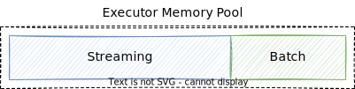

# RFC: Memory Management

## Summary

This RFC proposes a detailed and practical way to control the memory usage for both streaming and batch executors on compute nodes.

## Background

We had discussed a lot about how to allocate and manage memory before. [RFC: Yet another simple idea for memory management](https://singularity-data.quip.com/CldAAcFmzZSO/Yet-another-simple-idea-for-memory-management) proposed a simple way to control the memory usage of streaming executors by controlling the *watermark epoch* of the LRU caches on a compute node, which was finally adopted in our system, surpassing [RFC: Simpler Dynamic Memory Management Among LRU-Caches](https://singularity-data.quip.com/A1kHAOBUo3Im/RFC-Simpler-Dynamic-Memory-Management-Among-LRU-Caches) and [RFC: Dynamic Memory Budget of Streaming Operators](https://singularity-data.quip.com/J9KYAQc2xIbr/RFC-Dynamic-Memory-Budget-of-Streaming-Operators).

In short, the idea is loop the following steps:

1. **Measure**: Get the total memory usage from `jemalloc` lib. Currently we are using [`tikv_jemalloc_ctl::stats::allocated`](https://docs.rs/tikv-jemalloc-ctl/0.5.0/tikv_jemalloc_ctl/stats/struct.allocated.html), which might be a little bit less than the actual usage. That's why we have introduced "reserved" memory.
2. **Policy**: The policy will take the current state as well as previous state to decide whether and how much memory should be released. We run policy every barrier interval i.e. 1 second. The difference between previous state and current stats gives the policy a feedback i.e. how much memory has been released since last decision, so it can adjust the policy accordingly. See lastest [`memory_management/policy.rs`](https://github.com/risingwavelabs/risingwave/blob/main/src/compute/src/memory_management/policy.rs) for details.
3. **Action**: The policy increase a LRU "watermark" i.e. the lowerst epoch of data that should be kept in memory. Streaming executors will evict data with epoch lower than the watermark in proper time.

This method has several drawbacks:

1. It assumes the memory usage of streaming executors dominate the total usage, or in another words, it assumes the memory consumption of storage and batch engine are 0 or some consistand value. Obviously, this is a fragile assumption, and it is never true in practice.
2. There is no gurantee that the streaming operators can evict data in time aka. in the 1-second feedback loop. The policy assumes all its decision has been applied, but this might not be the truth - some operators cannot react to the new watermark due to many reasons.

Recently, [RFC: Coarse grained resource management for batch query engine](https://github.com/risingwavelabs/rfcs/pull/11) tried to control the memory of batch executors as well, but the 1st and 2nd version of the design was controversial because some designs were too complicated or infeasible. Luckily, the RFC has been refined a lot during the discussion, which finally comes to the solution of this RFC. 

## Goals

- The total memory usage is controlled to prevent OOM (Out-of-Memory).
- The streaming and batch executors should be isolated as far as possible.

## Design

Memory of compute node is a scarce resource. Due to the nature of streaming processing, the memory will be sooner or later consumed out. Therefore, we need to limit the memory used by each component to prevent OOM.

**This RFC will focus on the memory controlling on both streaming and batch executors**, assuming the storage, network buffer, system metadata, etc. always take a fixed size of memory.

Our approach uses one background coroutine to continuously run the loop below (inspired by @yuhao-su):

1. **Measure**: Get the current memory usage
2. **Policy**: Decide whether and which component needs to release memory
3. **Action**: Take actions to release memory

### Measure: How to measure memory usage?

Deprecated: Estimate memory usage

Here we propose to use the simple and stupid way to calculate the memory usage - **estimating** the memory consumed by all the in-memory data structures and aggregating in levels. This is opposite to the solutions that rely on memory allocators to get an exact memory usage.

How to estimate memory usage depends on the data structures:

- For indexing structures like `HashMap`, `BTreeMap`, etc., we could estimate the memory size according to the `capacity()` or something else. 
   - @liurenjie1024: It also seems possible to inject an `Allocator` to count the exact allocated space, as long as it exposed such generic type parameter.
- For pure data structures like `DataChunk`, `Vec<Datum>`, etc., we could compute the exact size it used by summing up the sizes of internal arrays & variables as well as padding and other overhead.

A CN-level memory manager will collect the memory usage in a fixed interval like 100ms. It collects the memory recursively regarding the hierarchy: stream/batch -> fragments -> actors -> executors. To simplify the ownership, executors' memory usage can be stored in `AtomicUsize` and be updated by executors on every `next()`.

We continue to work on `TaskLocalAlloc` ([PR #4785](https://github.com/risingwavelabs/risingwave/pull/4785)) and use it to get the coroutine (actor) level memory statistics.

The basic idea of `TaskLocalAlloc` is to associate an extra 8-byte pointer for every heap object to a shared atomic counter, which stores the total memory usage of this coroutine. So that even if an object is passed from actor A to actor B, the memory usage is still counted to A and will be deducted from A's memory usage once being dropped.

Through this way, we can get the memory usage of tasks (in terms of batch) or actors (in terms of streaming), and then aggregate them on the query level and the node level. Executor-level statistics are unavailable under this approach, but luckily it is not necessary for our overall memory management design.

### Action: How to release the memory?

- **Streaming**: We have implemented a CN-level LRU Manager to control the watermark epoch of all stateful operators. Once memory usage reaches the limit, the watermark epoch will be increased to evict some least-recent entries. See [RFC: Yet another simple idea for memory management](https://singularity-data.quip.com/CldAAcFmzZSO/Yet-another-simple-idea-for-memory-management) for details.
- **Batch**: We release the memory from batch engine by simply killing 1 or more running queries with the largest memory consumption. The implementation of `kill()` should be identical to handling `Ctrl+C`. I think an `AtomicBool` can make it work.

Notice that the background coroutine works in an async style, that is, there is no strict guarantee that a task must be killed **immediately** once the memory usage exceeds the limit. 

### Policy: Which component should give out memory?

#### Without Overselling

2 straight-forward options are exposed to users:

- `batch_memory_limit_mb`: The **upper bound** of memory consumed by batch executors
- `streaming_memory_limit_mb`: The **upper bound** of memory consumed by streaming executors

Once the memory usage exceeds the limit, we run the actions to release some memory from streaming or batch.

#### With Overselling (Optional)

In total, there are `batch_memory_limit_mb + streaming_memory_limit_mb` for both streaming and batch executors. @liurenjie1024 proposed to utilize the memory space by allowing streaming and batch executors to use memory from each other, but must return it back immediately once the "owner" requires.

2 additional parameters need to be introduced:

- `batch_memory_reserved_mb`: The memory that must be reserved for batch no matter whether it's free. Must be `<= batch_memory_limit_mb`
- `streaming_memory_reserved_mb`: The memory that must be reserved for streaming no matter whether it's free. Must be `<= streaming_memory_limit_mb`

Then `free - reserved` is the memory size that could be borrowed by each other, denoted as `overflow`. For example, assuming `limit` of streaming is 500MB and `reserved` is 100MB:

- If `allocated` = 0MB and `free` = 500MB, then `overflow` = 500MB - 100MB = 400MB
- If `allocated` = 300MB and `free`= 200MB, then `overflow` = 200MB - 100MB = 100MB
- If `allocated` = 450MB and `free`= 50MB, then `overflow` = 50MB - 100M = -50MB, so overflow is prohibited now

Why `reserved` is necessary? This is because we are using an async way to control memory i.e. with a background coroutine. As a result, **any actions will be slightly later than the actual exhaustion of memory**. The `reserved` memory is designed to mitigate the problem by reserving some space in case that memory cannot be reclaimed immediately.

@fuyufjh prefers the solution without overselling to keep it simple and stupid.

## Implementation

The "measure" part takes the most effort to implement. However, albeit not perfectly, we can do this in 2 stages:

1. First, we implement the memory estimation for the batch engine, and the usage of the streaming engine can be estimated by `total - batch`, where the `total` is the process-level usage from `jemalloc`.
2. Then, we implement the memory estimation for the streaming engine. This will make the numbers more accurate and also allows us to inspect the memory taken by each fragment/actor/executor. 

## Unresolved questions

## Alternatives

None

## Future possibilities

Some potential extensions or optimizations can be done in the future based on the RFC.
