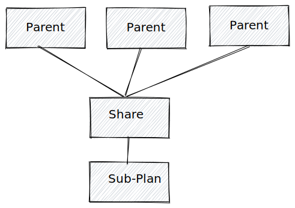
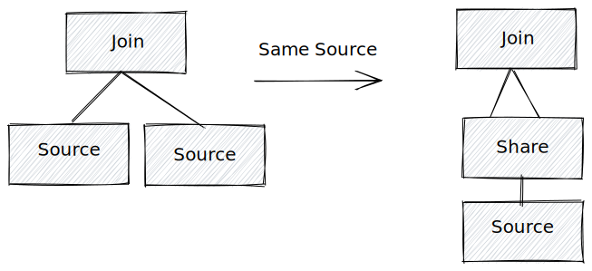
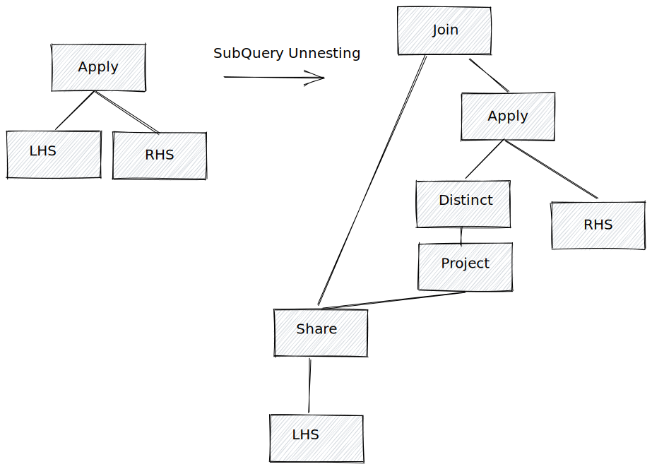

# DAG Structured Query Plan

## Summary

This RFC proposed a way to represent DAG(directed acyclic graphs) structure query plan for optimizer and executor.

## Motivation

Risingwave and many traditional databases use tree structured query plans for optimizer and executor. Tree structured query plan works well in most of scenarios, but not good enough when plan contains common sub-plans or even worse it could result in incorrect result if the same source occurs more than once in streaming processing. So it is useful if we can provide a way to represent the DAG structured query plan in our system. 

Actually, Mv on Mv is a DAG. Users can create multiple mv on the same mv. If you look at the streaming graph, you can find it is actually a DAG! Theoretically users can construct DAG step by step by themselves if they want, but we want to create dag for streaming queries automatically and intelligently. 

Even in the same query statement, there could be lots of chances to create a DAG, e.g. CTE(common table expression) is an ideal place to optimize by DAG. Subquery unnesting is also a good place to be optimized by DAG, if you are familiar with the techniques we use(We will calculate the domain of the apply operator which will create a DAG naturally). Self join is also a common use case.

## Design

The DAG structured query plan can be supported by optimizer and executor independently. If the executor doesn't support DAG, we can always transform the DAG plan back to a tree plan. For example, if our optimizer can generate a DAG plan, but only streaming executor can support DAG execution and batch executor can't. We can convert it back to a tree plan before we send it to the batch executor. In reality I think streaming executor can benefit from DAG plan more than batch executor.

### Optimizer

The simplest way to implement a DAG plan for the optimizer is that we can place an optimization stage at the end of all other stages and try to find out all the common sub-plan and transform it to a DAG plan. It is simple and also adopted by flink. One of the biggest drawbacks of this method is it is hard to find any sub-plans after the prior optimization: column pruning and predicate push down etc.

### Share Operator

In order to represent the DAG plan during the whole optimization time, we can use a `Share` operator to explicitly represent the sub-plan having multiple parents. Why do we need to add an additional operator instead of directly letting its parent point to the sub-plan? Because we have lots of optimizer transformations which will clone and modify the subquery and finally break the DAG plan back to a tree plan. Using a `Share` operator we can tell the optimizer we want to keep the sub-plan unchanged during the optimization.

The `Share` operator contains multiple parents. Each of them wants to push the predicate and prune the columns of it, so we need to merge them instead of directly affecting the sub-plan. We can create a new optimization stage for merging all the predicates pushed down from the parent of the `Share` operator. The merge operation for filters is to `OR` them together. We can merge the required columns from the parents in a similar way. The merge operation for the column pruning is to `UNION` them together.

#### Example
With the `Share` operator we can perform common plan detection at any time of the optimization. I will give some examples:

- CTE. At the binder/planner stage, we can create a `Share` for the table expression and reuse it.
- Subquery unnesting. We can calculate the domain by creating a `Share` operator of the LHS of the apply operator.
- Same source operator appears multiple times in a query. Use Share operator at binder/planner or at end of optimizer are both ok.
- Common sub-plan detection. We can use a field `digest` for each sub-plan and if two sub-plan have the same `digest` it means they are probably the same sub-plan. `digest` is just like a hashcode. We also need to have a `deepEqual` method for each plan to compare with another one.

Last but not least, at the end of the optimization, we might find that the `Share` operator has only one parent. In this case, we can remove the `Share` operator.

#### Cost

The cost of DAG structured plans can be complex if we have a large search space, especially for batch query. Luckily for streaming queries, we don't have a large search space for now and we can always convert the plan to the DAG plan if possible or provide a configuration for users to determine whether to use it or not.

For the batch query, DAG means we need to read the input multiple times which inevitably leads to buffer or materialization. The cost of DAG is determined by how many times it has been read. Normally, the first time has a higher cost than later ones, because of the materialization. It is hard to tell whether to use DAG or not for batch query, I think we can always convert the DAG back to the tree for batch executor.

For the streaming query, it seems not a big deal. We support buffering and dispatch naturally.

### Execution

We only discuss the execution for streaming query here for the reason that batch query needs to do a materialization/buffering which is complicated and hard to tell if DAG plan execution is better or not. `Share` operator has multiple downstream and we can dispatch its data to each downstream just like `ChainNode`.

## Future possibilities

The common plan detection can be used for Mv on Mv scenarios. We can detect the query common sub-plan with the existing mv and reuse the existing mv to construct a new mv.
