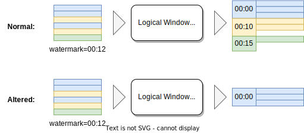

# The Semantics of EMIT ON WINDOW CLOSE

## Motivation

Let’s clarify the problem we are solving with an example. Providing a 1-hour window aggregation, the 2 behaviors below are both sensible:

- **Emit on updates.** The last window is incomplete and contains partial results
- **Emit on window close.** All the output results are complete windows, which also means it could wait for (window_size + watermark_delay) to show a result

This concept doesn’t have consistent terminology yet, but most streaming systems including Spark and Kafka Stream support it natively, while Flink provides several workarounds to archive equivalent results.

Currently, we are going to support

- **Time-window TVF** without early-fire
- **Over Aggregation** i.e. `OVER WINDOW` with `ORDER BY`
- **Deduplication** (N-th event)
- **Session Window**
- **Pattern Recognition**

Therefore, it’s inevitable to make a clear semantic for `emit on window close`.

## Design

Modern streaming systems follow the data model proposed (summarized) by [The Dataflow Model](https://static.googleusercontent.com/media/research.google.com/en//pubs/archive/43864.pdf) paper. The core contribution includes

- A **windowing model** to support unaligned windows on unordered event time
- The **watermark** to deal with unbounded late events
- A **triggering** model to define when (in processing time) to emit the results

However, the dataflow model was defined on programming API. As more and more systems embrace SQL as their user interface, we need a complete definition for streaming SQL, especially for triggering i.e. `emit on window close`.

As we know, SQL is a declarative query language on a **static dataset** aka. relations, based on the theory of relational algebra. SQL has **well-defined** **semantics**, so you can always **determine** the query result semantically and uniquely, no matter using nested-loop join, hash join, or paper and pen.

<aside>
☝ All the occurrences of the word “operator” refer to logical operators since we are talking about semantics rather than implementation.
</aside>

**Definition 1. All events above the watermark from Source constitute the input dataset of Source, denoted as *INPUT* here.**

As most streaming systems did, we assume the watermark must be associated with the source instead of anywhere else.

With this definition, the **static dataset** SQL runs against is now well-defined. In practice, we could place a Materialize Executor right after Source & Watermark Executor to get the ***INPUT*** dataset. 

**Definition 2. For `emit on updates` streaming queries, at any time, the streaming results should be the same as the batch SQL query on *INPUT i.e., Q(INPUT)***

This is the consistency model we have been following since day one.

In theory, **all** queries, including the ones with time-window TVF, over window, or session window, must comply with this rule. That is, they must be able to output a reasonable result set when being evaluated as a batch SQL query.

Of course, sometimes, the cases may not be sensible. For example, pattern recognition functions should operate on a full session, but that is the fault of the aggregation function rather than the SQL operators. OR, some cases may be too expensive, so we disallow users to do that.

**Definition 3. For streaming queries with `emit on window close`, the result set becomes append-only, and it would eventually be consistent with *Q(INPUT)***

This rule is induced by the behavior from Flink, the de-facto standard of streaming SQL, and other well-known systems like Spark Structured Streaming. 

Given definitions 1, 2, and 3, can we assume our streaming SQL has well-defined semantics? The answer is no. Take this simple window aggregation as an example, if ***Q(INPUT)*** is 

```
window_start         count
2022-12-16 00:00     1000
2022-12-16 00:01     1000
2022-12-16 00:02     1000
2022-12-16 00:02     500
```

Then, any subset of ***Q(INPUT)*** could be a legitimate output, like

```
window_start         count
2022-12-16 00:00     1000
2022-12-16 00:01     1000
2022-12-16 00:02     1000
```

```
window_start         count
2022-12-16 00:00     1000
2022-12-16 00:01     1000
```

This inspires us that the triggering condition of window closing must also be well-defined.

**Definition 4. For streaming queries with `emit on window close`, there should be a deterministic trigger condition for those (logical) operators.** 

*To formally define a trigger condition: a function that tells whether a row in **Q(INPUT)** should present in the result set or not, given the current **INPUT**.*

Particularly, the `emit on window close` clause alters the behavior of (logical) operators inside the query. It’s a property of (logical) operators rather than the query. We define it on the query level to make it more understandable to users.



Here are some examples of deterministic trigger conditions.

| Feature | Trigger of window closing |
| --- | --- |
| Time-window TVF  | Watermark > Window’s upper bound |
| Over Aggregation | Watermark > Frame’s upper bound |
| Deduplication | Watermark > Timestamp of N-th event |
| Session Window | Watermark > last_event_time + max_wait |
| Pattern Recognition | Watermark > last_event_time |

Note that the operators’ behaviors are altered for batch queries equivalently. 

- The watermark in batch query can be determined by substituting `MAX(time_column)` into the watermark expression e.g., `MAX(time_column) - interval '5 minutes'`.
- Besides, late events are already filtered out of ***INPUT*** by definition 1.

Therefore, the definition 2 - the streaming results should be the same with ***Q(INPUT)***, also holds for `emit on window close` queries.

**Definition 5. For `emit on window close` streaming queries, at any time, the streaming results should be exactly the same as the SQL query on *INPUT i.e. Q’(INPUT)*, where Q’ is the altered operator of Q under `emit on window close`.**

As a result, we should be able to run an `emit on window close` query with a simple batch SELECT. The result is guaranteed to be exactly the same as the materialized view. Note that this is only in theory; whether to do it depends on the workload is beyond the scope of this document.

## Notes

- As for implementations, our current design seems to be 100% compatible with this proposal. The changes only apply to the semantics (syntax) level.
- According to our definition, the Watermark should **not** be a TVF as proposed in [RFC: The WatermarkFilter and StreamSort operator # Syntax](https://github.com/risingwavelabs/rfcs/blob/005f086e68569bbc054a5eac7d6ff0c20c58a633/rfcs/0002-watermark-filter.md#syntax). Instead, it should be associated with the Source just like Flink.
- By the way, inspired by the structure of Flink’s document, it might be better to consider our features in terms of user-facing features like over aggreagtion, deduplication, window deduplication, etc. rather than SQL syntax. https://github.com/risingwavelabs/rfcs/pull/8

## Discussion

- There may be a better name for `EMIT ON WINDOW CLOSE`. Alternatives: `FINALIZED` (Snowflake), `APPEND ONLY` (Spark SQL), `SUPPRESSED` (Kafka Stream).