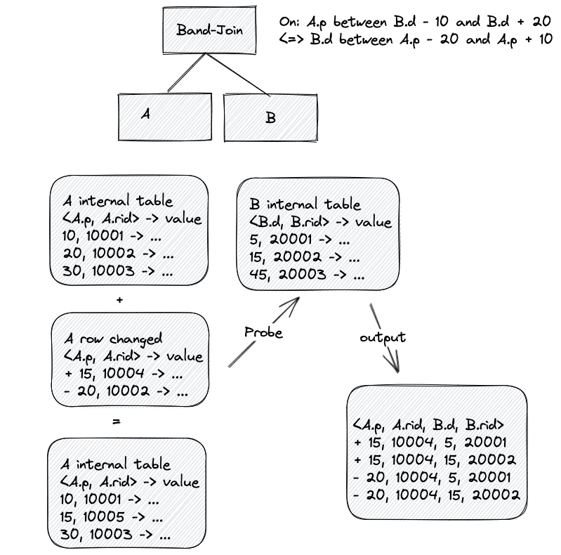

# Band Join

A band join is a special type of non equi join in which key values in one data set must fall within the specified range (“band”) of the second data set. There is another concept, range join which is similar to the band join but more flexible. Unluckily, range join is too general for streaming queries. We can only implement range join for batch queries.

```sql
-- This is a band-join.
select * from A join B on A.p between B.d - 10 and B.d + 20.

-- This is not a band-join, but a range join.
select * from A join B on A.p between B.start and B.end.
```

The band join has a nice property. The range condition of band join only involves 2 columns: one from the LHS the other from RHS, so we can always reverse the condition. For example, `A.p between B.d - 10 and B.d + 20` can be converted into `B.d between A.p - 20 and A.p + 10`. This is a crucial property for streaming queries, as we need to treat both sides of the join logically equivalent (both sides need to be built and probed).


## Motivation

A general nested-loop join in streaming query is known as inefficient join implementation, so we are seeking opportunities to recognize the special case of non equi join and try to implement a efficient join algorithm for it, e.g. dynamic filter which requires the RHS of join to be a scalar row and contains comparison condition. Band join is also one of these cases that we can implement an efficient join for it. I also want to mention that so many database systems have already supported band join in some way e.g. Oracle, Vertica, Duckdb, Umbra, DataBricks, Flink (Interval Join). 

## Design

Band join can contain more than one range condition, generally if it contains k range conditions we call it k dimensions band join. By the way, band join can also contain equal conditions. If the equal conditions of the band join with poor selectivity we can still use `BandJoin` to optimize it, otherwise a `HashJoin` is enough. 

Without loss of generality, we will consider the following query.

```sql
select * from A join B on A.a = B.b and A.p between B.d - 10 and B.d + 20 and A.q between B.e - 5 and B.e + 15.
```

### Streaming



- If we have an equal condition `A.a = B.b` and its selectivity is low, using `HashJoin` is enough.
- If we have an equal condition `A.a = B.b` and its selectivity is high, we can use this condition to distribute the data to acquire parallelism. For `A.p between B.d - 10 and B.d + 20`, we can construct an internal table with order key = `A.a, A.p, A.rid` for A side and order key `B.b, B.d, B.rid` for B side. For `A.q between B.e - 10 and B.e + 20`, we can construct an internal table with order key = `A.a, A.q, A.rid` for A side and order key `B.b, B.e, B.rid` for B side. When a row came from B with (B.b, B.d, B.e) = (100, 200, 300). We can lookup A's internal table row ids with range queries: A between (A.a = 100, A.p = 200 - 10 = 190) and (A.a = 100, A.p = 200 + 20 = 220). Merge the other A's internal table row ids with range queries: A between (A.a = 100, A.q = 300 - 5 = 295) and (A.a = 100, A.p = 200 + 15 = 315). Finally we can intersect the row ids to get the corresponding A matched rows. When a row comes from A, we first need to reverse the range condition as we mentioned before and then do the same logic as for row came from B. Row deleted is basically equivalent to the insertion, but with opposed operators. Update can be handled as delete followed by insert.
- If we don't have equal conditions `A.a = B.b`, we can only use singleton for both input sides or broadcast one side to the other side. The other logic is basically equivalent with the above example without `A.a` and `B.b` as their prefix keys.

As we can see, we need to estimate the selectivity of the equal condition to decide whether to convert the join into a `BandJoin`, for the reason that we have no statistics now, we can provide a join hint or other ways for users to use it or not. If we have no equal condition, we can always turn the join into `BandJoin`.

### Batch

For batch query, it is more flexible to implement the `BandJoin`. We can even support `RangeJoin` rather than `BandJoin`. One of the most elegant ways to implement it is to use kd-tree as an index, for more details you can read the paper of `A scalable and generic approach to range joins`. At least we have nested-loop-join to run the `BandJoin` or `RangeJoin`, despite their inefficiency.


## Unresolved questions

* Parallelize the streaming `BandJoin` if there is no equal condition. Some papers have discussed how to optimize the distributed `BandJoin` by partitioning the input datasets, but it might need a special shuffle algorithm.
* For simplicity, we can only support `InnerJoin` for now.

## Future possibilities

If you are familiar with Flink, we can find that they have interval join which is just a special case of the `BandJoin`. Interval join requires an equal condition and the range condition looks like `b.timestamp ∈ [a.timestamp + lowerBound; a.timestamp + upperBound]`. Interval join also requires the input stream to be append-only and can cooperate with the watermark to prune the old states. We can use `BandJoin` to implement interval join in the future.

## Reference

- Li R, Gatterbauer W, Riedewald M. Near-Optimal Distributed Band-Joins through Recursive Partitioning[C]//Proceedings of the 2020 ACM SIGMOD International Conference on Management of Data. 2020: 2375-2390.
- Reif M, Neumann T. A scalable and generic approach to range joins[J]. Proceedings of the VLDB Endowment, 2022, 15(11): 3018-3030.
- https://www.vertica.com/blog/what-is-a-range-join-and-why-is-it-so-fastba-p223413/
- https://docs.oracle.com/en/database/oracle/oracle-database/19/tgsql/joins.html#GUID-24F34188-110F-4245-9DE7-43954092AFE0
- https://docs.databricks.com/optimizations/range-join.html
- https://nightlies.apache.org/flink/flink-docs-release-1.16/docs/dev/datastream/operators/joining/#interval-join
- 