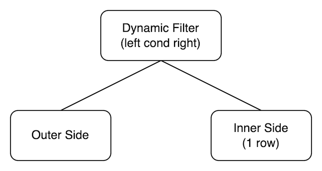
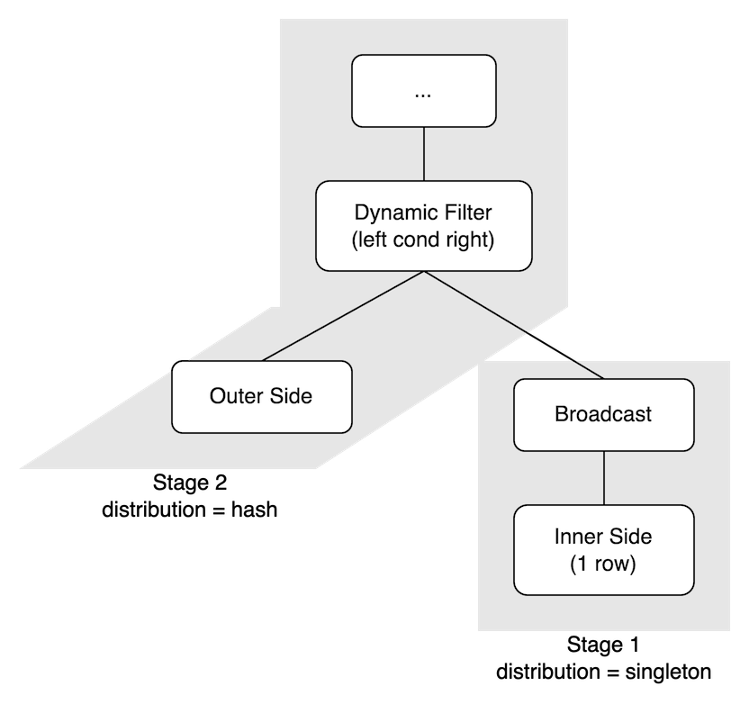
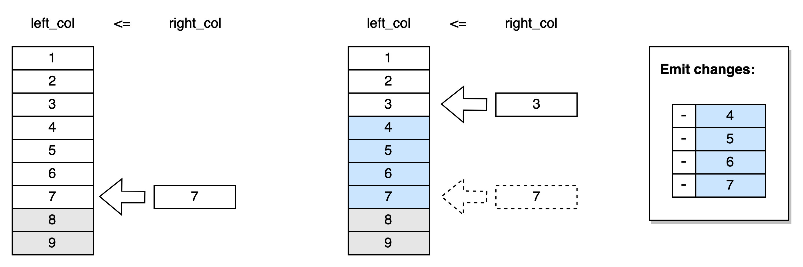

# RFC: Dynamic Filter - A New Streaming Operator

## Background

[Discussion: subquery caused streaming nested-loop join #2655](https://github.com/singularity-data/risingwave/issues/2655)

Currently, TPC-H Q11 and Q22 are not supported in streaming, because their query plans seem to require a nested-loop join operator. The 2 cases are very similar. For example, let’s take a closer look at Q11:

```sql
select ps_partkey, round(sum(ps_supplycost * ps_availqty), 1) as value
from partsupp, supplier, nation
where ps_suppkey = s_suppkey and s_nationkey = n_nationkey and n_name = 'ARGENTINA'
group by ps_partkey
having sum(ps_supplycost * ps_availqty) > (
        select sum(ps_supplycost * ps_availqty) * 0.0001000000
        from partsupp, supplier, nation
        where ps_suppkey = s_suppkey and s_nationkey = n_nationkey and n_name = 'ARGENTINA'
      )
order by value desc;
```

```
LogicalProject { exprs: [$0, $1] }
  LogicalJoin { type: Inner, on: ($2 > $3) } <-- Attention!
    LogicalAgg { group_keys: [0], agg_calls: [sum($1), sum($1)] }
      LogicalProject { exprs: [$0, ($2 * $1)] }
        LogicalJoin { type: Inner, on: ($3 = $4) }
          LogicalProject { exprs: [$0, $2, $3, $5] }
            LogicalJoin { type: Inner, on: ($1 = $4) }
              LogicalScan { table: partsupp, columns: [ps_partkey, ps_suppkey, ps_availqty, ps_supplycost] }
              LogicalScan { table: supplier, columns: [s_suppkey, s_nationkey] }
          LogicalProject { exprs: [$0] }
            LogicalFilter { predicate: ($1 = 'ARGENTINA':Varchar) }
              LogicalScan { table: nation, columns: [n_nationkey, n_name] }
    LogicalProject { exprs: [($0 * 0.0001000000:Decimal)] }
      LogicalAgg { group_keys: [], agg_calls: [sum($0)] }
        LogicalProject { exprs: [($1 * $0)] }
          LogicalJoin { type: Inner, on: ($2 = $3) }
            LogicalProject { exprs: [$1, $2, $4] }
              LogicalJoin { type: Inner, on: ($0 = $3) }
                LogicalScan { table: partsupp, columns: [ps_suppkey, ps_availqty, ps_supplycost] }
                LogicalScan { table: supplier, columns: [s_suppkey, s_nationkey] }
            LogicalProject { exprs: [$0] }
              LogicalFilter { predicate: ($1 = 'ARGENTINA':Varchar) }
                LogicalScan { table: nation, columns: [n_nationkey, n_name] }
```

The highlighted LogicalJoin is very special compared to typical use cases of nested-loop joins.

* **The inner side always contains exactly one row**. In this case, the inner side is generated by a simple aggregation
* **None of the columns from the inner side is required to output**. (Pruned by the Project above.) In another word, this join operator is closer to semi-join instead of inner join.
* **The filter condition** (`$2 > $3`) **can be incrementally evaluated when the inner row changed.** Let’s say, once the inner side (`$3`) is increased from X to Y, instead of going through every outer row, only those rows with `$2` between X and Y need to be deleted/inserted in its result, which could be done efficiently if the materialized state of outer side is ordered by `$2`.

These observations make me rethink of it - maybe nested-loop join is not the best choice?

### Why is nested-loop join very expensive in streaming?

In short, every 1 change could trigger O(n) changes to downstream, where n is the amount of data on one side. For example, assume that the left side contains 1 million rows and the right side contains 10 rows, once a row from the right side is updated, 1 million update events will be triggered to downstream.

More importantly, the nested-loop joins are very rare in the real world, excluding the cases of index nested-loop joins. For the latter one, it’s called LookupJoin in our system.

## Design: Dynamic Filter Operator

We propose a special operator called Dynamic Filter. As its name suggested, its function is like a Filter operator, but the filter condition contains a dynamic variable, which is determined by the inner stream.



The conditions must be `left_col cond right_col` , where `cond` can be one of `==, <>, <, <=, >, >=`. Furthermore, it can be easily extended to multiple conditions like `left_col cond_1 right_col_1 AND left_col cond_2 right_col_2 AND ...`, but for the sake of brevity, we won’t discuss more in this document.

The dynamic filter operator can be parallelized as shown in the right diagram. The inner side is very small to broadcast.



### Implementations

The internal state of left table is ordered by `left_col`. More specifically, the state key is: `left_col + left_pk`. The right table also needs to be persisted, but only one row, so its state key is `[]`.

Imagine the value of `right_col` as a pointer to a position in the internal state. If the `right_col` is updated, slide the point upwards or downwards to a new position, and the **rows passed through** will be emitted downstream.

For example:

1. Initial: left_col = `[1, 2, 3, ..., 9]`, right_col = `7`, cond: `<=`
2. Update right_col from `7` to  `3`
3. The rows between 7 and 3 are emitted, which can be scanned with a reversed iterator



For `==` and `<>` conditions, the rows passed through will not be emitted, but the scan is still necessary to find the right position (i.e. the matched outer row) to point to.

<details>
<summary>
Deprecated: Optimizations for Monotonical Inner Side
</summary>

When the inner side is monotonic, the internal state of the left table can be further trimmed. In the previous example, if we can make sure the `right_col` is monotonically decreasing, the rows higher than it can be dropped.

Note that a monotonic inner input can be derived from an append-only aggregation. For example, a `count()` aggregation with append-only input is guaranteed to be monotonically increasing.

</details>

## Temporal Filter

Materialize supports a feature called “Temporal Filter” https://materialize.com/docs/sql/patterns/temporal-filters/

```
`SELECT count``(*)`` FROM events`
`WHERE insert_ms >= mz_logical_timestamp``()`` - INTERVAL '1 day'`
```

This feature can be easily accomplished with our dynamic filter, with an additional special source to emit an event to update the current timestamp for every epoch.


## Limitations & Advantages

As mentioned in the beginning, compared to nested-loop join, the dynamic filter is limited to these preconditions:

* The inner side always contains exactly one row.
* None of the columns from the inner side is required to output
* The filter condition can be incrementally evaluated when the inner row changed.

Meanwhile, it’s more efficient than nested-loop join, which needs to loop through all outer rows when the inners changed.

On the other hand, there is no conflict: we may still add nested-loop join in the future if necessary.


## Q&A

* ~~Maybe we can make a more general optimization (in the future) that not just apply for the 1 row inner side case. example:https://varada.io/blog/presto/dynamic-filtering-for-highly-selective-join-optimization/~~
* For the left side of dynamic filter, what cache policy should we choose? Also the distribution of dynamic filter operator?
    * The problem looks similar to the 2-phase aggregation problem in streaming. I’ll investigate it later. Roughly speaking, introducing filtering by vnodes can solve this.
* Dynamic filter can only have one parallelism? (Seems Yes) Looks similar to LocalSimpleAgg.

    * This design differs from most of the current executors. Currently, executor doesn’t rely on vnode number to find or scan a key (the vnode filter doesn’t guarantee that only data from the specified vnode will be returned). But now the storage layer will need to support “scan by vnode”, that is to say, specify some vnodes, and scan all data matching that condition.
* So am I right to say that the answer to the above question is “No, we can have > 1 parallelism” and that we can achieve this by encoding the key as `vnode | predicate_col | pk`? (I guess yes, via: [RFC: Take VNode into consideration for Internal State KV ordering](https://singularity-data.quip.com/F1qtAyCCHG5Q)?)
    * And to my understanding, is:
        * the vnode equivalent to a hash of the PK modulo the `MAX_VNODE`
        * a row is assigned to an actor with id equivalent to the vnode’s assigned partition based on consistent hash, where the number of partitions is the equal to the parallelism of the fragment

