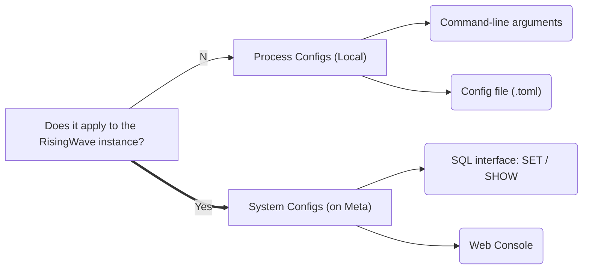

# RFC: System Parameters on Meta

## Motivation

Currently, we have 2 kinds of configurations:

- Command-line arguments
- Configuration file `risingwave.toml`

[Distinguish system config variables and cli options #5676](https://github.com/risingwavelabs/risingwave/issues/5676) clarifies the difference between CLI args and config file:

> Intuitively, *Options* should contain basic user-facing options, e.g., addr & host and maybe some feature gates, while *Config* contains deep-dark internal system variables to fine-tune the system performance.

However, this is not a complete solution because

1. **`risingwave.toml` is a local file**, which makes it possible that multiple nodes could see different parameters and this is absolutely unacceptable. For example, if some nodes use `data_directory = 'hummock_001'` and others use `data_directory = 'hummock_002'`, the stored data will be corrupted.
2. **Unable to `SET` a config after the process started**. Even if changes are written to disk, new nodes still miss these changes.

This proposal will continue to improve the configuration mechanism but also repudiate the design of #5676.

Previously I think this might not be an urgent issue until I realized that our Cloud platform couples tightly with more and more configurations. The later we commence, the heavier burden it will become. 

## Design



### System Configs

What we need is a centralized source-of-truth of cluster configurations. Obviously, the best choice for RisingWave is the Meta Service and the underlying etcd. 

Here we could borrow the syntax from Postgres:

```sql
-- Set or reset a parameter
ALTER SYSTEM / DATABASE SET parameter TO value / 'value' / DEFAULT;

-- List all parameters keys & values
SHOW PARAMETERS;
```

> NOTE: PG uses `SHOW ALL` because it doesn't has other `SHOW` commands like us. Which one is better?


See also: 

- [PostgreSQL: Documentation: 15: ALTER SYSTEM](https://www.postgresql.org/docs/current/sql-altersystem.html)
- [PostgreSQL: Documentation: 15: 20.1. Setting Parameters](https://www.postgresql.org/docs/current/config-setting.html)
- [PostgreSQL: Documentation: 15: SHOW](https://www.postgresql.org/docs/current/sql-show.html)

Similar to other system metadata e.g. catalog,

- Changes to global parameters should be propagated to all nodes, in the cluster in a deterministic order ideally
- When a node reboots or recovers, the latest snapshot of parameters should be passed from Meta Service.

Therefore, the Notification Service seems to fit the scene well.

### Process-level Configs

Given the existance of System Config, how to design the machine/process-level CLI options and config file? We propose to **unify** them because local parameters are still too many to be written as CLI options. (See [example.toml](https://github.com/risingwavelabs/risingwave/blob/main/src/config/example.toml)) 

This pattern is widely adopted in many databases and even other applications. For example, TiDB considers configuration file as a superset of CLI options:

> The TiDB configuration file supports more options than command-line parameters. You can download the default configuration file `[config.toml.example](https://github.com/pingcap/tidb/blob/master/config/config.toml.example)` and rename it to `config.toml`. This document describes only the options that are not involved in [command line options](https://docs.pingcap.com/tidb/stable/command-line-flags-for-tidb-configuration).
>
> 🔗 [TiDB Configuration File | PingCAP Docs](https://docs.pingcap.com/tidb/stable/tidb-configuration-file)

In RisingWave it will be like

```toml
# risingwave.toml
[server]
total_memory_bytes = 1073741824
parallelism = 4
[storage]
shared_buffer_capacity_mb = 4096
sstable_size_mb = 256
block_size_kb = 1024
```

```bash
# Override total_memory_bytes as 2GB
./risingwave compute-node --total-memory-bytes=2147483648
```


### Mutability

- Process configs must be **immutable**, because there is no user-interface to change it.
- Global configs might be **immutable or mutable**, the mutable ones can be further divided into take effect immediately or need reboot.
    - **Immutable** e.g. `data_directory` should be rejected upon SET
    - **Mutable & need reboot** e.g. `heartbeat_interval_ms`
    - **Mutable & immediately** e.g. `batch_chunk_size`

### Style

- Process configs follow the style of TOML (lower-case, underscore) and ordinary CLI arguments (lower-case, hyphen)
- Global configs should be flatten unlike TOML. Consider add a prefix e.g. `stream_foo`, `batch_foo` if it seems ambiguous.
- Dangerous configs should be named with keyword `developer` or `unsafe` as a warning.

