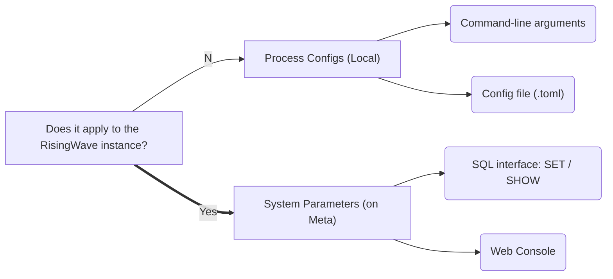

# RFC: System Parameters

## Motivation

Currently, we have 3 kinds of configurations:

- Command-line arguments
- Configuration file `risingwave.toml`
- Session parameters

These can not meet the requirements for several reasons.

1. **Consistency**. `risingwave.toml` is a local file, which makes it possible that multiple nodes could see different parameters and this is absolutely unacceptable. For example, if some nodes use `data_directory = 'hummock_001'` and others use `data_directory = 'hummock_002'`, the stored data will be corrupted.
2. **Mutability**. Users are unable to `SET` a config after the process started. The root cause is still the local file - changes of configs must be persisted in some cluster-level storage.

This RFC proposes to introduce centralized configurations on Meta Service and data will be persisted in etcd.

For the sake of clarity, in this doc, we will use the word "parameters" for system and session parameters, and "config" for command-line arguments or config files.

**Note:** Previously I think this might not be an urgent issue until I realized that our Cloud platform couples tightly with more and more configurations. The later we commence, the heavier burden it will become. 

## Design



### System Parameters

What we need is a centralized source-of-truth of cluster configurations. Obviously, the best choice for RisingWave is the Meta Service and the underlying etcd. 

Here we could borrow the syntax from Postgres:

```sql
-- Set or reset a parameter
ALTER SYSTEM / DATABASE SET parameter TO value / 'value' / DEFAULT;

-- List all parameters keys & values
SHOW PARAMETERS;
```

> NOTE: PG uses `SHOW ALL` because it doesn't has other `SHOW` commands like us. Which one is better?


References:

- [PostgreSQL: Documentation: 15: ALTER SYSTEM](https://www.postgresql.org/docs/current/sql-altersystem.html)
- [PostgreSQL: Documentation: 15: 20.1. Setting Parameters](https://www.postgresql.org/docs/current/config-setting.html)
- [PostgreSQL: Documentation: 15: SHOW](https://www.postgresql.org/docs/current/sql-show.html)

Similar to other system metadata e.g. catalog,

- Changes to global parameters should be propagated to all nodes, in the cluster in a deterministic order ideally
- When a node reboots or recovers, the latest snapshot of parameters should be passed from Meta Service.

Therefore, the Notification Service seems to fit the scene well.

### Session Parameters

PostgreSQL allows users to set parameters for the current session as well.

```sql
SET parameter TO value / 'value' / DEFAULT;
```

References:

- [PostgreSQL: Documentation: 15: 20.1. Setting Parameters](https://www.postgresql.org/docs/current/config-setting.html)

Previously, we had already introduced [session parameters in RisingWave](https://github.com/risingwavelabs/risingwave/blob/53f7e0db772ac7e51773791bb8301624ed763ae8/src/common/src/session_config/mod.rs#L265). Some of them can also be system parameters like `batch_enable_sort_agg` or `query_mode`. Postgres enforces that session parameters must also be system paramters, we can follow this rule as well.

### Process Configs

Let's rethink the current design of CLI options and config files. ([#5676](https://github.com/risingwavelabs/risingwave/issues/5676)) Given the existence of system parameters, some existing parameters may need to be moved to system parameters, like `data_directory` as mentioned before.

We propose to **treat** CLI options as a way to override config files, as a result, the items in CLI options are a subset of the config file. The reasons for this include

- All configs are still too many to be written as CLI options. (See [example.toml](https://github.com/risingwavelabs/risingwave/blob/main/src/config/example.toml)) 
- While CLI configs are handy to set some frequently-used options like endpoint and memory.

This pattern is widely adopted in many databases and even other applications. For example, TiDB considers configuration file as a superset of CLI options:

> The TiDB configuration file supports more options than command-line parameters. You can download the default configuration file [config.toml.example](https://github.com/pingcap/tidb/blob/master/config/config.toml.example) and rename it to `config.toml`. This document describes only the options that are not involved in [command line options](https://docs.pingcap.com/tidb/stable/command-line-flags-for-tidb-configuration).
>
> Ref. [TiDB Configuration File | PingCAP Docs](https://docs.pingcap.com/tidb/stable/tidb-configuration-file)

In RisingWave it will be like

```toml
# risingwave.toml
[server]
total_memory_bytes = 1073741824
parallelism = 4
[storage]
shared_buffer_capacity_mb = 4096
sstable_size_mb = 256
block_size_kb = 1024
```

```bash
# Override total_memory_bytes as 2GB
./risingwave compute-node --total-memory-bytes=2147483648
```

### Mutability

- Process configs must be **immutable**, because there is no user-interface to change it.
- Global configs might be **immutable or mutable**, the mutable ones can be further divided into take effect immediately or need reboot.
    - **Immutable** e.g. `data_directory` should be rejected upon SET
    - **Mutable & need reboot** e.g. `heartbeat_interval_ms`
    - **Mutable & immediately** e.g. `batch_chunk_size`

### Style

- Process configs follow the style of TOML (lower-case, underscore) and ordinary CLI arguments (lower-case, hyphen)
- Global configs should be flatten unlike TOML. Consider add a prefix e.g. `stream_foo`, `batch_foo` if it seems ambiguous.
- Dangerous configs should be named with keyword `developer` or `unsafe` as a warning.

