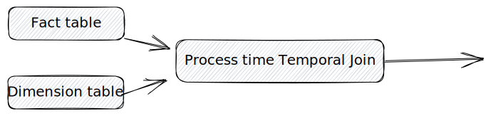
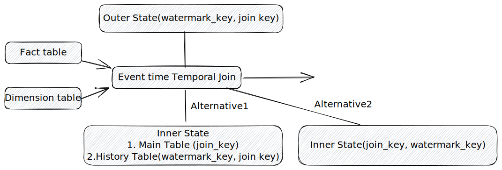

# Temporal Join

A temporal join is used to join a stream (the outer side) against a versioned table (the inner side). Unlike the regular stream join, the temporal join keeps using the outer side to lookup the inner side and any changes to the inner side would not affect the previous output; therefore, the temporal join is driven by the outer side only.

## Motivation

Lots of production scenarios contain a fact table and several dimension tables. Users want to enrich their fact table with dimension tables. Enrichment doesn't need to affect the previous join output results despite the changes on the dimension table side. To meet this requirement, we need a new kind of stream join, the temporal join. Let's assume the fact table side is an append-only stream and the dimension table side is a versioned table backed by a CDC (e.g. Debezium). The basic join process is every row coming from the outer (fact table) side needs to be joined with a snapshot/version of the inner (dimension table) side. The snapshot is determined by the outer row's time/watermark related column or process time. As a result, we can continuously enrich the fact table with a versioned dimension table.

## Design

There are two types of temporal join. The first one is the process time temporal join and the second one is event time temporal join. Both of them require the outer side to be append-only and the inner side's primary key contained in the equivalence condition of the temporal join condition. The reason for the append-only outer side is that if the outer side is retractable, the previous `insert` output row will be unmatched with the later `delete` one, because the snapshot of the inner side of these two might differ. The reason why the primary key of the inner side needs to be contained in the equivalence condition of the temporal join condition is that, we are trying to enrich the outer side, but we don't want to duplicate them.


## Process time temporal join



Let's get started with the simpler one, the process time temporal join. The process time temporal join always joins the outer side with the latest snapshot of the inner side. The syntax looks like that `SELECT * FROM A LEFT JOIN B FOR SYSTEM_TIME AS OF NOW() ON A.col = B.id`. `FOR SYSTEM_TIME AS OF` is from the SQL:2011 standard. `NOW()` is used to express that we want to look up the latest snapshot of the inner side. It is different from Flink syntax of the process time temporal join (`SELECT * FROM A, LATERAL TABLE(B(a.proctime)) WHERE a.col = b.id`, where `proctime` is the process time attribute for A). Flink has a time attribute to express process time and uses `temporal table function` and lateral join.

> Note The reason why the FOR SYSTEM_TIME AS OF syntax used in temporal join with latest version of any table/view is not support is only the semantic consideration, because the join processing for left stream doesn’t wait for the complete snapshot of temporal table, this may mislead users in production environment. The processing-time temporal join by temporal table function also exists same semantic problem, but it has been alive for a long time, thus we support it from the perspective of compatibility.

> Flink time attribute
```sql
CREATE TABLE user_actions (
  user_name STRING,
  data STRING,
  user_action_time TIMESTAMP(3),
  -- declare user_action_time as event time attribute and use 5 seconds delayed watermark strategy
  WATERMARK FOR user_action_time AS user_action_time - INTERVAL '5' SECOND
) WITH (
  ...
);

CREATE TABLE user_actions (
  user_name STRING,
  data STRING,
  user_action_time AS PROCTIME() -- declare an additional field as a processing time attribute
) WITH (
  ...
);
```

As we finish the syntax part, let's dive deep to the implementation. We want to support process time temporal join as a stateless operator. In order to achieve this, first we need to materialize the dimension table as a table with a connector which is already supported by our system and users can meet this requirement easily. Second, we need to schedule the process time temporal join operator together with the dimension table which is similar to the way we schedule the batch lookup join, the chain operator and delta join. More specifically, the process time temporal join operator requires consistent hash shuffle for its outer side input stream and no shuffle for the inner side input stream. Finally, each outer side row can lookup the inner side table locally. No state exists! One more thing need to be discussed is which snapshot of the inner side needs to be accessed? We can lookup the current epoch version which is the same as the regular join but it needs to buffer data. Or we can just look up the previous epoch which is fresh enough and do not need to buffer anymore.

## Event time temporal join



The event time temporal join is far more complicated than the process time temporal join. It requires watermark and maintaining states for both input sides. The syntax looks like that `SELECT * FROM A LEFT JOIN B FOR SYSTEM_TIME AS OF A.even_time ON A.col = B.id`, where `event_time` is the watermark column of the table `A`. This SQL means for each row from table A, it will lookup the snapshot of table B based on its `even_time`. In order to find the exact snapshot of table B, table B (the inner side) also needs to have a watermark column. Only in this way we can make sure table A will not join a stale snapshot of table B. The reason why both sides need state is that both sides need to store rows beyond the current watermark. The reason why the outer side needs a watermark is that it can use it to keep its state small.

Let's go through an example.

Assuming the watermark is an integer and all rows have the same join key.

```
 // Both m and n of WaterMark[n] and Row[m] are event time.
 // +Row stands for insert and -Row stands for delete.
 // Only watermark message will trigger EventTimeTemporalJoin to perform join
 // When both WaterMark[10] and WaterMark[8] are received we can make sure Row[5] can join Row[2]
 // and no stale read, meanwhile, Row[7] will see no data because of -Row[6].
 WaterMark[10] -> +Row[7] -> +Row[5] -> WaterMark[1] -> outer side \
                                                       EventTimeTemporalJoin 
 WaterMark[8] -> -Row[6] -> +Row[2] -> WaterMark[1] -> inner side  /

 // Output
 EventTimeTemporalJoin -> WaterMark[7] -> JoinedRow(+Row[7], Null) -> JoinedRow(+Row[5], +Row[2])
```

### State Cleaning

The outer side will clean up its state's outdated data (which is behind current watermark). The inner side will clean up its outdated data too, but keep at least one row for each primary key. We need to decide the state's primary key between the join key before the watermark key or watermark key before the join key. 

#### The Outer Side

For the outer side, it is better to use the watermark key before the join key, because each time the join watermark increases, we need to join all rows between the previous watermark and current watermark. Moreover, using the watermark key before the join key is helpful to clean up the outer side's state.


#### The Inner Side

If the watermark between both sides will not vary too much so that we can clean up the state quickly and unprocessed input messages will be small enough to be kept in the memory buffer. Use the watermark key before the join key as the state primary key is better.

As we need to keep at least one row for each primary key, it is more appropriate to maintain two states: the main table and the history table. The main table always stores the latest version of records and its primary key is the join key. The history table stores the other versions of records and its primary key is the watermark key before the join key. In this way we can clean up the state quickly (only scan the history table) and keep at least one row for each primary key.

Otherwise, if there is too much data on the inner side, Use the join key before the watermark key as the state primary key is better. In this way, we can just maintain one state and use the memory as a cache. A state cleaning is performed along with access to the inner side table at the same time.

Considering how to handle watermarks for `Mv on Mv`, it needs to consume all the snapshot data of the upstream mv before producing watermarks. The data size could be huge, so using the join key before the watermark key as the state primary key may be better.

## References
- [Flink Temporal Join](https://nightlies.apache.org/flink/flink-docs-master/docs/dev/table/sql/queries/joins/#temporal-joins)