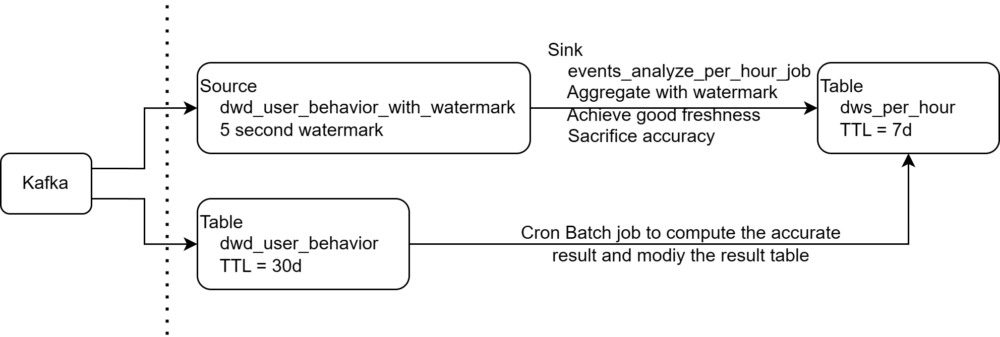
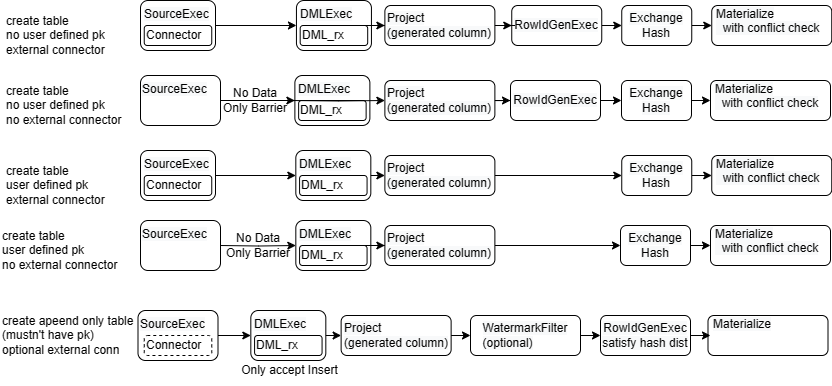
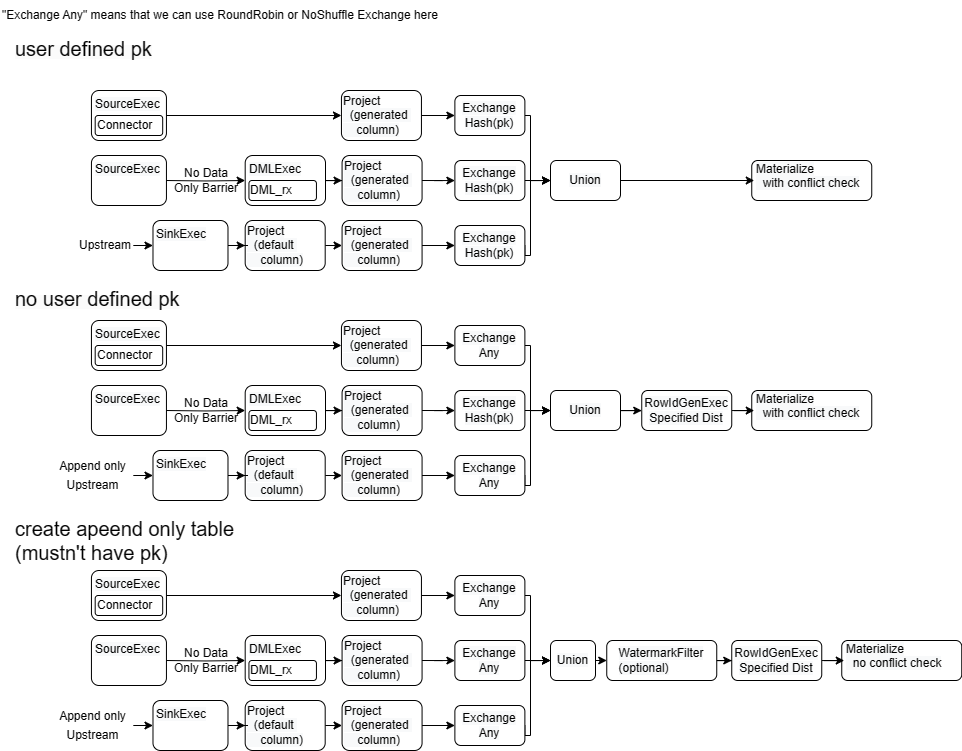

# Create Sink into Table

## Background && Summary

Currently, RisingWave use two ways to create a streaming job. They both construct a streaming job to maintain the changes of the streaming query's result continually. But it 
- `CREATE MATERIALIZED VIEW`.
  - Materialize the result as a RW's table and apply the changes on it.
  - The table is coupled with the streaming job. They trust some property of each other.
    - The streaming job is the only changes source of the table. No other changes such as DML is allowed on this table.
    - The table's PK and other constraint is inferred by the streaming query's own property. They trust each other and do not need additional check.
    - The result table is in the same global checkpoint with the upstream table. So the changes are applied exactly-once naturally. 
- `CREATE SINK`
  - Apply the changes into an external system's table(such as MySQL).
  - The table in the external storage and the streaming job in RW do not trust any assumption each other.
    - The user can do DML on the external in the storage. The can create multiple sink into the same table too.
    - The table's PK and other constraint is maintained by the external storage. 
    - The RW's streaming execution need additional 2pc mechanism with external storage to achieve exactly-once.

This RFC give a new SQL grammar `CREATE SINK sink_name TO table_name AS SELECT ...` to create streaming job and apply its changes into a RW's table, which decouples the streaming job and the result table.
- It's changes events behavior is same with other external sinks.
- When table's constraint is violated by the changes, the behavior should be determined by the RW's table. Specifically, it can be defined by ON CONFLICT clause ([RFC: on conflict clause](https://github.com/risingwavelabs/rfcs/pull/48)). 
- align the barrier and epoch with upstream, satisfying exactly-once and snapshot isolation with upstream.

Also, the `ALTER MATERIALIZED VIEW [mv_table] TO TABLE` is used for transforming an existent MV to a table and a Sink to the table. 
## Motivation
There are some use cases.

### Multiple data streams into a single table
Required by some of our Poc users.

In wide table model, the table's field of one row could be from multiple sources. Traditional data warehouse or ETL uses multi tables join according to the primary. But the streaming join brings issues such as low efficiency and large memory consumption. So some people do it by the result table's partial update feature. https://docs.starrocks.io/en-us/latest/loading/Load_to_Primary_Key_tables#partial-updates

```SQL 
CREATE SOURCE dwd_click_events (
    user VARCHAR,
    product VARCHAR,
    event_time TIMESTAMP
) WITH (
    'connector.type' = 'kafka',
		...
);

CREATE TABLE dwd_orders (
    user VARCHAR,
    product VARCHAR,
    price BIGINT,
    event_time TIMESTAMP,
) WITH (
    'connector.type' = 'kafka',
		...
);

CREATE TABLE dws_product_per_hour (
  hour TIMESTAMP,
  product VARCHAR,
  click_cnt BIGINT,
  sell_cnt BIGINT,
  PRIMARY KEY (hour, product)
) WITH (
  'ttl' = '7d'
) ON CONFLICT PARTIAL UPDATE;

CREATE SINK click_production_analyze_per_hour_job INTO dws_product_per_hour AS 
SELECT 
  window_start,
  product,
  COUNT(*),
  NULL as sell_cnt
FROM TUMBLE(dwd_click_events, event_time, INTERVAL '1' HOUR)
GROUP BY window_start, product;

CREATE SINK order_production_analyze_per_hour_job INTO dws_product_per_hour AS 
SELECT 
  window_start,
  product,
  NULL as click_cnt,
  COUNT(*)
FROM TUMBLE(dwd_orders, order_time, INTERVAL '1' HOUR)
GROUP BY window_start, product;
```

### provide user more control over the result table
- Do DML on it and do modifications
- define Primary key and on conflict behavior
- define a TTL on the table
  - But it will introduce wrong check pk behavior and give the downstream an illegal changes stream 


```SQL 
-- append-only event source with watermark
CREATE SOURCE dwd_user_behavior_with_watermark (
    user VARCHAR,
    product VARCHAR,
    price BIGINT,
    event_time TIMESTAMP,
    behavior VARCHAR,
    WATERMARK FOR event_time AS event_time - INTERVAL '5' SECOND
) WITH (
    'connector.type' = 'kafka',
		...
);

-- the detailed events table which considered as the source of the truth
CREATE TABLE dwd_user_behavior (
    user VARCHAR,
    product VARCHAR,
    price BIGINT,
    event_time TIMESTAMP,
    behavior VARCHAR)
WITH (
    'connector.type' = 'kafka',
    'ttl' = '30d'
		...
);

CREATE TABLE dws_per_hour (
  hour TIMESTAMP PRIMARY KEY,
  buy_cnt BIGINT,
  sell_cnt BIGINT)
WITH (
  'ttl' = '7d'
);

-- the real-time aggregation per hour. 
-- the recent result might not be accurate because of the watermark and will be corrected by dml later
CREATE SINK events_analyze_per_hour_job INTO dws_per_hour AS 
SELECT 
  window_start,
  COUNT(*) filter(where behavior = 'buy'), 
  COUNT(*) filter(where behavior = 'sell'),   
FROM TUMBLE(dwd_user_behavior_with_watermark, event_time, INTERVAL '1' HOUR)
GROUP BY window_start;

-- a cron job to correct the table dwd_user_buy_events's result
INSERT INTO dws_per_hour
SELECT 
  window_start,
  COUNT(*) filter(where behavior = 'buy'), 
  COUNT(*) filter(where behavior = 'sell'),   
FROM TUMBLE(dwd_user_behavior_with_watermark, event_time, INTERVAL '1' HOUR)
WHERE DAY(event_time) = '${1-days-ago}'
GROUP BY window_start;
```

### SQL evolution
After decoupling the sink and the table. Users have chance to change the sink's SQL by drop the old sink and rebuild the new sink to the table. In that case, the table's downstream will not be affected. 
But RW can not give consistent guarantee, so user must give additional declaration in SQL.

I summarize two patterns here
- Backfill: If user have all historical data in the upstream table, he can drop the old the create the new sink to the table
  - 👍 Easy to understand. No more SQL rewritten
  - 👍 eventually consistency
  - 👎 The result table and all its down stream mv's version will rollback and seems a stale read for user.
  - 👎 Long time to backfill and re-compute all the data.
  - 👎 In some cases, user can not get all upstream historical data such as a kafka source with TTL.  
- Apply delta: User can determine a timestamp of event time to determine use the old sink or the new sink to update the result table.
  - 👍 No result rollback
  - 👍 Incremental computation
  - 👎 Limited with event time column in the result table.
  - 👎 Might be complex for user to write on conflict.

Examples :
1. This is a Backfill case but user define a proper on conflict behavior with the monotonically increasing `order_cnt` to prevent data rollback. 
```SQL
  CREATE TABLE dwd_orders (
    user VARCHAR,
    product VARCHAR,
    price BIGINT,
    event_time TIMESTAMP,
) APPEND ONLY;

CREATE TABLE dws_product (
  product VARCHAR,
  order_cnt BIGINT,
  PRIMARY KEY (product)
) WITH (
  'ttl' = '7d'
  -- only update when the new incoming row's order_cnt is larger than the old order_cnt
) ON CONFLICT DO UPDATE SET (product, order_cnt) = (
      CASE WHEN EXCLUDED.order_cnt IS NOT NULL AND EXCLUDED.order_cnt > order_cnt 
        THEN EXCLUDED.product ELSE product 
      END,
      CASE WHEN EXCLUDED.order_cnt IS NOT NULL AND EXCLUDED.order_cnt > order_cnt 
        THEN EXCLUDED.order_cnt, order_cnt ELSE order_cnt 
      END)

CREATE SINK order_production_analyze_job INTO dws_product AS 
SELECT 
  window_start,
  product,
  COUNT(*) as order_cnt,
FROM dwd_orders
GROUP BY product
WITH (
  -- because the table's on- conflict behavior can only applied on the “INSERT” conflict，so we need use force append-only sink here.
  force_append_only = 'true'
);

-- when the user want to add an new aggregator
ALTER TABLE dws_product ADD sell_sum BIGINT ON CONFLICT DO UPDATE SET 
  sell_cnt = CASE WHEN EXCLUDED.order_cnt IS NOT NULL AND EXCLUDED.order_cnt > order_cnt 
                  THEN EXCLUDED.sell_sum ELSE sell_sum 
             END;
CREATE SINK new_order_production_analyze_job INTO dws_product AS 
SELECT 
  window_start,
  product,
  COUNT(*) as order_cnt,
  sum(price) as sell_sum,
FROM dwd_orders
GROUP BY window_start, product
WITH (
  force_append_only = 'true'
);

-- when the new job catch up
DROP SINK order_production_analyze_job;
ALTER SINK new_order_production_analyze_job RENAME TO order_production_analyze_job;
```

2. Apply delta

```SQL
  CREATE TABLE dwd_orders (
    user VARCHAR,
    product VARCHAR,
    price BIGINT,
    event_time TIMESTAMP,
) WITH (
    'connector.type' = 'kafka',
		...
);

CREATE TABLE dws_product_per_hour (
  hour TIMESTAMP,
  product VARCHAR,
  order_cnt BIGINT,
  PRIMARY KEY (hour, product)
) WITH (
  'ttl' = '7d'
) ON CONFLICT DO UPSERT;

CREATE SINK order_production_analyze_per_hour_job INTO dws_product_per_hour AS 
SELECT 
  window_start,
  product,
  COUNT(*) as order_cnt,
FROM TUMBLE(dwd_orders, order_time, INTERVAL '1' HOUR)
GROUP BY window_start, product
WITH (
  -- because the table's on- conflict behavior can only applied on the “INSERT” conflict，so we need use force append-only sink here.
  force_append_only = 'true'
);

ALTER TABLE dws_product ADD sell_sum BIGINT;
ALTER TABLE dws_product_per_hour ADD column sql_version int default 0;

-- This case is very similar to some AP system's conditional-updates behavior. https://docs.starrocks.io/en-us/latest/loading/Load_to_Primary_Key_tables#conditional-updates
ALTER TABLE ON CONFLICT DO UPDATE 
  SET (hour, product, order_cnt, sell_sum, sql_version) = (
    CASE WHEN EXCLUDED.sql_version = 0 AND hour < '2020-10-10 00:00:00' 
        THEN (EXCLUDED.hour,EXCLUDED.product,EXCLUDED.order_cnt,EXCLUDED.sell_sum,EXCLUDED.sql_version)
      WHEN EXCLUDED.sql_version = 1 AND hour >= '2020-10-10 00:00:00'
        THEN (EXCLUDED.hour,EXCLUDED.product,EXCLUDED.order_cnt,EXCLUDED.sell_sum,EXCLUDED.sql_version)
      -- do not update
      ELSE (hour, product, order_cnt, sell_sum, sql_version) 
    END)

CREATE SINK new_order_production_analyze_per_hour_job INTO dws_product_per_hour AS 
SELECT 
  window_start,
  product,
  COUNT(*) as order_cnt,
  sum(price) as sell_sum,
  1 as sql_version,
FROM TUMBLE(dwd_orders, order_time, INTERVAL '1' HOUR)
-- omit unnecessary historical data
WHERE window_start >= '2010-10-10 00:00:00'
GROUP BY window_start, product
WITH (
  force_append_only = 'true'
);

-- when the new job catch up
DROP SINK order_production_analyze_per_hour_job;
ALTER SINK new_order_production_analyze_per_hour_job RENAME TO order_production_analyze_per_hour_job;
```
In fact the complex ON CONFLICT behavior and the `sql_version` column are just because we can not add a filter condition on the exist streaming job, It can be replaced by "alter mv" feature too.

```SQL
ALTER TABLE dws_product ADD sell_sum BIGINT;
ALTER SINK order_production_analyze_per_hour_job AS SELECT 
  window_start,
  product,
  COUNT(*) as order_cnt
FROM TUMBLE(dwd_orders, order_time, INTERVAL '1' HOUR)
GROUP BY window_start, product
WHERE window_start < '2010-10-10 00:00:00'
WITH (
  -- because the table's on- conflict behavior can only applied on the “INSERT” conflict，so we need use force append-only sink here.
  force_append_only = 'true'
);

CREATE SINK new_order_production_analyze_per_hour_job INTO dws_product_per_hour AS 
SELECT 
  window_start,
  product,
  COUNT(*) as order_cnt,
  sum(price) as sell_sum
FROM TUMBLE(dwd_orders, order_time, INTERVAL '1' HOUR)
WHERE window_start >= '2010-10-10 00:00:00'
GROUP BY window_start, product
WITH (
  force_append_only = 'true'
);
```

## Syntax, semantics and behaviors

### create sink into table

```SQL
  CREATE SINK sink_name INTO table_name [( column_name [, ...])] AS select_query
```
All the behavior is the same with a sink into an external table with a connector. The number of the column_names should be the same with the number of the columns of the sink's schema. If the column names are not specified, the tables full schema(all not hidden columns).

For the table with pk, all the pk columns should be determined the sink's schema. And for the table without pk, the sink must be append-only.

A circular streaming plan is forbidden, with `dependent_relations` we can easily do it.

### create table as 

Additionally, we may introduce a `CREATE TABLE AS` syntax, which can be considered as a sugar of `CREATE TABLE (...)` and `CREATE SINK INTO` combined together. This syntax is also adopted by [Flink SQL](https://cwiki.apache.org/confluence/pages/viewpage.action?pageId=199541185) and [ksqlDB](https://docs.ksqldb.io/en/latest/developer-guide/ksqldb-reference/create-table-as-select/).

```sql
CREATE TABLE table_name AS select_query
```

### alter mv to table

To make it more usable for users, I would like to introduce another function to alter an exiting materialzied view to a table.

```sql
ALTER MATERIALIZED VIEW mv_table TO TABLE
```

This is because now we still recommend `create materialized view` at the first place instead of `create table as`. However, application developers are facing changes all the time, so it's very likely that they may realize they need to 'alter' an existing materialized view. Meanwhile, the strong consistency gurantee of MV prevents us to do any altering. With the help of `ALTER MATERIALIZED VIEW TO TABLE`, users can choose to break this consistency gurantee and alter their streaming pipelines.

Currently, we can just support it with limitation that the mv's primary key can not be hidden column, we will discuss why in the "implementation" phrase.

The statement requires **Allow a sink and a table have the same name**. It is ok in our system because the sink will never appear in the FROM clause. An alternative is that we can add a `_sink` suffix on the sink's name.

### Implementation

Thanks for @BugenZhao and @shanicky's offline discussion.
#### CREATE SINK into TABLE

Currently, the table's plan is shown as the graph. In brief, the table's data can comes from the external source or BatchDML. And the DMLExec is used here as a side input. .

The `create sink to table` introduces more data sources for the table. And now RW has implemented stream Union executor and RowIdGen with specified distribution. So we can support it more clearly with these new features.


Here are some Q&A for the details of the graph
- What's the difference between "append only table" and "table without pk"?
  - The only difference is that if Update/delte on the table is allowed. which make the non-append only table without pk
    - not append only, so the watermark is not allowed on it.
    - the DML changes must be hash shuffled to the materialize fragment.
    - the materialize must handle pk conflict for the DML changes.
  - maybe we will support alter table between append only and non-append only in future.  
- Why do we need blackhole SinkExecutor here? 
  - we have some special logic in the sink executor such as `force-append-only` and special compaction when the down stream's pk does not contain stream key, we can reuse these logic in SinkExecutor to maintain the same behvaior with other kind of sinks.
- "Exchange Any"
  - It appears on the append only stream whose row_id column has not been generated. So any uniform shuffle strategy is ok here. 
- Why not move the ProjectExec for the generated column on the Materialize's fragment?
  - when there is a user defined pk on the table. The pk might contains generated column, which will be used to shuffle. So it must be generated before the exchange executor.
  - when there is no pk, we can move it on the MaterializeExecutor's fragment. But I prefer make it consistent with the case having pk.
- Default column Project
  - For the Insert statement, the default column is handled in the batchInsert executor. To achieve the same behavior for the create sink into table, we must handle it between the sink and the materialize executor.

#### Alter MV to Table
We The mv's primary key can not be hidden column. In that way, we can modify the plan to a `create table` and a `create sink to table` plan.

When the mv's primary key is a hidden column. It is difficult to alter it to a table because its pk can not be generated by RowIdgen. In other word, for a newly inserted record we do not know how to assign pk for it. What we can try in the future is alter the append only mv with hidden primary key. Because it is append only we can just use RowIdGen to generate its primary key when creating the mv.

The catalog changes 
1. the sink and the table's streaming plan should be independent and in different `table fragments`
2. the `definition` of the table should be the SQL that "create table"

#### Schema Change
When schema change happens, RW will wait for all existing dml to finish. But the sink into table actually means a endless dml task. So we need define behavior here.
When adding a column, all sinks to this table should be changed. The `Project` operator handling default value should be changed to add the new columns's default value.
When dropping a column, all sinks to this table should be checked if there is a sink try to update the column, or the request should be reject. Similarly with adding column, the changes happens on the `Project` operator too.
