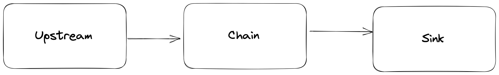
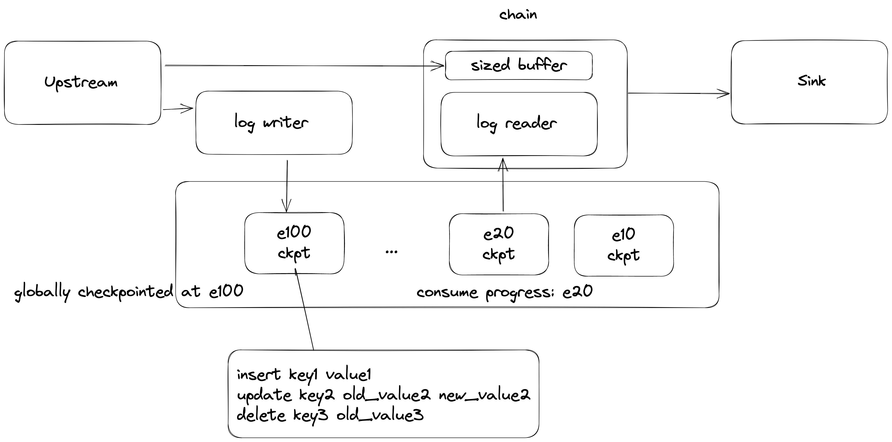
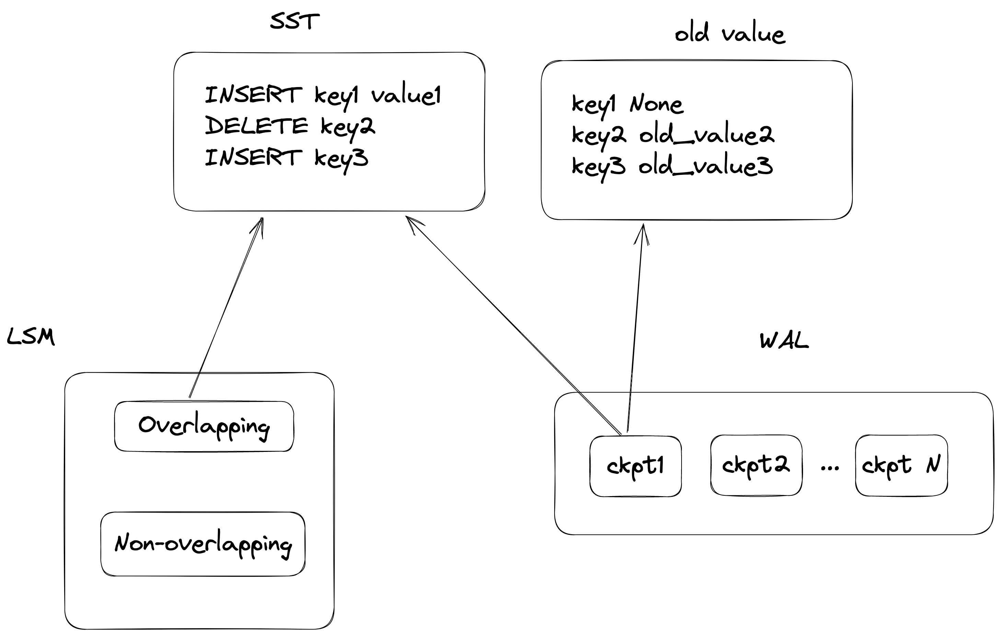
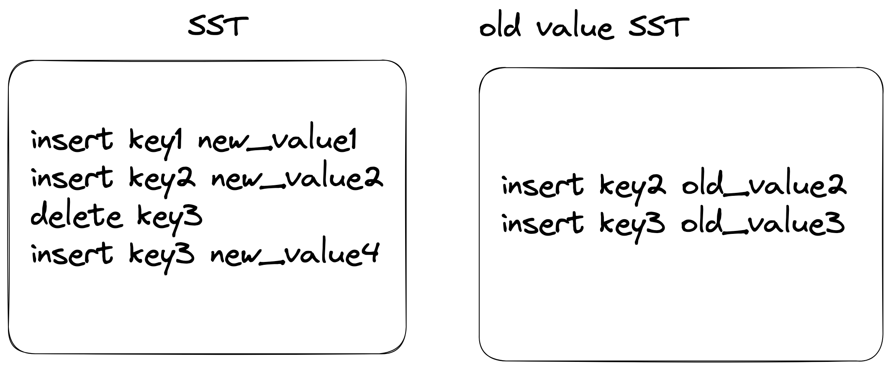
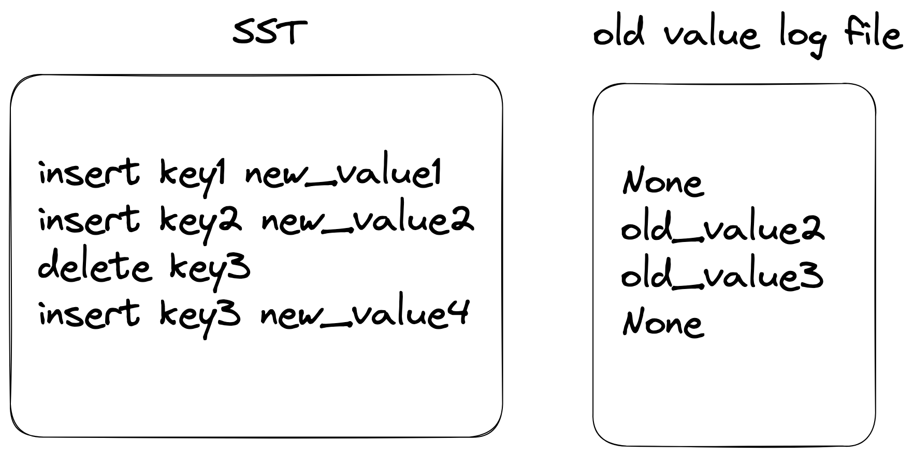
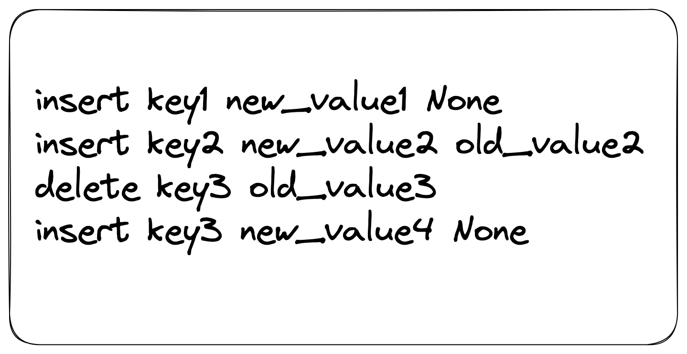
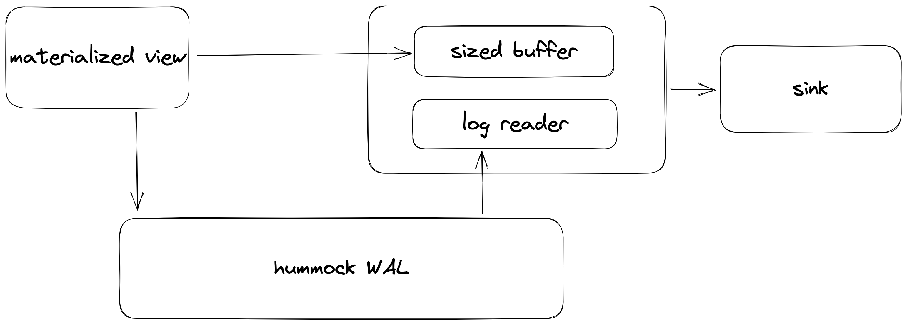
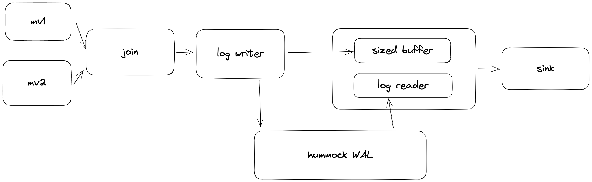
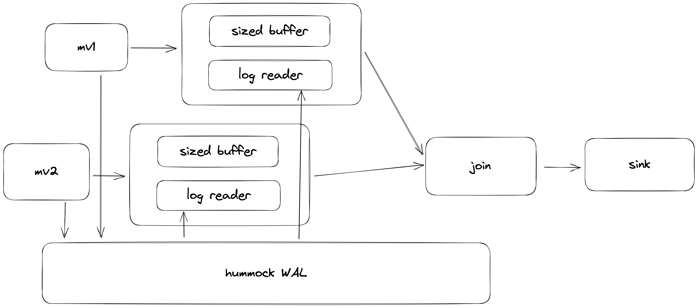

# RFC: Decouple sink and checkpoint

## Summary

In short, we want to decouple sink and checkpoint so that the sink can consume and commit the upstream changes in an asynchronous manner. We can keep a copy of unconsumed data in a checkpoint in a log like store to maintain consistency.

## Motivation

In our system, we have sink executors that sink the data in RisingWave to some external systems, such as Kafka, MySQL, Iceberg and etc. The sink executors are part of the stream graph, and has a similar general processing logic to other executors: start a transaction, consume incoming stream chunks, and then commit the data to the external system. The current design makes the sink logic easy to implement because the data consistency of sink is maintained in the same way as sources and materialized views and sink is part of the global checkpoint. 

However, the external systems may not be able to consume the data fast enough and may not be stable. Under current design, if the external systems cannot consume the data fast enough, back pressure will happen and affect the performance of upstream graph, and besides, the time taken to commit to the external systems will increase the overall barrier latency.

Therefore, we should have a design to decouple sink and checkpoint so that we can have the following features:

- The data consumption of downstream graph will not affect the upstream graph.
- The completion of a checkpoint barrier does not depend on committing to the external sinks.

## Design

In general, the data flow of the sink part of our system is like the following:

Via the chain executors, the upstream data are flowing into the sink directly. The connection between the upstream to the sink is a **bounded connection**, which causes back pressure when the down stream sink cannot consume the data fast enough. Besides, the stream data from the upstream **cannot be replayed** directly during recovery, and only the sources are able to replay the data, and this is the reason why we currently have to maintain checkpoints globally across the whole streaming graph, and **a checkpoint has to wait for committing to the sink**. 

Therefore, to solve the problems mentioned above, we will design a connection between the upstream and the sink with the following properties:

- Unbounded, or a bound much greater than the bound of current connection, such as the capacity of shared storage, or a configurable upper bound.
- Ability to replay the operations between two checkpoint epochs.
- Ability to clean up the consumed data that no sink is reading.

Such connection is similar to the write ahead log of transactional databases, and differs in that this connection between upstream and the sink is at the granularity of checkpoint rather than each single row operation. In the following part of this doc, we will use `hummock WAL` to denote such WAL like connection between upstream and sink. 

In general, hummock WAL stores all the single row operations between two checkpoint barrier as log data in the object store. With hummock WAL, the sink will work as in the following figure.

Under this design,

- Instead of waiting for committing to the external sink, a checkpoint can be regarded as completed after the log writer **has written the row operations to the log file and upload it to object store**.
- A new chain executor will consist of a sized buffer and a log reader. The upstream executor will still also send stream data directly to the chain executor, and the sized buffer will **buffer the unconsumed upstream data in its best effort**. For the term best effort, it means, it stores as much data as possible when the buffer has not reached its size limit, and when it reaches its size limit, it will drop some latest data to reduce the buffer size. **The dropped data can be replayed from the log reader eventually.** Since this downstream executor will keep consuming the stream data sent directly from the upstream and drop the stream data when the sized buffer reaches its size limit, **even if the sink is consuming data very slowly, it will not cause back pressure to the upstream.**

Besides, we can have two potential ways for optimization.

- **Potential to reuse materialized view data.** In materialized view, we have stored the key along with new value in the SST. We only need to additionally store the old value in some ways to implement hummock WAL.
- ************************************************************Potential to do log compaction************************************************************. When the log reader is lagging behind a lot, we can either do merge-on-read to merge the log data of multiple checkpoints epochs, or we may asynchronously merge the log data of multiple checkpoints epochs so that the sink can consume less data than original.

## Implementation

We have the following key implementation details to be decided.

### Log Data Management

Currently hummock provides a key-value storage interface for data read and write, and we have our own SST data format to store the payload of data. To decide the log format, we may want to discuss to which extent do we want to reuse the current system, based on which we can have several alternatives.

#### 1. Separate Metadata for Log Store

We can use a new set of metadata to manage the log data, and provide a new method `scan_diff` to scan the key operations between two checkpoint epochs. The new metadata will ****keep track of **a log file added in each checkpoint,** and keep track of **the progress of log consumer** for log data cleaning. 

A sink usually comes after a materialized view (for sink not from a materialized view, we will discuss in later section). In each checkpoint epoch, the materialized view has already stored and uploaded the keys and values written in the checkpoint in SSTs. Therefore, to form a replay-able log, besides SST uploaded from materialized view, we will have to **store the old value** if we want to replay the log (If the sink is upsert sink, only the data written from materialized is enough for replay). 

We can have a new set of metadata to manage the log data that is separated to LSM metadata. In a checkpoint, the SST data written from materialized view will be added to both LSM metadata and the log store metadata, so that **the payload of LSM can be reused for log store**. We can do **log compaction** for some later unconsumed checkpoints. After log compaction, we can simply update the metadata of hummock WAL, and the LSM side will not be affected.

Under this design, we may have to further decide the log format. We have the following choices. 

**Format 1: Reuse the current SST format to store the old value along with key in a separated SST**

Pros:

- No extra data format introduced.
- No extra overhead for materialized view reading, since the old value are stored separated to new value.
- The old value file is self-contained. No need to store empty tag for key operation without old value

Cons:

- More storage cost. Store the key in the old value file.

**Format 2: Redesign a new data format to store only the old value in a file separated to the SST**

Pros:

- No extra overhead for materialized view reading, since the old value are stored separated to new value.
- Less storage cost. No need to store key in the old value file.

Cons:

- Introduce new data format
- The old value file is not self-contained. Need to also read the original SST to restore the key of each old value. Need to store an empty tag for key operation with no old value (i.e. INSERT)

**Format 3: Redesign a new data format that stores each key operation as `key|new_value|old_value` in the file**

Pros: 

- the logic of replay is simply scanning the entries one by one.

Cons:

- Introduce a new data format, need to redesign and reimplement it
- If we want to reuse the data written by MV, the data of upstream materialized view is stored in this format, which introduces extra read overhead for materialized view reading. It will read more data than the current system, because the new value and the old value are stored next to each other and it will need to also read the old value.

#### Reuse KV interface

We can reuse the current kv interface to store the log. The key encoding will be `epoch|pk`, and the value encoding will be `new_row_struct|old_row_struct`. We can use range delete to remove a pk range once the log reader has finished reading the log of the checkpoint epoch.

Pros:

- No need to introduce extra complexity in the storage side.

Cons:

- Unable to reuse the data of materialized view. Double the storage overhead along with more spaces to store old value.
- Much harder to do log compaction.
- Log data are added to the LSM tree, and will be mixed with the key value entry. Introduce extra read and write overhead when we read the data, and do range delete for the consumed data. Increase read and write amplification in compaction.

#### Summary of log data management

The design choice mentioned above is summarized in the following table.

|                      | no new  API | reuse data format | log compaction | reuse MV data | zero MV read overhead | extra storage cost               | No LSM overhead |
|----------------------|-------------|-------------------|----------------|---------------|-----------------------|----------------------------------|-----------------|
| log store + format 1 | ❌           | ✅                 | ✅              | ✅             | ✅                     | key +  old value  (no empty tag) | ✅               |
| log store + format 2 | ❌           | ❌                 | ✅              | ✅             | ✅                     | old value (empty tag)            | ✅               |
| log store + format 3 | ❌           | ❌                 | ✅              | ✅             | ❌                     | old value (empty tag)            | ✅               |
| reuse kv             | ✅           | ✅                 | ❌              | ❌             | Not reuse MV data     | key +  old value + new value     | ❌               |

**Personally, I will prefer introducing a new set of metadata for log store besides the LSM, and use format1, which stores the old value in separate SST.**

### Where to Write the Log

With PR https://github.com/risingwavelabs/risingwave/pull/7183, we are able to get the old value in storage side if the flag `is_consistent_op` is set for the local state store.

Currently, we have two kinds of sink, depending on whether there is a materialized view right before the sink or not. For simplicity we will denote them as `materialized sink` and `direct sink`. A materialized sink is created by `CREATE SINK xxx FROM <TABLE_NAME|MV_NAME>`, and a direct sink is created by `CREATE SINK xxx AS SELECT xxx`.

- For materialized sink, since the upstream materialized view has already written the materialized data with key and new value to storage, it only needs to additionally write the old value to form the log data. The downstream executor only needs to read from the log.

- For direct sink, there are two ways to write the log. Let’s take the example `CREATE SINK s1 as SELECT * FROM mv1 JOIN mv2 ON [mv1.id](http://mv1.id) = mv2.id`.
    - Write extra log data right before the sink. This is similar to adding a materialized operator before the sink but differs in that, the data written from materialized operator **will not be added to the LSM tree, but only added to the log**.
    
    
    
    - No extra log right before the sink. Instead, we can replay the nearest replay-able upstream, such as source or materialized view. But we will need to **introduce partial checkpoint**, because there can be some internal state in the sink (e.g. join state if the sink is created from `SELECT JOIN`)
    
    

**Personally, I think we can either**

- **write extra log data right before the direct sink**, and improve it when we support **partial checkpoint** in the future
- ******************************************************************************************************************************************************************************or****************************************************************************************************************************************************************************** if we want to avoid additional storage cost for materializing the direct sink, before we support partial checkpoint, the feature of decoupling with checkpoint might be **disabled for direct sink**, and ******************************************************************************************************************************************************************************only materialized sink can support decoupling with checkpoint.******************************************************************************************************************************************************************************

### Report Log Consume Progress

If we choose to maintain the log data besides the LSM tree, we may need to collect the log consume progress so that we can clean the consumed log data.

For simplicity, we can report the consume progress on each CN via the rpc `barrier_complete`. If the log of a checkpoint epoch has been consumed by all readers, the log data can be cleared.

### Failure Recovery

We will collect the log consume progress of each hummock WAL reader. Therefore, during failure recovery, we can reset the current epoch of the log reader to the latest consumed checkpoint epoch, and then replay the log. After the log reader has set its progress, we can already see the sink part as recovered. During replaying the log of some previous epochs, data from new epoch can be written to log store and the upstream is not affected.

Beside, In our current system, since sink is part of the global stream graph, **a failure in sink will trigger a recovery in the whole streaming job**. With hummock WAL, the sink part of the stream graph can be further decoupled with the global stream graph, and we may only recover the sink part.

**TBD:** should we **maintain the sink part of the graph as a special subgraph**, or we introduce a **more general partial checkpoint**, which split the whole stream graph into several subgraph, and do checkpoint at the granularity of each subgraph?

**Personally, I think we can first still see the sink as part of the global streaming graph, and implement decoupling sink and checkpoint first. With this implemented, failure in the sink may still trigger a global recovery. Later we can further implement partial checkpoint, so that failure in sink will only trigger a recovery in the sink part of the graph.**

<!-------
## Unresolved questions

* Are there some questions that haven't been resolved in the RFC?
* Can they be resolved in some future RFCs?
* Move some meaningful comments to here.

## Alternatives

What other designs have been considered and what is the rationale for not choosing them?

## Future possibilities

Some potential extensions or optimizations can be done in the future based on the RFC.

----->
