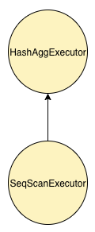

# Distributed Query Processing Engine Design

This article describes high level design for risingwave's adhoc query engine. 


# Architecture 

# Distributed Query Processing Engine Design

This article describes high level design for risingwave's adhoc query engine. 


# Architecture 


# Terminology 

Here we use following sql as example: 

```sql
`select a, avg(b) from t1 group by a`
```

**Physical Plan: A physical plan is a distributed execution plan.**


**Plan Fragment: The plan of a stage.**


Query: An execution of a physical plan. 
Stage: An execution of a plan fragment. 
Task: A scheduling unit on compute nodes. 


**Executor: An executor is executed on compute node.**




# Fault Tolerant 

Our execution engine is designed to support adhoc query, rather than long running etl jobs, so we just fail whole execution when any non-recoverable error happens. 


# Task Scheduling 

Currently we'll use all at once scheduling strategy rather than phased scheduling strategy since we don't need to spill exchanges to disk. This strategy is helpful for reducing query execution latency, but it consumes more resources. 


# Task Execution 

In this version we will use blocking model, e.g. one task per thread for executing. We'll implement more advanced task execution strategy in future for executing many queries concurrently. 


# Data Exchange 

In this version we don't need to spill exchange data to disk since our fault tolerant strategy is quite simple. We just need an in memory blocking queue to buffer producer's data. 

