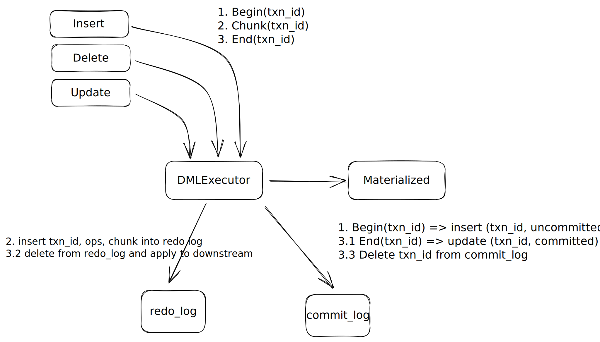
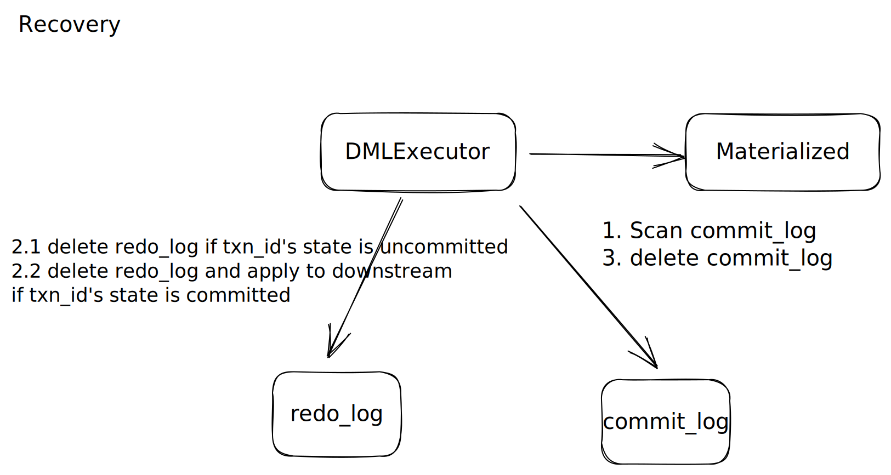

# DML Atomicity

## Motivation

As we all know, DML in RisingWave currently cannot provide atomicity. For example, when using the INSERT SELECT statement to load a large amount of data from one table to another, it is possible for the system to crash, resulting in partial updating.

As a database, atomicity is a must-have feature. A single DML statement can be regarded as a minimal transaction. In terms of transactions, atomicity guarantees that each transaction is treated as a single "unit", which either succeeds completely or fails completely. A guarantee of atomicity prevents updates to the database from occurring only partially, which can cause greater problems than rejecting the whole series outright.

## Design

To provide atomicity for DML, we can use the concept of redo log or WAL (write-ahead logging). This RFC proposes a redo log and a commit log as internal states for `DMLExecutor`.

Any insert, delete, or update executor should follow this contract:

- Send `Begin(txn_id)` to `DMLExecutor`, where `txn_id` is a transaction ID that can be generated using the same algorithm as `row_id`.
- Send `Chunk(txn_id)` to `DMLExecutor`.
- Send `End(txn_id)` to `DMLExecutor`.

(Note that all of the above messages must be sent to the same `DMLExecutor` e.g. using `hash(txn_id)` .)

As for DMLExecutor, maintain two internal states: 
1. create table redo_log(txn_id, ops, column_1, …, column_N). ops and columns are exactly the same meanings as the stream chunk. The primary key of `redo_log` is `txn_id` plus dml table's primary key which also means the `row_id` generator should also be merged into the `DMLExecutor`.
2. create table commit_log(txn_id, state). The value of the state column could be uncommitted or committed

The DMLExecutor should follow this contract:
- `Begin(txn_id)` : insert txn_id with the uncommitted state into the commit log.
- `Chunk(txn_id)` : insert chunks into the corresponding txn_id redo log.
- `End(txn_id)` : Update the txn_id from an uncommitted to a committed state in the commit log. Then, apply the records from the redo log to the downstream. Applying records involves deleting them and sending them downstream. After applying the records, delete the txn_id from the commit log.

As we can see, DML statements write their chunk into the redo log before actually applying them to the downstream. This is done so that we can ensure atomicity. If a recovery event occurs, we need to check the commit state to decide whether to apply or discard the data in the redo log. A `committed` state means we need to apply the remaining records in the corresponding redo log to the downstream, while an `uncommitted` state means we need to clean up the state of the corresponding redo log. We can perform this cleanup job after the `DMLExecutor` receives the first barrier. In summary, we should scan the commit log and clean up the redo log after recovery.

## Durability

Durability isn't guaranteed in this RFC. DMLs are considered finished after sending `End(txn_id)` to the `DMLExecutor`. The reason why we don't guarantee right now is that the current design relies on the checkpoint to commit DML statements, unless we can emit a checkpoint barrier right after a DML statement to force a checkpoint, but it seems expensive. Might be DMLs plus `Flush` is a more pratical solution to the durability.

## Transaction

This design relies highly on the fact that DMLs in our system only modify one table. If we want to support modifying more than one table in a transaction or a DML statement, we need a more complex design to coordinate the transaction which seems unsuitable to our current stage.

## Others
- Table schema change needs to modify the redo log state together.
- Which distribution should the redo log and the commit log states have?