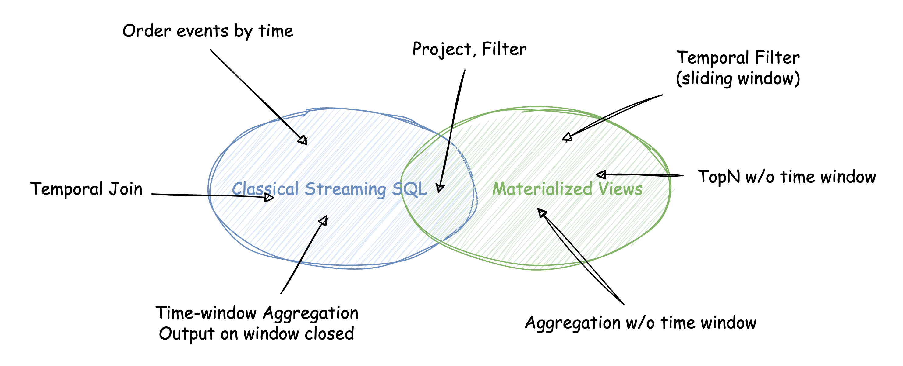

# RFC: General Window Function

## Preface

Before we comes to the discussion of Over Window Function, I would like share some thoughts about the difference between Classical Streaming SQL and Materialized Views.

|  | World of Classical Streaming SQL  | World of Materialized Views |
| --- | --- | --- |
| Basic Unit | An event that has happened aka. event-driven | A change that can be either insert, delete or update |
| Input | An append-only stream of events | A table, or equivalently, a stream of changes on that table |
| Output | An append-only (or updatable) stream of events | A materialized view, or equivalently, a stream of changes to update that MView |
|  | To make the output append-only, watermark & emit-on-close are necessary. Events might be “buffered” in pipeline until watermark arrives. | Materialized must be updated immediately. You cannot define watermark or late events here. |

If we draw a Venn diagram of all the use cases, it may look like below



In theory, these two worlds are constructed on completely different assumptions, and the problems they solved have very little in common. However, they can approache each other’s territory by introducing some extension. For example,

- Flink has once introduced a concept called “early fire”, which was substituted by `CUMULATE` window later, to simulate a growing (but not closed yet) window.
- Materialize Views can also support time-window TVF (e.g. `TUMBLE`) to handle time-window join or aggregations without breaking the semantics

As we can observe today, most use cases are supported on both sides, even though in different SQL queries.

While in some subtle cases, these patches cannot fill the gap completely. (Or, although the function is met, the usability is much worse). Just to name a few,

- Classical Streaming SQL can hardly express a real growing window result (like sliding window), because it requires events to trigger updates.
- Materialized Views can hardly output events ordered by timestamp, which certainly requires watermark defined by users.

Beside these abilities and disabilities, it’s more remarkable that they have strength and weakness:

- Classical Streaming SQL is good at ELT pipeline and time-window-based computation
- Materialized Views are good at complex real-time analytics

Last but not least, the world of Classical Streaming SQL is actually defined, ruled and dominated by Flink SQL. Any subsequent competitor has no choice but to follow the de-facto standard, which makes them even harder to surpass Flink.

Obviously, RisingWave per se belongs to the “Materialized Views” faction, and we also introduced a powerful extension “[emit on window close](https://github.com/risingwavelabs/rfcs/pull/30)” in order to fulfill some requirements.

## Background

From now, let’s come back to our topic: over window functions.

Over window function has nothing to do with time-window. They just accidentally have word “window” in names. Over window is introduced in modern ANSI SQL standard, for example,

```sql
SELECT start_terminal,
       duration_seconds,
       SUM(duration_seconds) OVER
         (PARTITION BY start_terminal ORDER BY start_time)
         AS running_total
  FROM tutorial.dc_bikeshare_q1_2012
 WHERE start_time < '2012-01-08'
```

Things become more tricky when it comes to streaming. We saw a conflict between the world of Classical Streaming SQL and Materialized Views. 

### With Classical Streaming SQL

Flink SQL chose to implement only a subset where

- A watermark must be defined on the source table
- An `ORDER BY` clause is mandatory, and the order key must be the watermark column.
- A range definition is mandatory
    - The upper boundary must be `CURRENT ROW`
    - The lower boundary is mandatory and it can be either `RANGE` or `ROW` interval

These limitations, together with watermark, are all designed to **avoid retractions**. As long as the events are ordered & filtered by watermark column beforehand, all events can be tagged with a correct and final aggregation result.

### With Materialized Views

Since materialized views are happy with any updates, there is no limitation at all technically.

Meanwhile, the worst-case cost may be the order of total input set (e.g. `SUM()` without partition), which seems to be unacceptable. So I prefer to ban this case by forcing users to specify a `PARTITION BY` clause, making the worst-case cost decrease to the order of partition size, which makes it much more practical.

## Design

Now let’s come back to the core question: *How to do window function in RisingWave*?

Previously, since we have devoted a lot of effort in watermark & emit-on-window-close, we were going to do it in the “Classical Streaming SQL” way. **Here I am proposing the opposite: do it in the “Materialized Views” way**, which is more general in syntax and have less restrictions.

For simplicity, we will call these 2 approaches as *watermark-version* and *general-version* since then.

There are 2 major restrictions in the watermark-version.

1. Watermark must be defined
2. **The input must be append-only**

The 1st is totally acceptable, considering that the real-world use cases mostly use time column as the ordering column, **but** the 2nd restriction is critical. According to [RFC: Unify the materialized source and table](https://github.com/risingwavelabs/rfcs/blob/main/rfcs/0004-unify-materialized-source-and-table.md), tables are supposed to be source-of-truth and we should at least allow users to revise it with DML statements, which make every table become updatable in fact.

A real-world example:

```sql
-- Here is a streaming query
SELECT
    account_id,
    token0,
    token1,
    reserve0,
    reserve1,
    LAG(reserve0) OVER (PARTITION BY account_id ORDER BY txn_number);
    LAG(reserve1) OVER (PARTITION BY account_id ORDER BY txn_number);
FROM
    txns -- This is a table!
```

This is quite frustrating because we actually recommend users to use Tables more than Sources, and as a result, I think we should prioritize the general or table-specific features than source-specific features.

## Implementation

This proposal mainly focuses on requirement & syntax design, and I will not talk a lot about detailed design. Let me just briefly introduce a naive algorithm in pseudocode:

```
let state T = all input rows and current agg results
              (i.e. the output result set)

for new incoming row R:
   let P = partition of R
   for each existing row R' in P (recorded in T):
      if frame of R' is affected:
         update result of R' = aggregate on frame of R'
```

It’s trivial to optimize the way to find all affected rows & frames, for example, for `range preceeding 5 rows and current row`, we can know it only requires to loop over 5 rows in total.

After we complete the naive, general solution, we may take use of some delicate algorithms to improve *some* cases. For example, [prefix sum in Materialize’s design doc](https://github.com/ggevay/materialize/blob/windowing-design-doc/doc/developer/design/20230110_window_functions.md#Implementation-details-of-DD's-prefix-sum).

**Cache design**: In the first version we may simply load all data in one partition into memory, just like the way we do in the Hash Join operator. In the future, we may introduce better cache design to avoid OOM for large partitions and small frame size.

It is worth mentioning that this implementation seems to be very different from the watermark-version, for example, here the aggregation is actually one-time instead of incremental. We may work on these 2 features in parallel, as long as we have adequate human resources.


## Q&A

**Commented by @Dylan:**

Agree to support the general window functions only when partition by is specified. It is really like stream hash join if we treat partition columns as join keys. As long as the cardinality of these columns is high enough, then the cost is acceptable. In some way, a window function without partition columns can be regarded as a nested loop join. Banning it is very natural and just like the reason why we ban nested loop join. BTW, if I were a user, I can always find a way to hack our restrictions on partition columns by partitioning a constant column.

**How to handle multiple window functions in one query?**

We may merge window functions with the same window definition (i.e. partition & order by clause), and cascade those with different window definitions. For example, `SUM() OVER (PARTITION BY a ORDER BY b) AS sum_a_b, AVG() OVER (PARTITION BY a ORDER BY b) AS avg_a_b, COUNT() over (partition over c)` can be represented with 2 window operators, one for `SUM` and `AVG`, another on for `COUNT`.

**Commented by Bugen**:

(just like the sorting algorithms) The input is more roughly ordered, the complexity of the retractable one is more closer to the append-only one, except for more retractions yielded. If this is acceptable, I guess we may even unify the implementation to achieve better maintainability in the future.

**Commeneted by RC:**

We may begin from the batch opeartors, then streaming operator, and see whether there are something can be unified at that time.
