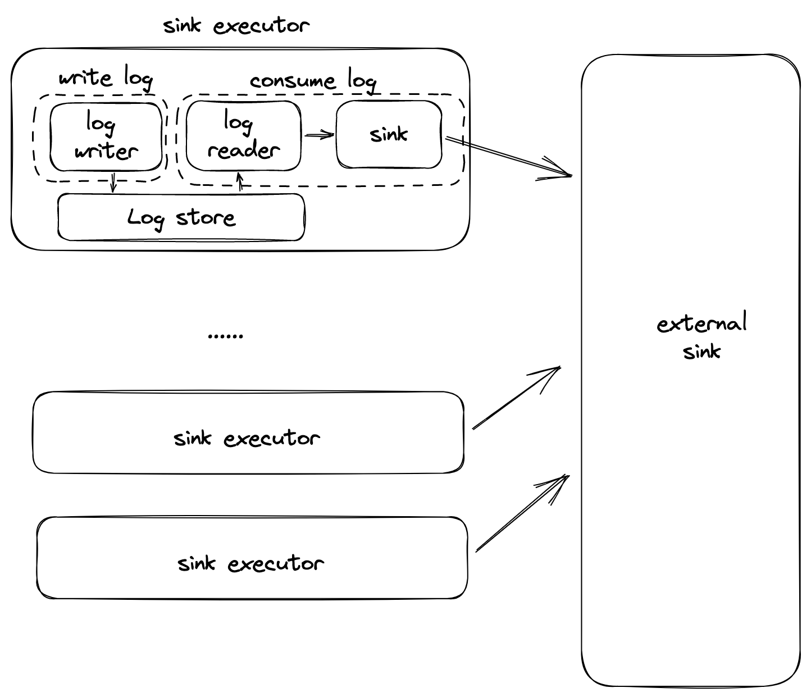
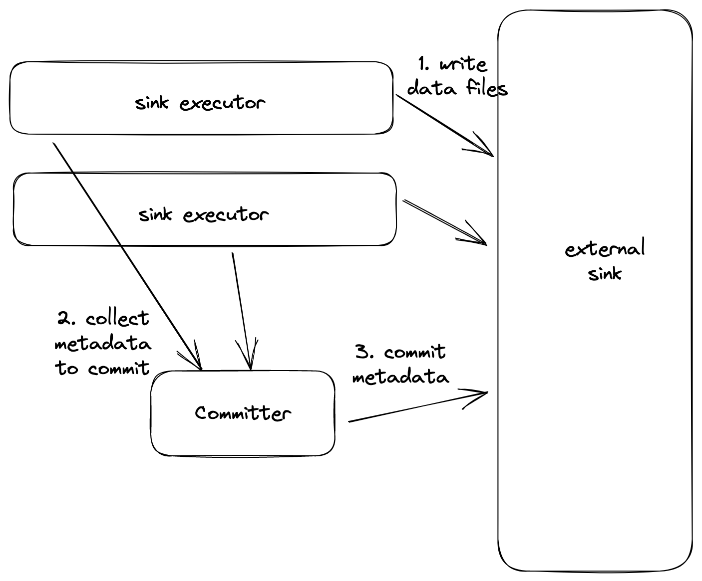
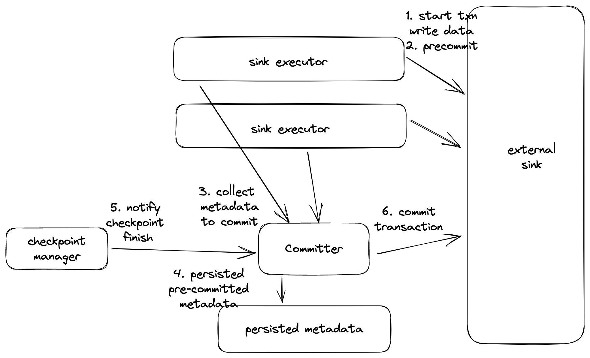
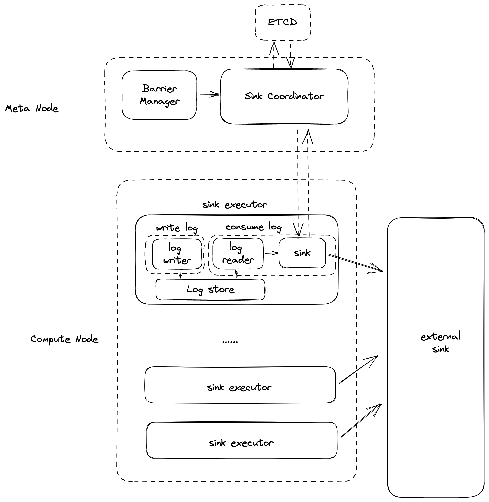

# Sink Coordinator

## Motivation

### TL;DR

- Data lake sinks support concurrent write, but has poor support for concurrent commit.
- Two phase commit sinks need a coordinator to coordinate different parallelism.


### Revisit Current Sink Abstraction

Each sink has multiple parallelism, each parallelism manipulate a sink instance that implements the `Sink` trait.

```rust
pub trait Sink {
		// the following interface is for transactions, if not supported, return Ok(())
    // start a transaction with epoch number. Note that epoch number should be increasing.
    async fn begin_epoch(&mut self, epoch: u64) -> Result<()>;

    async fn write_batch(&mut self, chunk: StreamChunk) -> Result<()>;

    // commits the current transaction and marks all messages in the transaction success.
    async fn commit(&mut self) -> Result<()>;

    // Basically never used
    async fn abort(&mut self) -> Result<()>;
}
```

The data and barrier to sink is read from the log reader, which implements the `LogReader` trait.

```rust
pub enum LogStoreReadItem {
    StreamChunk(StreamChunk),
    Barrier { is_checkpoint: bool },
}

pub trait LogReader {
    /// Initialize the log reader. Usually function as waiting for log writer to be initialized.
    async fn init(&mut self) -> LogStoreResult<()>;

    /// Emit the next item.
    async fn next_item(&mut self) -> LogStoreResult<(u64, LogStoreReadItem)>;

    /// Mark that all items emitted so far have been consumed and it is safe to truncate the log
    /// from the current offset.
    async fn truncate(&mut self) -> LogStoreResult<()>;
}
```

Each sink executor read an `LogStoreReadItem`, which can be either a stream chunk or a barrier simplified with only a flag indicating whether it is a checkpoint barrier, by calling `next_item` of the log store reader. When receiving a stream chunk, it calls `write_batch` of sink, and when receiving a checkpoint barrier, it calls `commit` of sink. If the `commit` return successfully, it calls `truncate` on the log store reader to indicate that all data previously read from the log store reader have been consumed, and it is safe to clean the consumed data.



Under the current sink abstraction, each parallelism of a sink writes and commits data on their own. Such abstraction works well with the current kafka sink and jdbc sink, and also the future redis sink. In these sink, each parallelism writes and commits data on their on without any need for coordination, and the external systems to sink support concurrent write and commit. However, the data lake sinks and the future two phase commit sink are not compatible with the current sink abstraction.

### Sinks that need extension

#### Data Lake Sink

The write model of most data lakes (delta lake, hudi, iceberg) is to write data files in a concurrent manner, and then commit the metadata to the data lake. The metadata of data lakes are maintained as immutable files in distributed file system, and therefore data lake has pure support for concurrent commits. Under this limit, we have to set the parallelism of these data lake sink to singleton, otherwise, the concurrent commits of multiple parallelism will cause the sink to fail frequently.

An ideal way to better support data lake sink will be, multiple parallelism write data files concurrently, and a separate single committer collects the metadata to commit and commit to the data lake.



#### Two Phase Commit Sink

Our current sink abstraction only guarantees at-least-once semantic. If we want to support exactly-once semantic, we will have to support two phase commit. A typical write path of two phase commit is as followed:

1. Each parallelism starts a new transaction, and starts writing data to the external sink.
2. At arrival of checkpoint barrier, each parallelism calls pre-commit on the transaction and get the metadata of the pre-commit transaction.
3. A centralized coordinator gather all the metadata of pre-commit transaction from all parallelisms, and persist these metadata to a persistent storage.
4. After the checkpoint of the internal state of streaming system has finished, the centralized coordinator will be notified on the successful checkpoint, and will try to commit the transaction. Even if the later commit on the transaction fails, the checkpoint is still regarded as finished, because the pre-commit metadata has been persisted, and can be fetched and retrying commit.
5. If the checkpoint of the internal state failed, the centralized coordinator will be notified on a failed checkpoint, and will try to call abort on pre-commit transaction.

Note that the two phase transaction of the external sink should be designed as, after the transaction has been pre-committed, any number of subsequent commit on the transaction can be succeeded idempotently. This is because it is possible that the transaction gets called on commit for multiple times. For example, after we successfully call commit on the transaction, the streaming system crashes before we mark that the transaction as committed, and then during recovery, the transaction can be committed again.

The overall workflow of two phase commit sink is as followed.




## Design

### Coordinated Sink

In addition to sink executors that concurrently write data to external sink, we will introduce a sink coordinator in the meta node for some sinks if necessary(e.g. data lake sinks, and two phase commit sink).




Sink that needs coordinator, will implement the trait `CoordinatedSinkWriter` and `SinkCoordinator`. Each sink has at most one coordinator in the meta node. Each parallelism of the sink holds an instance of sink writer and communicates with the coordinator via gRPC.

The trait `CoordinatedSinkWriter` is like the following:

```rust
pub trait CoordinatedSinkWriter {
    async fn start_write(&mut self) -> Result<()>;
    async fn write_batch(&mut self, chunk: StreamChunk) -> Result<()>;
    async fn finish_write(&mut self, epoch: u64) -> Result<Bytes>;
}
```

The `CoordinatedSink` holds an implementation of the sink writer, and a grpc client to the meta node for communication with the coordinator.

```rust
pub struct CoordinatedSink<W: CoordinatedSinkWriter> {
    writer: W,
    coordinator_client: CoordinatorClient
}

impl<W: CoordinatedSinkWriter> Sink for CoordinatedSink<W> {
    async fn begin_epoch(&mut self, epoch: u64) -> Result<()> {
        self.writer.start_write()?;
    }

    async fn write_batch(&mut self, chunk: StreamChunk) -> Result<()> {
        self.writer.write_batch(chunk)?;
    }

    async fn commit(&mut self) -> Result<()> {
        let metadata = self.writer.finish_write();
        self.coordinator_client.commit(epoch, metadata)?;
    }
}
```

The coordinated sink calls `write_batch` on the sink writer when receiving the stream chunk. In case of checkpoint, it calls `finish_write` on the sink writer to persist the data and return the metadata for the checkpoint. The metadata will be sent to the coordinator via gRPC. The coordinator implements the following trait.

```rust
pub trait SinkCoordinator {
	async fn init(&mut self, writer_info: Vec<SinkWriterInfo>) -> Result<()>;
    async fn commit(&mut self, epoch: u64, metadata: Vec<Bytes>) -> Result<()>;
    async fn on_checkpoint_success(epoch: u64) -> Result<()>;
    async fn on_checkpoint_fail(epoch: u64) -> Result<()>;
}
```

After collecting the metadata from all parallelisms, we will call `commit` on the coordinator, which commits the metadata from all parallelisms to the external sink. Besides, for two phase commit sink, it should be notified when the checkpoint succeeds. Therefore, the `SinkCoordinator` has another method `on_checkpoint_success` as a hook to be notified on checkpoint success.

### Data Lake Sink with Concurrent Write

With the framework of coordinated sink, we can implement our data lake sinks that can concurrently write data files.

The data lake sink writer will write their own data file when called `write_batch`, and return the file names of the written data files when called `finish_write`. The data files written by all parallelism will be gathered in the data lake sink coordinator, and `commit` the metadata to the data lake all at once.

### Two Phase Commit Sink

We can support two phase commit sink with the coordinated sink framework. 

At the beginning of processing checkpoint data, the sink writer will first start a new transaction and write data to the transaction when called `write_batch`. When called `finish_write`, the sink writer calls pre-commit on the transaction and returns the metadata of the transaction. After the coordinator gathers the metadata of all parallelism and gets called on `commit`, it only persist these metadata together with the current epoch to ETCD and then return without committing these transactions. This is because the checkpoint of RisingWave may have not finished yet. After the checkpoint finishes, it gets notified with `on_checkpoint_success`, and then it commits on all transactions.

In case of failure recovery, if and only if both the transaction metadata of all parallelisms have been persisted and the checkpoint of the specific epoch succeeds, the data is regarded as consumed consistently, and if there is some transactions are still in pre-committed stage and not committed yet, the coordinator will commit these transactions. If the transaction metadata have been persisted while the checkpoint of RisingWave fails, the coordinator will call abort on the pre-committed transaction and remove the persisted metadata.

In general, the two phase commit sink writer will follow the trait `CoordinatedSinkWriter`, which starts a new transaction when called `start_write`, and pre-commits the transaction and returns the pre-committed metadata when called `finish_write`. We will then introduce a new trait `TwoPhaseCommitSinkCommitter`. 

```rust
trait TwoPhaseCommitSinkCommitter {
	async fn commit(&mut self, epoch: u64, metadata: Vec<Bytes>) -> Result<()>;
    async fn abort(&mut self, epoch: u64, metadata: Vec<Bytes>) -> Result<()>;
}
```

A `TwoPhaseCommitSinkCoordinator` will hold an implementation of `TwoPhaseCommitSinkCommitter` and a meta-store writer. 

```rust
struct TwoPhaseCommitSinkCoordinator<C: TwoPhaseCommitSinkCommitter> {
    committer: C,
    metastore: MetaStore, // mostly ETCD
}

impl SinkCoordinator for TwoPhaseCommitSinkCoordinator<C> {
    async fn init(&mut self, writer_info: Vec<SinkWriterInfo>) -> Result<()> {
        // Recovery. Commit and abort some pre-committed but not committed epoch
        for (epoch, metadata) in self.metastore.checkpoint_epochs() {
            if checkpoint success {
                self.committer.commit(epoch, metadata)?;
            } else {
                self.committer.abort(epoch, metadata)?;
            }
        }
    }

    async fn commit(&mut self, epoch: u64, metadata: Vec<Bytes>) -> Result<()> {
        // only persist pre-committed metadata, and wait for checkpoint success
        self.metastore.persist(epoch, metadata);
    }

    async fn on_checkpoint_success(epoch: u64) -> Result<()> {
        let metadata = self.metastore.metadata(epoch);
        self.committer.commit(epoch, metadata);
        self.metastore.report_committed_epoch(epoch);
    }

    async fn on_checkpoint_fail(epoch: u64) -> Result<()> {
        let metadata = self.metastore.metadata(epoch);
        self.committer.abort(epoch, metadata);
        self.metastore.report_aborted_epoch(epoch);
    }
}
```

The `LogReader` and `Sink` trait will be changed to the following so that we can start the log reader from a specific point to avoid repeatedly consume some epochs.

```rust
pub trait Sink {
    **async fn init(&mut self) -> Result<Option<u64>>;
    ...**
}
```

```rust
pub enum LogStoreReadItem {
    StreamChunk(StreamChunk),
    Barrier { is_checkpoint: bool },
}

pub trait LogReader {
    /// Initialize the log reader. Usually function as waiting for log writer to be initialized.
    async fn init(&mut self, **consumed_epoch: Option<u64>**) -> LogStoreResult<()>;
    ...
}
```

The sink executor will first call `init` on sink, and get the latest consumed epoch if there is any. Call `init` on the log reader to set the epoch to consume as such latest consumed epoch. Such latest consumed epoch is introduced for sinks with exactly once semantic. If the latest consumed epoch is None, the log reader will consumed from the previous truncated offset of the log store.


