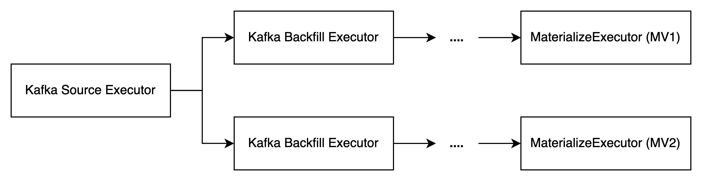

# Reusable Source Executor


## Motivation

Conceptually, a source is very different from a table or a sink in terms of whether it is instantiated. A source defined by a `CREATE SOURCE` statement is not an instance, it's just a set of metadata stored in the catalog until it's referenced by a materialized view, at which point a `SourceExecutor` is instantiated.

As a result, when creating multiple materialized views on top of one source, the `SourceExecutor` is not reused between them. It leads to multiple times of resource utilization and multiple consuming offsets, metrics, etc. Furthermore, it becomes a bug if the source definition uses some exclusive property, such as the consumer group of Kafka source.

## Design

Recall that most source has more or less historical data. For message brokers including Kafka, Pulsar, Kinesis, etc, this can be configured with option `scan.startup.mode`. When `scan.startup.mode` is not set to `latest`, the consumer must read the historical data before consuming any new events. This process is implicitly done by the client library, and RisingWave is not aware of it.

Let's assume that the Kafka client library is stupid and RisingWave needs to read the historical data by itself. Then, it turns out this procedure is quite similar to the backfilling procedure of tables. Recall that when a new materialized view is created, we introduce a `BackfillExecutor` to read the historical data. Here we can solve the problem with the same idea by dividing it into 2 phases: 1) backfill and 2) consume new events.



Here,

- `KafkaSourceExecutor` is created on executing `CREATE SOURCE` statement, although a trivial optimization is doing nothing when there is no downstream operator attached.
- `KafkaBackfillExecutor` is created along with the `CREATE MATERIALIZED VIEW` statement. Each MV has its own `KafkaBackfillExecutor` respectively.

Obviously, for a source without historical data or message broker source `scan.startup.mode = latest`, the `BackfillExecutor` can be omitted.

Note that our design only applies to sources, excluding the tables with connectors, which are already instantiated and shared between all materialized views. By the way, [RFC: CDC Source with Backfill](https://github.com/risingwavelabs/rfcs/pull/63) takes a similar idea by introducing a dedicated `CdcBackfillExecutor` operator.

### Implementation for Message Brokers

Events from Kafka should be processed according to their sequence in partition, no matter for historical events or new incoming events.

So how to combine the backfill data with incoming data without duplicating or missing events?

Since everything happens inside the `BackfillExecutor`, the implementation is not difficult. Here is the pseudo-code.

```rust
let source_stream = the stream from upstream SourceExecutor i.e. new events
let backfill_stream = read from message brokers with user-defined scan_startup_mode) i.e. historical events

// In fact, these should be per kafka partition
let backfill_offset = 0;
let backfill_completed = false;

next_event = select! {
    biased;
    e = source_stream.next() => {
        if backfill_completed {
          yield e;
        } else if e.offset > backfill_offset {
          // do nothing. ignore e
        } else {
          // the progress catched up. backfilling is completed
          backfill_stream.close();
          backfill_completed = true;
          yield e;
        }
    }
    e = backfill_stream.next() => {
      assert!(!backfill_completed);
      backfill_offset = e.offset;
      yield e;
    }
}
```

### Implementation for File Source

Naturally, the file source doesn't have any guarantee on ordering. This makes it more difficult to do backfilling because it becomes more challenging to record which part of the data has been consumed.

An intuitive approach is to take a snapshot of the current progress of the `SourceExecutor`, which is a list of `file_name:offset`. Then, the `BackfillExecutor` scans files according to this list. Meanwhile, all of the new incoming events will also be streamed, because the event order doesn't matter.

Note that the snapshot i.e. the list of `file_name:offset` for backfilling is large it might need to be persisted as a state to achieve fault tolerance. This is why I say it is more difficult.

### Batch Scan (Kafka-only)

The batch scan operation is actually the same as the backfilling process - it reads all existing data and ignores any new incoming events. Hopefully, we should reuse the implementation as much as possible. 

