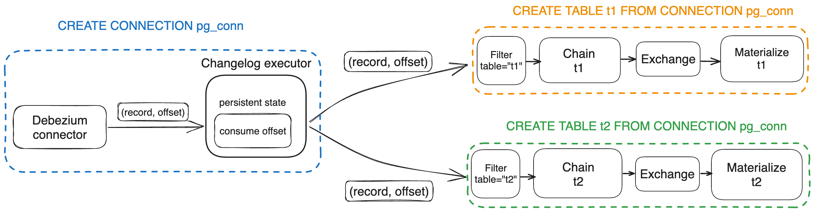

# RFC: Share a change log stream for multiple CDC tables

## Motivation

[Transaction from CDC Sources](https://www.notion.so/Transaction-from-CDC-Sources-7e567eb581654473818f6a0ba1a27672?pvs=21) proposes a multi-in one source that can allow reusing an upstream change log between multiple tables.
However, the Source is only a catalog object in our system and it won’t create any real physical resources. Only when the Source is used to create a Table/MV, the stream job will initialize the connector to the upstream source. So in theory the multi-in one source can be referenced outside the transactional DDL block, and would still create multiple change log streams on the OLTP database. [To save the resource of upstream OLTP database](https://github.com/risingwavelabs/risingwave/issues/10653), this RFC proposes a solution based on the Connection concept.

## Design

Based on our existing concepts, we can leverage the connection object to share a change log stream between multiple CDC tables. Suppose we have an upstream postgres and there are two tables, `orders` and `shipments`, in the database named `mydb`. We can create a connection to the `mydb` and poll change log from it. Then we can use that connection object to create cdc tables for `orders` and `shipments`. 

```sql
CREATE CONNECTION pg_connection WITH (
		type='postgres-cdc',
    hostname = 'localhost',
    port = '8432',
    username = 'myuser',
    password = '123456',
    database.name = 'mydb',
);

// create at time t1
CREATE TABLE orders (
		order_id int PRIMARY KEY,
	  order_date bigint,
    customer_name string,
    price decimal,
    product_id int,
    order_status smallint
) FROM CONNECTION pg_connection;

// create at time t2
CREATE TABLE shipments (
  shipment_id INTEGER,
  order_id INTEGER,
  origin STRING,
  destination STRING,
  is_arrived boolean,
  PRIMARY KEY (shipment_id)
) FROM CONNECTION pg_connection;
```

The new things here are a new connection type, `postgres-cdc`,  which is same as the direct pg cdc connector. And a new syntax: `CREATE TABLE t1 FROM CONNECTION conn`.

### Implementation of the streaming job

Since we want to avoid creating multiple change log streams, we will initiate **only one connector instance** for a connection to the upstream. And we cannot maintain the upstream offset on the Source operator (e.g. source of `orders` and `shipments`), otherwise, we will have multiple consumption offsets for a single connection.

 [RFC: CDC Source with Backfill](https://github.com/risingwavelabs/rfcs/pull/63) proposes an implementation for the intra-table parallelism of backfill, which introduces a new `Changelog` operator to broadcast events to each Source. We adapt the idea to this RFC but for inter-table parallelism.



Introduce a new `Changelog` operator which will be initialized when the user executes the `CREATE CONNECTION` statement to create a CDC connection. And barrier will be injected into the `Changelog` operator before flowing to the downstream table fragment. 

Since Debezium has a unified format for change log, for example here is a record in JSON format.

```json
{
    "before": null,
    "after":
    {
        "id": 101,
        "name": "scooter",
        "description": "Small 2-wheel scooter"
    },
    "source":
    {
        "version": "1.9.7.Final",
        "connector": "mysql",
        "name": "RW_CDC_mydb.products",
        "ts_ms": 1670876463000,
        "snapshot": "true",
        "db": "mydb",
        "sequence": null,
        "table": "products",
        "server_id": 0,
        "gtid": null,
        "file": "binlog.000001",
        "pos": 105622,
        "row": 0,
        "thread": null,
        "query": null
    },
    "op": "r",
    "ts_ms": 1670826063558,
    "transaction": null
}
```

 We can impose the following schema on the `Changelog` operator.

```json
{
    "before": jsonb,
    "after": jsonb,
    "source": jsonb,
    "op": varchar,
    "ts_ms": bigint,
    "transaction": jsonb
}
```

The `Chain` operator will initiate the backfill algorithm described in [RFC: CDC Source with Backfill](https://github.com/risingwavelabs/rfcs/pull/63), we can add a new physical operator for the `Chain`.

If we want to support transactional CDC, we can wrap those `CREATE TABLE…FROM CONNECTION` statements into a transactional DDL block.

### Discussion

TODO: We need a new concept/syntax instead of extend the `CONNECTION`

```sql
CREATE CONNECTION pg_privatelink WITH (
	type = 'privatelink',
	provider = 'aws',
	[service.name](http://service.name/) = 'com.amazonaws.xyz.us-east-1.abc-xyz-0000'
);

CREATE CONNECTION pg_connection WITH (
	type='postgres-cdc',
	hostname = 'localhost',
	port = '8432',
	username = 'myuser',
	password = '123456',
	[database.name](http://database.name/) = 'mydb',

	[connection.name](http://connection.name/) = 'pg_privatelink',
	privatelink.targets = '[{"port": 5432}]'
);
```
