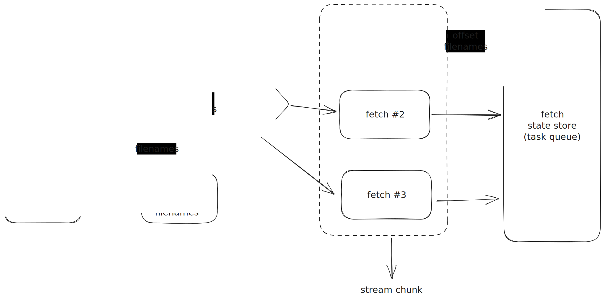

# RFC: Refined S3 Source

## Background and Motivation

There has been two RFCs ([RFC: Refine S3 Source: List Objects in A Lazy Way](https://github.com/risingwavelabs/rfcs/pull/74) 
and [RFC: S3 Source with SQS](https://github.com/risingwavelabs/rfcs/pull/22)) talking about S3 source but neither of them 
fits the need of RisingWave. This RFC is to combine the pros of both RFCs and make S3 source elegant.

The main problems are:

* There can be millions of files in s3, but we cannot store all items in Meta's memory or ETCD.
* Pushing down the file assignment from Meta to Compute Node can be burdensome, and it makes barrier stuck if it carries 
  too many files.

# Solution

The intuitive solution is to use state store to store the file list, and it is kind of a good idea.
But it is not easy for Meta to access Hummock, the storage engine, and even if it could write the file list down to state
store, it is even harder to align the data with barrier, which means it can be dangerous for source executors to use the list.

## List and Fetch

So I am proposing a new solution, which is to use two separate executors to complete the job.
Let's say they are `list` and `fetch`, aligning the name in [RFC: S3 Source with SQS](https://github.com/risingwavelabs/rfcs/pull/22), 
and they do the same thing.

* `List` is unique in a source plan. It is responsible for keep listing all files and push the filename changes to the downstream.
* `Fetch` is responsible for fetching the file from S3 and push the file contents to the downstream.

## How It Works

### List Part

The `list` cannot push all filenames to the `fetch` part every time. Letting the shuffle operator distribute millions of
rows every minute is an excessive and unnecessary burden on the system.

The `list` executor will keep listing the files in S3 bucket and de-duplicate the files with its state store and only push the changes to the downstream.
It will record the timestamp when doing the last listing and filter out the files that are created before the timestamp as an optimization.
And we can utilize the idea of [RFC: Refine S3 Source: List Objects in A Lazy Way](https://github.com/risingwavelabs/rfcs/pull/74),
not to list all pages at once, but to list the pages one by one, minimizing the overhead to perform `point-get`.

`list` executor will keep the max page `p` number as well as the last list timestamp `ts` in its state store.
When list op is triggered, it filters out the files that are created before `ts` in the first `p` pages.
If `p` increases (`list` only increase `p` at the request of Meta by barrier), it will push down all items in the `p+1` page
and update `p` and `ts` in the state store.

Furthermore, the design is suitable for [RFC: Reusable Source Executor](https://github.com/risingwavelabs/rfcs/pull/72).
When a source is created, the corresponding `list` is built, making `create source` no longer just in definition in catalog.
Building multiple MVs on a source is going to share the same `list` executor, and the task queue for `fetch` executor can be
efficiently backfilled from the `list`'s state table.

#### State Table Schema

* `list` state table 1 (expected only one row in one table)

| source_id (u32) - pk | last_timestamp_in_millis (i64) | max_page (usize) |
|----------------------|--------------------------------|------------------|

* `list` state table 2: `list` only use the bloom filter to filter out the files that are already dispatched.

| filename(varchar) - pk   |
|--------------------------|

### Fetch Part

The `fetch` part will do the ordinary thing, get files by name, read, and yield stream chunks.
Each `fetch` executor accepts both message stream (filenames from `list`) and barrier stream.

Every `fetch` executor keeps a local task queue, and a state cache in the memory.

* Task queue is used to store the filenames that are not fetched yet.
  * Task queue is initialized by `select * from state_table where partition in local_vnode`. It just reads all things in the state store according to the vnode.
  * When receiving new filenames from the message stream, it will push the filenames to the task queue.
  * After finishing a file, it just **deletes** the filename from the task queue in memory as well as state store.
* State cache is used to store the filenames that are fetched but not written to hummock yet.
  * State cache is initialized with an empty HashMap.
  * When receiving new filenames from the message stream, it will push the filenames to the state cache.
  * When receiving a barrier, it will write the state cache to hummock and clear the state cache. It is guaranteed that one file will be only dispatched once by `list`.
* `fetch` will report the current workload to Meta via barrier. 
  Meta is responsible for triggering a new page in `list` when reaching the threshold. (idea from [RFC: Refine S3 Source: List Objects in A Lazy Way](https://github.com/risingwavelabs/rfcs/pull/74))

If `fetch` starts with a backfill, it is expected to receive a large barrier containing all existing files in `list`'s state store.
It just writes all files to its state store, and then returns to the normal process.

#### State Table Schema

| filename (varchar) - pk | offset (varchar) |
|-------------------------|------------------|

## Recover from Failure

It's evident that the aforementioned process can be easily aligned with the Barrier.

The `list` operator, upon the arrival of each barrier, persists the maximum page `p` and the last list time `ts` to the state store. 
This ensures that any changes in the bucket after each barrier can be captured.
The S3 source is not sensitive to time, allowing these changes to be pushed to the fetch part with some epoch delay.

The `fetch` part, upon each startup, reads the task queue from the local state table shard. 
The preceding shuffle operator ensures that the same filename will not be accessed by multiple fetch operators simultaneously.
The S3 source is also not sensitive to the reading order, so there's no need to ensure the same task queue order as before 
when the operator restarts. Any newly added file, once written to the state store, will be accessed and read in a certain order. 
If this file has a previous reading record, it will continue reading from that offset.
