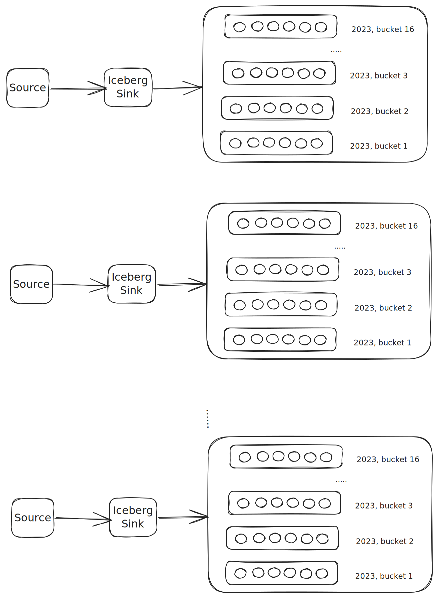
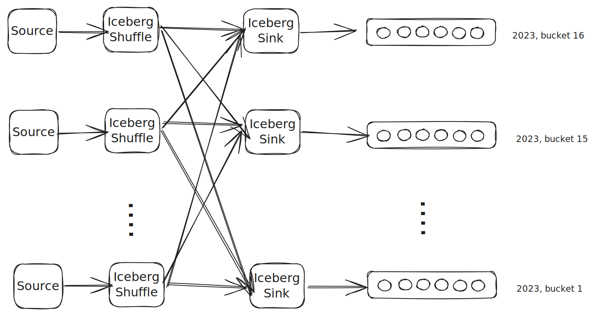
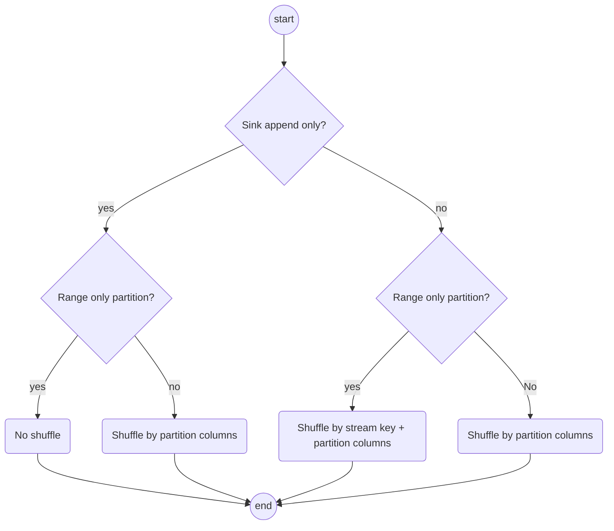
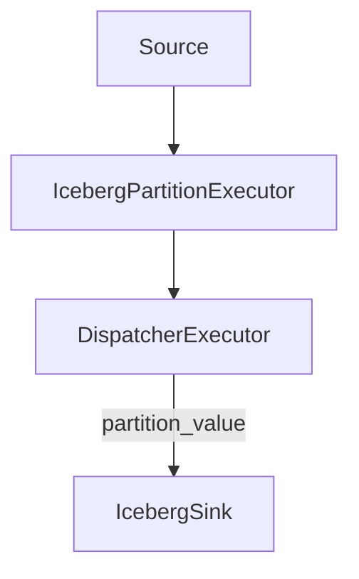
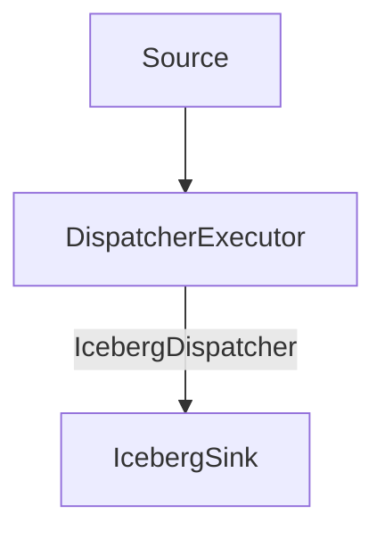

# Shuffle according to iceberg's partition spec

## Motivation

Apache iceberg allows users to define partition spec[1] for a table. The partition spec defines how data is partitioned and stored in the table. For example, a table can be partitioned by date and hour. Also, **it's required that each data file in apache iceberg can contain only one partition value**. This means that if the table is partitioned by bucket, we will have a lot of small files in the table if we don't do any shuffle at all. Let's use following table as an example:

```sql
CREATE TABLE prod.db.sample (
    id bigint,
    data string,
    category string,
    ts timestamp)
USING iceberg
PARTITIONED BY (bucket(16, id), years(ts))
``` 

If we don't do any shuffle, the writing process will be like following:



By shuffling values with same partition value to same sink, we can reduce the number of data files in the table:



## Design

There are several cases to think about when doing shuffle:



Here we will use several examples to explain different cases.

### Case 1: Append only table with range only partition

Following iceberg table definition has only range partition:
```sql
## Iceberg
CREATE TABLE prod.db.sample (
    id bigint,
    data string,
    category string,
    ts timestamp)
USING iceberg
PARTITIONED BY (years(ts))
```

And we want to sink following query to iceberg:
```sql
CREATE TABLE t0 (id bigint, data string, category string, ts timestamp) WITH (
  connector = 'kafka',
  topic = 'kafka_1_csv_topic',
  properties.bootstrap.server = 'message_queue:29092',
  scan.startup.mode = 'earliest'
) FORMAT PLAIN ENCODE CSV (delimiter = ',');

CREATE SINK s0 AS SELECT * FROM t0 WITH (
    connector = 'iceberg'
);
```

In this case we don't need to do any shuffle, since it's range only partition. Otherwise it all traffic will go to same actor.

### Case 2: Append only table with not range only partition

Following iceberg table definition has only range partition:
```sql
## Iceberg
CREATE TABLE prod.db.sample (
    id bigint,
    data string,
    category string,
    ts timestamp)
USING iceberg
PARTITIONED BY (bucket(id, 16), years(ts))
```

And we want to sink following query to iceberg:
```sql
CREATE TABLE t0 (id bigint, data string, category string, ts timestamp) WITH (
  connector = 'kafka',
  topic = 'kafka_1_csv_topic',
  properties.bootstrap.server = 'message_queue:29092',
  scan.startup.mode = 'earliest'
) FORMAT PLAIN ENCODE CSV (delimiter = ',');

CREATE SINK s0 AS SELECT * FROM t0 WITH (
    connector = 'iceberg'
);
```

In this case we need to shuffle by `(bucket(id), years(ts))` so that rows with same partition value will go to same actor.

### Case 3: Upsert table with range only partition

Following iceberg table definition has only range partition:
```sql
## Iceberg
CREATE TABLE prod.db.sample (
    id bigint,
    data string,
    category string,
    ts timestamp)
USING iceberg
PARTITIONED BY (years(ts))
```

And we want to sink following query to iceberg:
```sql
CREATE TABLE t0 (id bigint primary key, data string, category string, ts timestamp);

CREATE SINK s0 AS SELECT * FROM t0 WITH (
    connector = 'iceberg'
);
```

In this case we need to shuffle by `(years(ts), id)` to avoid all traffic go to same actor. 


### Case 4: Upsert table with not range only partition

Following iceberg table definition has only range partition:
```sql
## Iceberg
CREATE TABLE prod.db.sample (
    id bigint,
    data string,
    category string,
    ts timestamp)
USING iceberg
PARTITIONED BY (bucket(data, 16), years(ts))
```

And we want to sink following query to iceberg:
```sql
CREATE TABLE t0 (id bigint primary key, data string, category string, ts timestamp);

CREATE SINK s0 AS SELECT * FROM t0 WITH (
    connector = 'iceberg'
);
```

In this case we need to shuffle by `(bucket(data), years(ts))` so that rows with same will go to same actor. Notice that in iceberg we don't need to shuffle by `stream_key`, e.g. `id` since it only requires that insert/delete of same row will go to same partition. 

### Implementation

There are two possible implementations for shuffling by iceberg partition columns:

1. Add a new `IcebergPartitionExecutor`, which calculates the partition value of each record and adds it to the record, then asking the dispatcher executor to do hash shuffle according to the partition value. The plan is like following:



The `IcebergPartitionExecutor` will be a `StreamExecutor`, which calculates the partition value of each record and adds it to the record. The `DispatcherExecutor` doesn't need to change much, and do hash shuffle according to the partition value.

2. Extend dispatcher executor to support iceberg partition shuffle. The plan is like following:



In this approach we need to add an extra `IcebergDispatcher` to dispatcher executor. The `IcebergDispatcher` will calculate the partition value of each record and do hash shuffle according to the partition value.

I prefer approach 1 since it's more extensible and does not change too much current shuffle implementation, e.g. other lakehouse sinks (delta lake) could have similar approach.

## References

1. https://iceberg.apache.org/spec/#partitioning