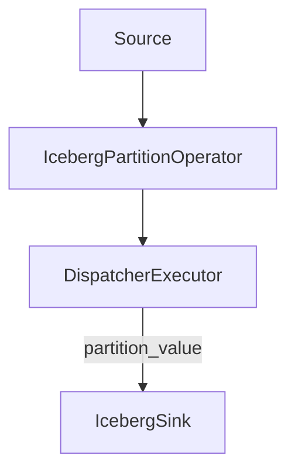
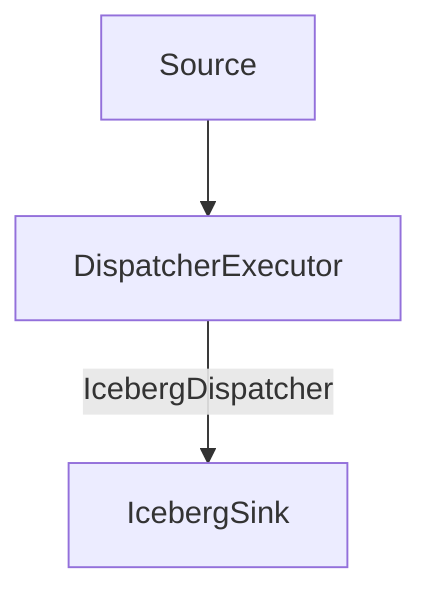

# Shuffle according to iceberg's partition spec

## Motivation

Apache iceberg allows users to define partition spec[1] for a table. The partition spec defines how data is partitioned and stored in the table. For example, a table can be partitioned by date and hour. Also, it's required that each data file in apache iceberg can contain only one partition value. In our current iceberg sink implementation, we don't do any shuffle. This means that if the table is partitioned by bucket, we will have a lot of small files in the table. This is not good for performance. We should shuffle the data according to the partition spec.

## Design

We will add a shuffle operator before sending data to iceberg sink. For example, let's assume the iceberg table is partitioned by following partition spec:

```sql
CREATE TABLE prod.db.sample (
    id bigint,
    data string,
    category string,
    ts timestamp)
USING iceberg
PARTITIONED BY (bucket(16, id), years(ts))
```

If we don't have the shuffle operator, the writing process will be like following:


After we add the shuffle operator, the writing process will be like following:


This way we can reduce the number of data files in the table, which helps to improve the read performance of iceberg.

### Implementation

There are two possible implementations for this feature:

1. Add a new `IcebergPartitionOperator`, which calculates the partition value of each record and adds it to the record, then asking the dispatcher executor to do hash shuffle according to the partition value. The plan is like following:



The `IcebergPartitionExecutor` will be a `StreamExecutor`, which calculates the partition value of each record and adds it to the record. The `DispatcherExecutor` doesn't need to change much, and do hash shuffle according to the partition value.

2. Extend dispatcher executor to support iceberg partition shuffle. The plan is like following:



In this approach we need to add an extra `IcebergDispatcher` to dispatcher executor. The `IcebergDispatcher` will calculate the partition value of each record and do hash shuffle according to the partition value.

I prefer approach 1 since it's more extensible and does not change too much current shuffle implementation, e.g. other lakehouse sinks (delta lake) could have similar approach.

### Caveats

When iceberg partition spec only contains range partitions(e.g. year, month, day), we don't need to do this shuffle, otherwise all traffic will go to same sink.
Also we need to reject upsert queries where partition columns is not a subset of the `stream_pk`. 

## References

1. https://iceberg.apache.org/spec/#partitioning