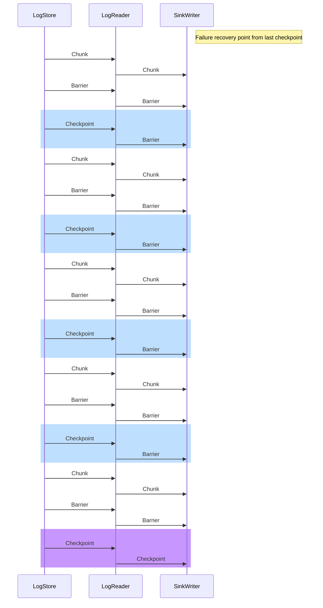
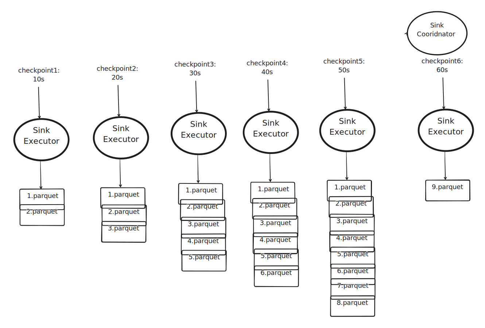
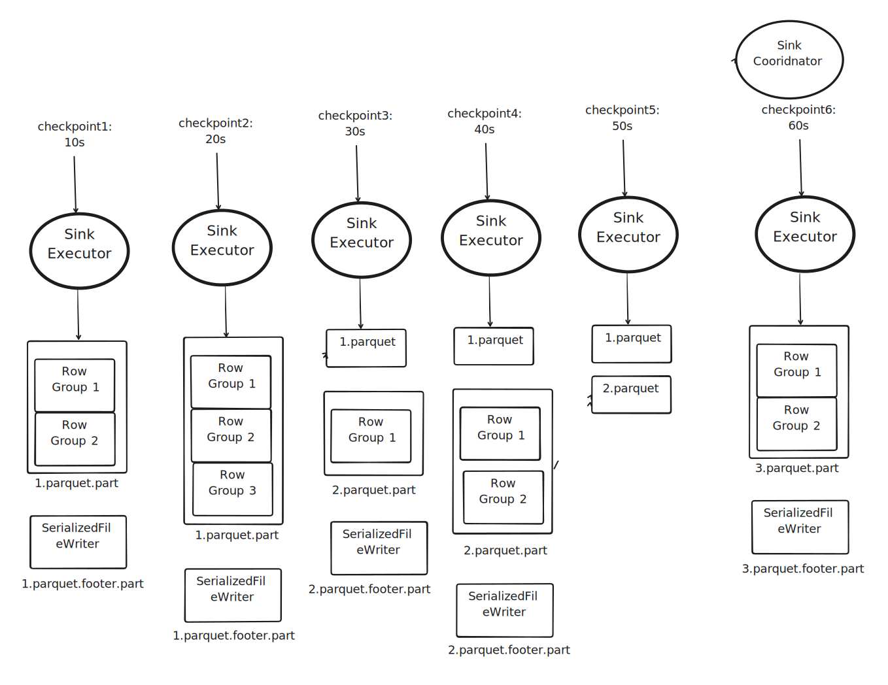

# RFC: Decouple iceberg sink commit from risingwave checkpoint

## Motivation

Currently, the iceberg sink commit is coupled with risingwave checkpoint, e.g. we commit changes to iceberg table when risingwave checkpoint is triggered. During our talk with some lakehouse user, we found that they want to commit changes to iceberg table less frequently than risingwave checkpoint. For example, they want to do checkpoint every several seconds for to get fresh view of materialized view, while commit changes to iceberg table should be much less frequent, e.g. every 5 to 10 minutes. Frequently commit changes to iceberg table will cause too many small files in iceberg table, which will cause performance issue when querying or maintaining iceberg table. In this proposal we want to allow user to have some way to control the frequency of committing changes to iceberg table so that it's more flexible.

## Design

### Syntax

We will add a new option `commit_interval` to iceberg sink, e.g. the time between two commits. By default, it's same as `checkpoint interval` of risingwave. If user wants to commit changes to iceberg table less frequently than risingwave checkpoint, they can set `commit_interval` to a larger value. It's worth discussion that if we require that `commit_interal` to be an exact multiplier of `checkpoint_interval`.

1. We enforce that `commit_interval` to be an exact multiplier of `checkpoint_interval`. In this case, risingwave should report an error when creating iceberg sink if violated. For example, if `checkpoint_interval` is 1 minute, and user's input is `commit_interval` is `2m 30s`, then risingwave should report an error.
2. We don't enforce that, but we will ceil `commit_interval` to the nearest multiplier of `checkpoint_interval`. For example, if `checkpoint_interval` is 1 minute, and user's input is `commit_interval` is `2m 30s`, then risingwave will round it to `3m` and report a warning to user.

Personally I'm in favor of first option, which will not introduce any surprise to user.

### Implementation

To simplify failure recovery, we still need to commit changes to iceberg table when risingwave checkpoint is triggered, but we don't need to commit changes to iceberg table every time. In following example let's assume that $commit\_interval \div checkpoint\_interval$ is $5$.

#### Approach 1

Modify sink log writer to trigger sink checkpoint every 5 checkpoint. Following diagram illustrates the process:

To avoid dead lock caused by some misconfiguration, e.g. allowed in flight checkpoint number, we need to enable partial checkpoint of log store.

Pros of this approach:

1. Easier to implement.
2. Easier to apply to more sinks (such as delta lake).

Cons of this approach:

1. This will increase failure recovery time for iceberg sink. For example, when the commit interval is set to 30 minutes, and sink failed in the 29 minute, we will need to replay all data for the first 29 minutes.

#### Approach 2

In this approach we don't do any modification to sink log writer, but modifies iceberg sink. Instead of committing all data files to iceberg table in every checkpoint, we flush data into parquet files, and save the flushed file paths into state table. Following graph illustrates the case:

While this method is simple enough, we may still experience small file problems if we do checkpoint frequently. We can further decouple flushing parquet file with checkpoint. Instead of flusing parquet files in every checkpoint, we flush parquet row groups. Following diagram illustraes the process:

There are chances we don't even need to flush row group. For example we can save the record sequence id of current row in log store to skip flusing row group, but I don't introduce to much dependency on such characteristics of log store to make things more complicated. One row group only adds a record in parquet's `FileMetaData`, and it has no impact on other readers of parquet.

The content of `SerializedFileWriter` can be found [here](https://docs.rs/parquet/latest/src/parquet/file/writer.rs.html#128-140), essentially it's row group metadata and some statistics information. We need to fork and maintain `parquet` to extract them.

The states in sink executor are essentially maps from `(executor id, partition value)` to `filename list`. When handling scaling in/out of actors, we should do a commit to iceberg table. There are other possible solutions to better handle it, but given that this doesn't happen frequently, I think it's acceptable without introducing too much complexity. After we decouple sink with mv using log store, it's no longer easy to maintain state table for sink executors, so we need to submit these states coordinator in every checkpoint and store them in metastore. The worst case of number of state entries is: $executor\_num * partition\_num\_of\_iceberg * 5$.

As with how to append to parquet file after closing, we need to rely on [multipart upload](https://docs.aws.amazon.com/AmazonS3/latest/userguide/mpuoverview.html), e.g. we concat different row groups to one parquet when doing actual committing. This is supported in almost all systems, even in hdfs 3, but not available hdfs 2.

Pros of this approach:

1. It enables faster failure recovery, e.g. we only need to replay data for each checkpoint.
2. It enables faster checkpoint without hurting iceberg performance.
3. It can be easily applied to other lakehouse formats (such as delta lake)

Cons of this approach:

1. Compared with approach 1, the engineering effort and complexity is much more.

## Discussion
