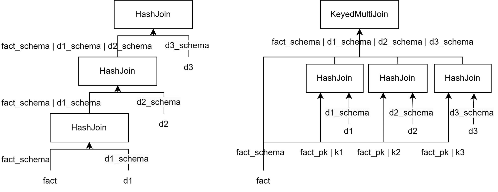
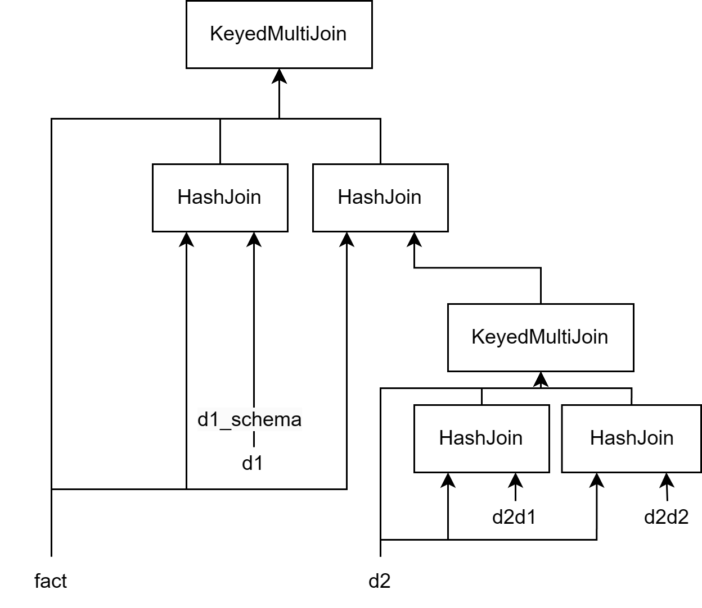

# Optimize multi-join with unique key(star/snowflake schema)

## Summary

Multi-join usually means a performance and cost bottleneck with big states. But in the PoC with users, we found the join key usually is the unique key/primary key of the input relation, especially in the [snowflake/star schema](https://www.databricks.com/glossary/snowflake-schema). This RFC gives a series of algorithms for streaming multijoin whose join key is the input’s pk.

## Design

### KeyedMultiJoin operator

KeyedMultiJoin is a stream operator. It has multiple input streams, and each input’s stream key(https://github.com/risingwavelabs/risingwave/pull/12458 actually gives a way to change any unique key as the stream key, so the algorithm here can be limited on the stream key) and must have the same schema. The operator will join the inputs with their stream keys.

The operator have two state table, `result table` and `exist table`. 

Result table materializes the full outer result of the join. In other words, it will materialize all input columns with the stream key. And there will be NULL values if a stream key exists in some input but does not exist in other inputs.

The exist table tells when the operator can emit the record in the result table. It records if a stream key exists in the non-outer inputs. We can have two choices here

1. pk: stream key | input_idx, value: None
2. pk: stream key, value: bitmap

The first method can get the help of the bloom filter in the state store and the second is size-optimized.

```sql
k is the unique key of all tables
Select * from 
A join B on A.k = B.k
join C on A.k = C.k;
```

### Star Schema Muti Join rewrite

The single KeyedMultiJoin’s use case is limited, this section will introduce its usage in “star schema” join case. With star schema, the data is constructed with a central fact table surrounded by several related dimension tables. Each dimension table is joined to the fact table through a foreign key relationship. 

Here is an example.

```sql
CREATE TABLE fact(pk int primary key, k1 int, k2 int, k3 int, v int);
CREATE TABLE d1(pk int primary key, v int);
CREATE TABLE d2(pk int primary key, v int);
CREATE TABLE d3(pk int primary key, v int);

SELECT fact.pk, d1.v, d2.v, d3.v FROM fact
JOIN d1 ON k1 = d1.pk
FULL JOIN d2 ON k2 = d2.pk
LEFT JOIN d3 ON k3 = d3.pk;
```

And the query can be rewritten to use KeyedMultiJoin.

```sql

SELECT fact.pk, cte1.v, d2.v, d3.v FROM fact
JOIN (
	SELECT fact.pk as fact_pk, d1.v FROM 
	fact JOIN d1 on d1.pk = fact.k1
) cte1 ON cte1.fact_pk = fact.pk
Right JOIN (
	SELECT fact.pk as fact_pk, d2.v FROM 
	fact FULL JOIN d2 on d2.pk = fact.k2
) cte2 ON cte2.fact_pk = fact.pk
LEFT JOIN (
	SELECT fact.pk as fact_pk, d3.v FROM 
	fact d3 on d3.pk = fact.k3
) cte3 ON cte3.fact_pk = fact.pk;

```



Let’s call the left algorithm “cascade join” and the right one “broadcast-reduce join”. 

The main issue of the cascade join is the upstream will affect all the downstream’s join. The result of the `fact join d1` is stored in all the downstream hash join executors in the above example graph. So if there are `N`   dimension tables, for the `i-th` dimension table, its join result will be materialized in the downstream join’s state `N-i` times. It is not only a state-size issue. Considering that there is an update on the dimension table, all downstream states must be updated, which has the same cardinality as the fact table.

In comparison, under “broadcast-reduce join”, the update on any dimension table will certainly introduce just one update on the keyedMultiJoin’s state.

Furthermore, the “broadcast-reduce join” has other advantages.

- reduce the plan’s height https://github.com/risingwavelabs/rfcs/pull/23
- reduce the difficulty of maintenance. It is easier to monitor the dimension table’s changes and find which dimension table introduces the performance issue.

### Snowflake schema

```sql
CREATE TABLE fact(pk int primary key, k1 int, k2 int, k3 int, v int);
CREATE TABLE d1(pk int primary key, v int);
CREATE TABLE d2(pk int primary key, k1 int, k2 int);
CREATE TABLE d2d1(pk int primary key, v int);
CREATE TABLE d2d2(pk int primary key, v int);

SELECT fact.pk, d1.v, d2d1.v, d2d2.v FROM fact
JOIN d1 ON fact.k1 = d1.pk
JOIN d2 ON fact.k2 = d2.pk
JOIN d2d1 ON d2.k1 = d2d1.pk
JOIN d2d2 ON d2.k2 = d2d2.pk;
```




# Questions

- @Eric Fu Shall we summarize the limitations of this approach here? I remember that we had listed some during discussion but I have forgot now.
    - I was thinking about a case: provided a star schema, what if there is an “inversed” outer join edge? What if “full” outer edge? For example:
        ```
        D1   <---  F (center fact table)  ----> D2
           ^
           |   <- What if it's an inversed outer join edge or full join edge?
           D3
        ```
