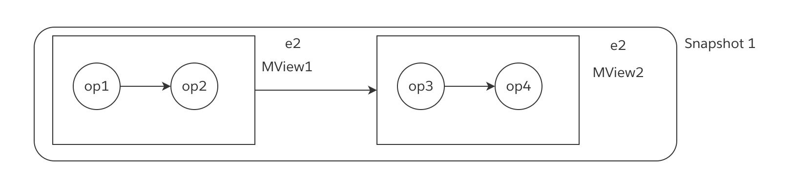
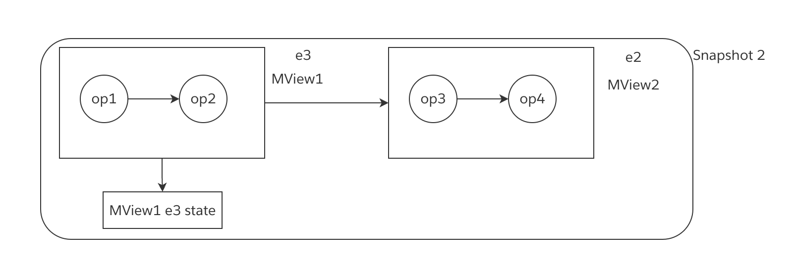
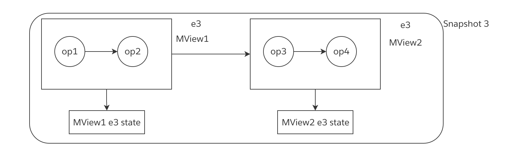
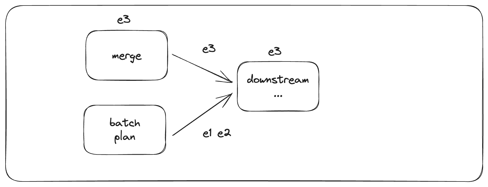
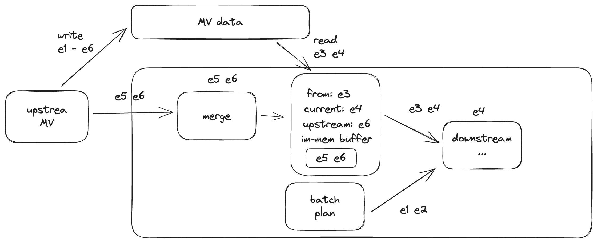

# Partial Checkpoint

## Summary

Target

- Failure isolation of downstream and upstream MV
- Slowness isolation of downstream and upstream MV
- Query consistency among the whole streaming graph

Different MVs will have different committed epochs in a checkpoint.

## Motivation

We have a unified global checkpoint, in which the committed epoch of all tables are aligned. The reason for this design is:

1. Only sources are replay-able. Therefore in failure recovery, we can only replay the data from source, and we should ensure states at the downstream of source (which are all states) should be at the same epoch.
2. All states (both internal states and MVs) are aligned in their epochs, and therefore a batch query can always read all states in a consistent view.

Under the current unified global checkpoint requirement, after we inject a barrier to the sources, we have to **wait for the barriers to flow through the whole streaming graph**, because only in this way can we ensure that all states have processed the data of the epoch reached a consistent state. However, under this mechanism, **the checkpoint of an upstream MV should wait for the downstream MV**, and then a slow downstream MV will affect the upstream MV, and a failure in downstream MV will cause the failure of checkpoint of upstream MV. In a word, the failure and slowness are not isolated between upstream and downstream.

## Design

As mentioned above, there are 2 reasons for global checkpoint, which makes us unable to isolate failure and slowness while maintaining query consistency. If we can resolve the 2 reasons, we can maintain query consistency while achieving failure and slowness isolation.

- For reason 1 (only sources are replay-able), we can resolve this reason when we can also replay the change log of our states. (L0 as a log for materialize state. See below.)
- For reason 2 (query consistency among all states). First, currently we support MVCC for batch queries by specifying a read epoch. Therefore, given a read epoch, when we want to read from some states (not necessarily all), as long as the read epoch is below the max committed epoch of these states, we can get a consistent result. Besides, not all users cares about the states in the whole graph, and sometimes users may be interested in only the upstream MV, which means given a later epoch, we can read the data of upstream MV when it has finished processing the data, without waiting for downstream.
    
    Therefore, in a checkpoint that can serve batch query, states do not need to have an aligned max committed epoch(MCE), and **each state can have its own MCE**. 
    
    By default, a batch query will use the **minimum MCE among all states** as the read epoch. This is the **same behavior as the current system**. If users are interested in some subset of states, with some ways of proper setting (user interface TBD), it will use the minimum MCE among this subset of states as the read epoch.
    
    In conclusion, for batch query, in a checkpoint we don’t have to have an global aligned MCE among all states.
    

In a word, in the proposed design

- in a checkpoint, states will not have a global aligned MCE, and instead each state may have their own MCE. The MCE of upstream is always higher than their downstreams.
- During failure recovery, the system can get back to work immediately from a checkpoint. For a downstream MV that reads from upstream, if it lags behind, it will first replay the change log of the lagged epochs of the upstream MV (barriers of the lagged epochs are also replayed), and then process the new data from the upstream.

## Detailed Design

### Partial checkpoint with unaligned MCE

> Copied from the previous design doc. 
**snapshot ⇒ checkpoint**
> 

Let’s look at the following graph. The MCE of each MView is e2 at the beginning and we have a snapshot 1



When all actors in the subgraph of MView1 has received the barrier and synced its state, we commit e3 only on MView1 and create a new snapshot 2



When all actors in the subgraph of MView2 has received the barrier and synced its state, we commit e3 on MView2 and create a new snapshot 3.



### L0 as a log

Implementation details in [Log Data Management](https://github.com/risingwavelabs/rfcs/pull/55) 

Summary:

- No extra storage. Reuse the L0 data written by upstream MVs. Materialized state writes extra old value.
- Easy truncation. Only metadata change.

### Introducing the New Executors to Read Upstream MV

Currently on MV-on-MV, we will forward the new data flowed from upstream directly to downstream backfill executor.



Under the new design, if a MV lags behind the upstream MV, it will first replay the change log of the lagged epoch of the upstream, and then send the new data in upstream to downstream executor. Following is an example.



After recovery, the MCE of upstream is e4 and it is going to process the following data of e5 and e6. The MCE downstream of downstream is e2 and it is going to process the data of e3 and later epoch. It will first replay the change log of the lagged epoch, which is e3 and e4. The new data from the upstream of e5 and e6 are stored in an in memory buffer. After data of e3 and e4 have sent to downstream executors, it will then send the data of e5 and e6.

**Note that**

- In downstream, barrier of e3 and e4 are produced when reading the change log.
- **The size of the in memory buffer is bounded**. When the buffered data gets too large, it can drop some data. The dropped data can eventually be replayed from the upstream change log. The in memory buffer can be seen as **a cache of the upstream** change log.

## Detailed Implementation

### Storage Metadata Change

on storage side, we only need to change the `max_committed_epoch` and `safe_epoch` from a globally unified one to per table.

```protobuf
message HummockVersion {
    ...
    max_committed_epoch: map<int32, int64>,
    safe_epoch: map<int32, int64>,
}
```

### Collect barrier and trigger checkpoint

**Currently**, we collect barrier and trigger checkpoint in the following way:

1. barriers are injected to source executors via a inject_barrier rpc. 
2. we also have a collect_barrier rpc to wait for the injected barrier to flow through the stream graph. 
    
    The dispatch executor at the end of each actor notifies the local barrier manager on that the barrier has followed through this parallelism of fragment. When the local barrier manager receives notification from all actors, it notify the rpc handle of collect_barrier
    
3. the rpc handle of collect_barrier wait for the checkpoint of the epoch of the barrier.
    
    Only an epoch can be used to describe the checkpoint.
    
4. After get the metadata of the checkpoint of the epoch, it returns to the meta node with the checkpoint metadata, and in the end meta node commit the checkpoint metadata to HummockVersion.

The current mechanism is for checkpoint with a globally aligned epoch.

**For the new design, the process can be the following:**

1. barriers are injected to source executors via a inject_barrier rpc.
2. no extra rpc are made to collect barrier. Instead, when the dispatch executor receives a barrier, it will report to local barrier manager, and the local barrier manager will report the epoch progress of each fragment to meta node.
3. The barrier manager can now get the epoch progress of each fragment (or even each actor). It can then trigger checkpoint based the epoch progress with some specific policies. Checkpoint is triggered via a new rpc sent to CN. The checkpoint information now includes the epoch of each state, meaning the max committed epoch of each state after this checkpoint.

**Note:** this does **not** mean that a checkpoint is triggered every time a barrier follows through a single MV. A new checkpoint can include the states across multiple MVs, depending on the checkpoint policies in barrier manager.

### Back Pressure

Downstream can back-pressure the upstream by configuring the max epoch lag in the log store read executor. When the max epoch lag reaches the limit, the executor will get blocked when trying to write to the in memory buffer, and eventually back-pressure the upstream.

### Batch Query Consistency

> Copied from above
> 

By default, a batch query will use the **minimum MCE among all states** as the read epoch. This is the **same behavior as the current system**. 

If some users are interested in some subset of states, with some ways of proper setting (user interface TBD), it will use the minimum MCE among this subset of states as the read epoch.

### Recovery

When a downstream MV crashes, the upstream will not be affected. Only the downstream MV and MV depends on the downstream MV will recover from the latest checkpoint.

## Unresolved questions

* Are there some questions that haven't been resolved in the RFC?
* Can they be resolved in some future RFCs?
* Move some meaningful comments to here.

## Alternatives

What other designs have been considered and what is the rationale for not choosing them?

## Future possibilities

Some potential extensions or optimizations can be done in the future based on the RFC.
