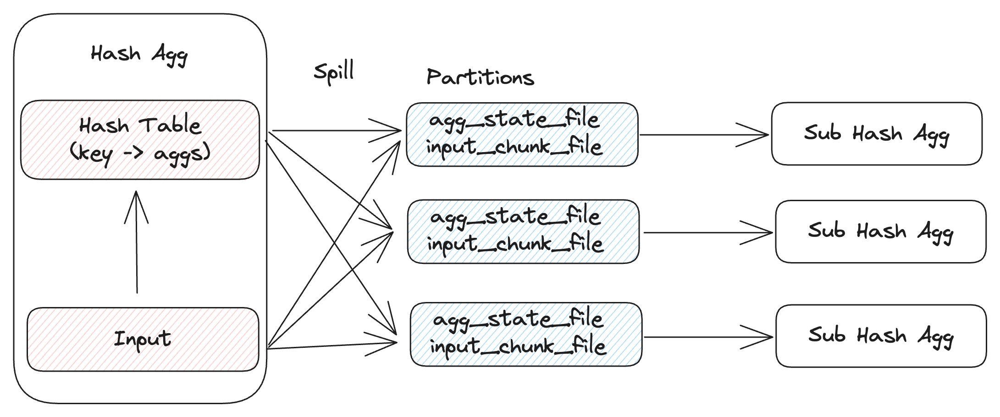

---

feature: Spill Hash Aggregation
authors:
  - "DylanChen"
start_date: "2024/05/13"

---

# Spill Hash Aggregation

## Motivation

RisingWave batch queries are executed purely in memory currently which could easily reach to the the reserved batch memory limit. Hash aggregation is one of the operator that could require a large amount of memory (depending on the cardinality of the group by keys). For example, deduplication is a common feature and in batch queries, hash aggregation is often used to implement it. During deduplication, the in-memory hash table of the hash aggregation could be quite large and cause an OOM error. If we could spill the in-memory hash table to the disk, it would greatly improve the cluster stability and be able to run a large query with a small machine.

## Design

As we know a batch query would be fragmented into different fragments and a fragment would be further assigned a parallelism to execute, for each parallelism, we call a task. Hash aggregation is an executor within a task, aka, HashAggExec. To spill a HashAgg, we need to spill the hash table and the input chunks. Ideally, we want HashAggExec to work normally when memory is sufficient and when memory is not enough, we spill the hash table and all input chunks.



### Partitions

First, we need to choose a partition number to partition the hash table and input chunks. After partitioning, theoretically, each partition would only contain 1/partition_num of the original data. If this size could be fitted in the memory, we can process the HashAgg partition by partition. If this size is still too large to be fitted in the memory, we need to recursively apply the spill algorithm. When recursively applying the spill algorithm, we need to make sure they use different hash functions to avoid data skew.

How to choose a partition number? If we have the priori information about the aggregation input size, we could choose a proper partition number to ensure each partition could be fitted into memory, however, risingwave doesn't contain this kind of statistic, so we need to choose a partition carefully.
Choosing too few partitions leads to a handful of large-sized partitions causing extra rounds of Spill and a large amount of spilling to disk. On the other hand, while using a larger number of partitions can reduce the total amount of spilling, it can make the agg's I/O pattern more random due to frequent writings of partitions containing just a few rows. According to this paper[1], we can use 20 as a default partition number.

```
  HashAggExec.execute:

    // process hash agg in memory
    ...

    if not enough memory:
      // Spill
      for (k,v) in hash_table:
        partition = hash(k) % partition_num
        write_to_agg_state_file(k, v)
      for chunk in inputs:
        partition = hash(k) % partition_num
        write_to_input_file(chunk)

      // process partition by partition
      for i in partition_num:
        HashAggExec.execute(agg_state_file[i].read(), input_file[i].read())

```

### Where to spill

There are two options for us to spill: local disk or object store.

1. Local Disk
  - Pros: low latency, fixed costs, k8s could handle orphan spilled files in case of failure.
  - Cons: limited capacity and throughput
2. Object Store
  - Pros: infinite capacity and throughput
  - Cons: high latency, extra storage, and access cost, need to clean orphan spilled file.

We can use a local disk first so that users don't need to pay any extra cost.

### Spill directory

Use need a pre-defined directory to hold all the temporary spilling files. In a cloud environment, k8s should be responsible for configuring this directory via the env variable `RW_BATCH_SPILL_DIR`. By default, we can use `/tmp/` as the default spill directory. Every executor should use a uuid to create a subdirectory under the default spill directory to ensure no conflict among them. After query processing, the executor are responsible for clearing the directory.


### Serialization

We can convert keys and values of the hash table into a chunk and then serialize the chunk into a protobuf bytes which has already been supported and used during shuffling between different tasks. Finally, spill file content will look like the below. As we can see this file write pattern is append-only and the read pattern is sequential scan. This can maximize the disk IO performance.

Spill file format:

```
[proto_len]
[proto_bytes]
...
[proto_len]
[proto_bytes]

```

## Unresolved questions

The above algorithm relies on the aggregation state that could be serialized. As far as I know, if the agg state is `AggregateState::Any`, they can't encode the state well, so this algorithm is only applicable to `AggregateState::Datum`. I think the most common aggregation function we know e.g. `count`, `sum`, `min`, `max` belongs to `AggregateState::Datum`, so it is fine. Any improvement later are welcome.

## Alternatives

To support a full set of aggregation functions to spill, we can buffer the input chunks for a while so that we don't need to spill the aggregation state, but this would introduce an extra memory occupation during in-memory aggregating which is not a good decision.

## Further

Derived form this RFC, it is not hard to generalized the partition based spill algorithm to the Hash Join. That is known as grace hash join or hybrid hash join.[2]

## Reference

- [1] Design Trade-offs for a Robust Dynamic Hybrid Hash Join
- [2] https://en.wikipedia.org/wiki/Hash_join
