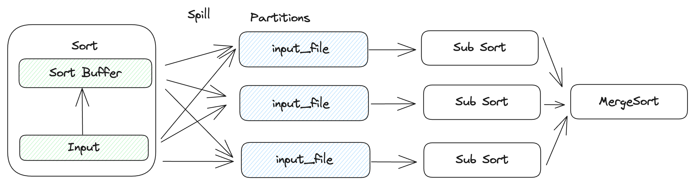

---

feature: Spill Sort
authors:
  - "DylanChen"
start_date: "2024/06/14"

---

# Spill Sort

## Motivation

Sorting is a fundamental algorithm in databases, and you can use the "ORDER BY" clause in SQL to instruct a database to sort a dataset. Furthermore, advanced operators like SortAgg, OverWindow, and SortMergeJoin rely on sorting to implement their functionalities, as they require their inputs to adhere to a specific order. If the sorting algorithm operates solely in-memory, it might impose limitations on the size of data a database system can handle. Hence, it is essential to support a spill-able sort, also known as external sort [1].


## Design

To implement a spill-able sort, we employ the divide and conquer approach, similar to how it was done in the RFCs for spill hash aggregation and spill join aggregation before ([spill hash aggregation RFC](https://github.com/risingwavelabs/rfcs/pull/89) and [spill join aggregation RFC](https://github.com/risingwavelabs/rfcs/pull/91) ). We partition the input for sorting into different segments, but this time using a round-robin method, which can be more efficient and helps avoid data skew. After partitioning, each segment's size is expected to be much smaller than the original input size. Consequently, we sort these partitions individually, and finally, a merge sort is employed to merge all the sorted segments.


### Partitions

Firstly, we must select a partition number to divide the input. After partitioning, theoretically, each partition would only contain 1/partition_num of the original data. If this size can fit into memory, we can sort each partition individually and then merge them. However, if this size is still too large to fit into memory, we need to recursively apply the spill algorithm. Similar to the previous spill RFCs, we can set 20 as the default partition number.

```
  SortExec.execute:

    // sort in memory
    ...

    if not enough memory:
      // Spill
      for chunk in sort_buffer:
        // write to partitions in a round-robin way
        write_to_input_file(chunk)
      for chunk in input:
        // write to partitions in a round-robin way
        write_to_input_file(chunk)

      // sort partition respectively
      let sorted_input = vec![]
      for i in partition_num:
        sorted_input.push(SortExec.execute(input_file[i].read()))
      // merge sort
      MergeSortExec.execute(sorted_input)

```

### Where to spill

There are two options for us to spill: local disk or object store.

1. Local Disk
  - Pros: low latency, fixed costs, k8s could handle orphan spilled files in case of failure.
  - Cons: limited capacity and throughput
2. Object Store
  - Pros: infinite capacity and throughput
  - Cons: high latency, extra storage, and access cost, need to clean orphan spilled file.

We can use a local disk first so that users don't need to pay any extra cost.

### Spill directory

Use need a pre-defined directory to hold all the temporary spilling files. In a cloud environment, k8s should be responsible for configuring this directory via the env variable `RW_BATCH_SPILL_DIR`. By default, we can use `/tmp/` as the default spill directory. Every executor should use a uuid to create a subdirectory under the default spill directory to ensure no conflict among them. After query processing, the executor are responsible for clearing the directory.


### Serialization

We can convert keys and values of the hash table into a chunk and then serialize the chunk into a protobuf bytes which has already been supported and used during shuffling between different tasks. Finally, spill file content will look like the below. As we can see this file write pattern is append-only and the read pattern is sequential scan. This can maximize the disk IO performance.

Spill file format:

```
[proto_len]
[proto_bytes]
...
[proto_len]
[proto_bytes]

```

## Reference

- [1] https://en.wikipedia.org/wiki/External_sorting
